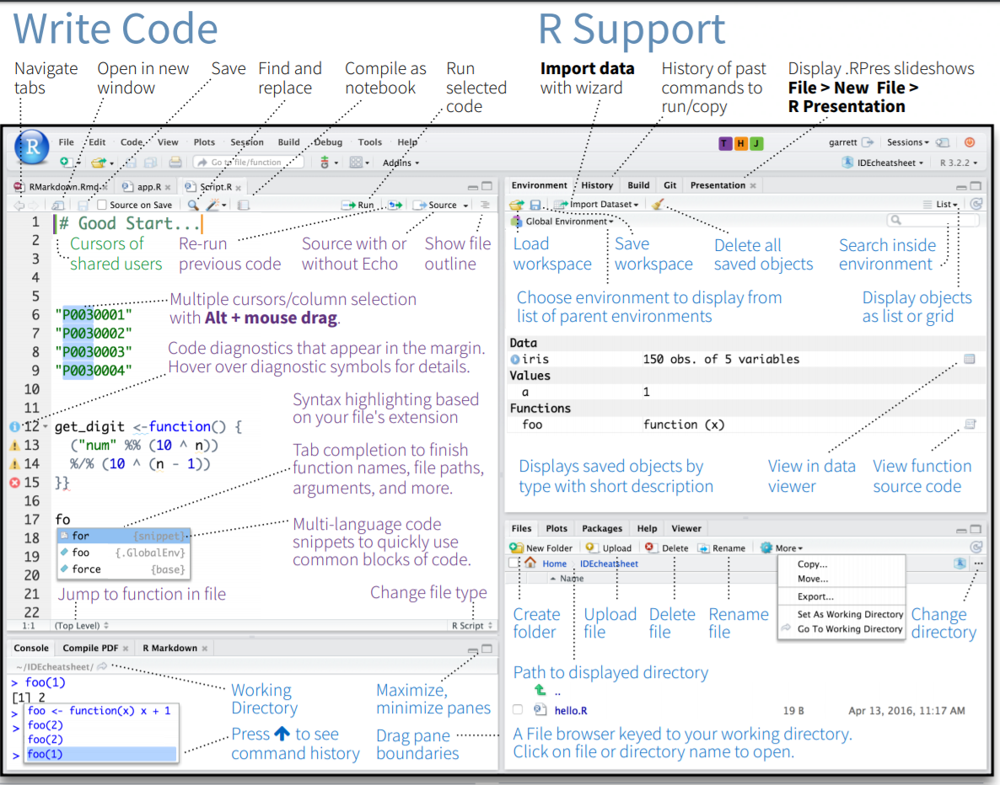
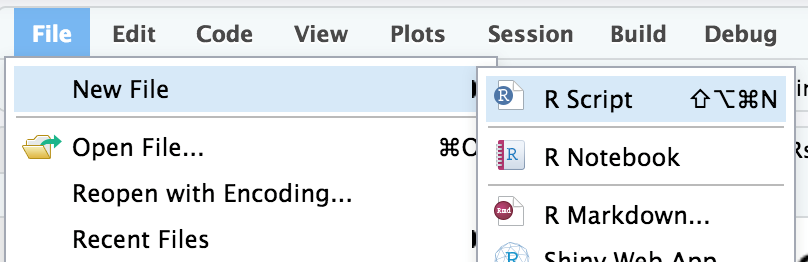
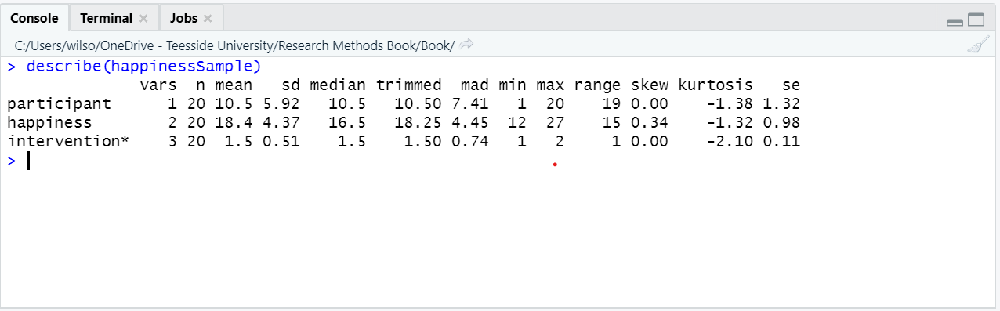

# Introduction to R and R Studio

<iframe src="https://teesside.hosted.panopto.com/Panopto/Pages/Embed.aspx?id=9ecb2696-88e3-408b-93ab-abdb00e20628&autoplay=false&offerviewer=true&showtitle=true&showbrand=false&start=0&interactivity=all" width=720 height=405 style="border: 1px solid #464646;" allowfullscreen allow="autoplay"></iframe>

## By the end of this section, you should be able to:

- Download R and R studio
- Identify the R script, R console, Data environment and file browser in R studio
- Write and run R code from a script
- Install and load R packages

## Why learn / use R?

### Some information about R

- R is developed and used by scientists and researchers around the world
- Open source = no cost
- Constant development
- Connects to other data science/research tools
- Worldwide community: training widely available
- Encourages transparency and reproducibility
- Publication-ready outputs

### Moving from other software to R

- Workflow is different
  *	Organise files and data differently
  *	Workspace can contain data and outputs
  *	Can manage multiple datasets within a workspace
- Learning curve can be steep initially
  *	e.g. Variables and coding, scripts
- Need to know what you want
  *	e.g. building your regression model / ANOVA error terms

## R has many advantages

- Using scripts means analysis is easy to follow and reproduce
- R scripts are small, online collaboration, no SPSS “older version” problems
- Data can be organised and reorganised however you need it (tidyr)
- Packages are available for “cutting edge” analysis: e.g. Big Data & Machine Learning
- A robust language for precise plots and graphics (ggplot)
- R analysis code can be embdeded into documents and presentations (R Markdown)

## Download R and R Studio

Click on these links to download:

- [R project](https://cran.r-project.org/) 
- [RStudio](https://rstudio.com/)

## The R Studio environment

The interface for R Studio looks daunting at first. However, there are 4 main sections, 2 on the left and 2 on the right. 

- MAIN TOP: R Script files or R Document Files
  * Where we usually type our code as a script before we run it. Script files are usually saved so we can work on them and rerun the code again later (.R files).
- MAIN BOTTOM: Console
  * Shows the output of our R code. We can type R code directly into the console and the answer will ouput immediately. However, it is more convenient to use script files.
- RIGHT TOP: Environment
  * Contains all of the objects (e.g. data, analysis, equations, plots) that are currently stored in memory. We can save all of this to a file and load it later (.RData files).
- RIGHT BOTTOM: File Browser
  * The folder that R is working from is called ‘the working directory’ and it will automatically look for files there if we try to import something (e.g. a data file). Using the more button on the file browser allows you to set your desired working directory.

## Working with a script

Scripts can be opened from the **File** menu.

The purpose of scripts is to allow you to type your analysis code and save it for use later. Scripts include, for example:

- Code for importing data into R 
- Your analysis code (e.g. t-test or descriptive statistics)
- Code for graphs and tables 
- Comments and notes (preceded by the '#' symbol)

To run a script, you click the **Run** button. You can choose to:

-	Run the whole script
- Run the selected line of code

When you run the script, you will normally see output in the **console.**

If your script contains code for a plot (graph), it will appear in the **Plots** window in the bottom right.

## Installing and loading packages

<iframe src="https://player.vimeo.com/video/203516241?color=428bca" width="640" height="400" frameborder="0" allow="autoplay; fullscreen" allowfullscreen></iframe>

<a href="https://vimeo.com/203516241">install Packages</a> from <a href="https://vimeo.com/rstudioinc">RStudio, Inc.</a> on <a href="https://vimeo.com">Vimeo</a>.

Packages add functionality to R and allow us to do new types of analysis.

- They can be installed via the menu (Tools -> Install Packages)
- The can also be installed using code: 

          install.packages()

For example, TidyR is a package that contains functions for sorting and organising data. To install the package:

or use the code:

    install.packages(“tidyr”)

Once a package is has been installed, you need tp load it using the *library()* command.
For example:

    library(“tidyr”)

