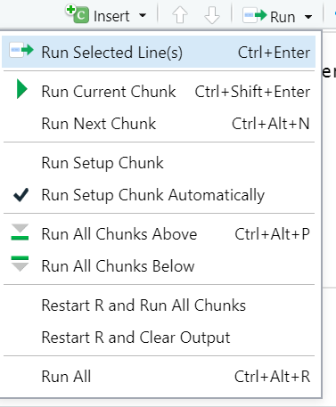
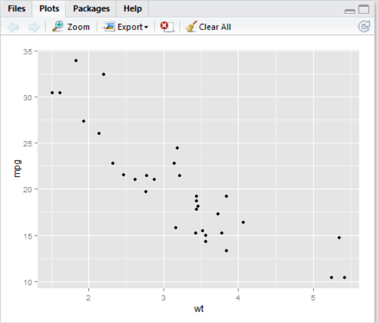
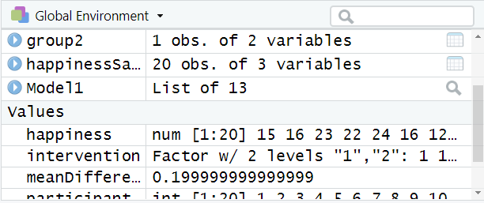
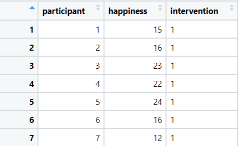
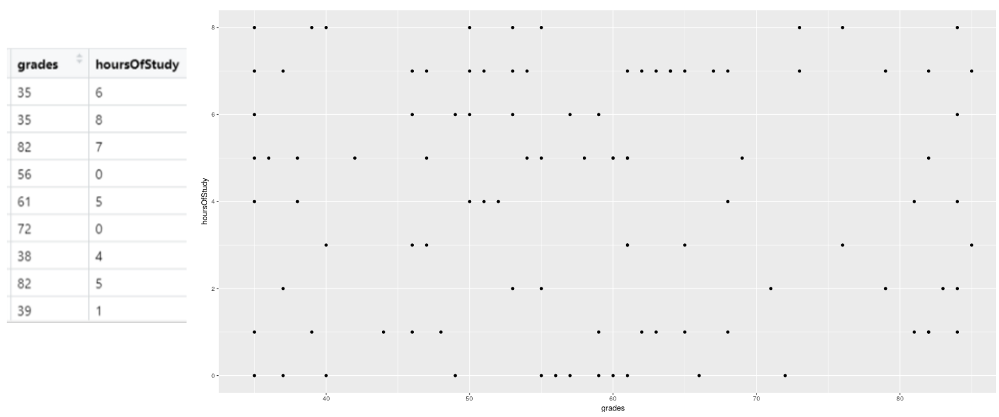
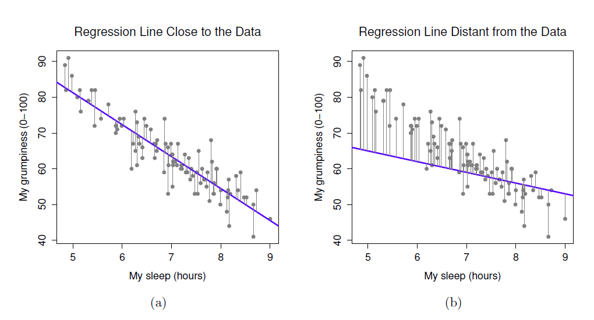
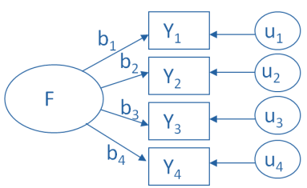
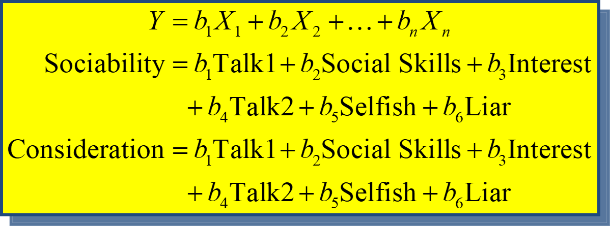

--- 
title: "Advanced Psychological Research Methods (PSY4034)"
author: "Christopher J. Wilson"
date: "September 2021"
link-citations: yes
bibliography:
- book.bib
- packages.bib
site: bookdown::bookdown_site
biblio-style: apalike
css: style.css
description: This is a handbook for postgraduate research methods courses in the psychology
  department at Teesside University.
documentclass: book
always_allow_html: true
---

# Welcome to the module

 > Note:To watch the embedded videos on this site, you will need to be logged into Teesside University's Blackboard site and be a part of this course. If you are on the course:
> 
> - Press *Ctrl* + *T* to open a new tab (keeping this one open) and go to [https://bb.tees.ac.uk](https://bb.tees.ac.uk). 
> - Login to Blackboard. Keep the blackboard tab open and switch back to this page.
> - Refresh this page (hit F5 on your keyboard).
> - You should now be able to play all of the video content.


## Module Overview

This Level 7 module for first year Doctorate in Clinical Psychology trainees aims to enable you to:

  - Refresh and extend your knowledge, skills and critical understanding of advanced research methods using both qualitative and quantitative approaches;
  - Creatively apply the principles of quantitative and qualitative research methods to clinical psychology research and practice;
  - Refresh and extend your skills in project design, management, analysis and presentation.

The module is also designed to explicitly prepare you for the two Doctorate level research modules which occur in Years Two and Three of the programme, ensuring that you have the requisite knowledge and skills to successfully engage with those modules.

The key foci for this module include:

  - critical review of established literature
  - project design
  - project management
  - data analysis
  - dissemination of research findings
  
The module is taught using a variety of techniques to best enhance your knowledge and understanding of the application of research theory and methods in the context of clinical psychology. These include lectures, seminars, guided statistical analysis and tutorials with the latter being used to provide individual guidance and formative feedback. The module has its own site on the University’s Virtual Learning Environment http://eat.tees.ac.uk - known as Blackboard), with resources and literature designed to support learning.


## Module timetable and delivery for 2021/2022


At the time of writing, all teaching is planned to take place face to face, on campus. 

Any adjustments due to the pandemic will be informed by the accreditation standards of the BPS, and in particular, the interim guidance ‘Clinical Psychology training and Covid-19’ (2020):  this guidance emphasises flexibility and a focus on competencies, rather than a dilution of competencies; and that trainees are still expected to gain the range of experiences outlined in the BPS standards.  

Any updates regarding course delivery will be provided regularly via https://bb.tees.ac.uk/  so please do check this site frequently.

The timetable for this module appears on the Clinical Psychology Programme Site/Timetables.

The majority of the sessions will take place on Monday mornings (9-12). Please note that the timetable should be checked on a regular basis.


### Learning and Teaching Strategies

The module is taught using a variety of techniques to best enhance your knowledge and understanding of the application of research theory and methods in the context of clinical psychology. This includes activities designed to encourage independent learning, a key skill for successful performance in research modules in Years Two and Three of the programme.  Evidence of independent learning is expected in the assignments for this module.  Specific links are made with research informed activity in practice. 

You will be provided with two papers for critical review at the start of the module and asked to decide which one you will use for your summative critical review assignment; one of these papers is from a quantitative research tradition and the other is from a qualitative research tradition. 

All presentations (with added annotations) are available, along with additional support materials, via an e-learning@tees on the VLE.  E-learning is enabled through group activities on the VLE or Microsoft Teams where discussion and problem solving is undertaken in relation to tasks set during teaching sessions. The discussion boards or Microsoft Teams site will be used to ask and answer questions that arise from the taught material and also your independent work.

## Assessment

### Formative assessment

Formative feedback is provided throughout the module through practical exercises and in seminars on trainee presentations.

By the end of year one, trainees are expected to have identified a thesis topic and have a completed research proposal. As such, there are a number of formative milestones across the year that will be monitored by the module team. Please see Appendix 1 of this guide for details.

The required format for thesis research proposals can be found in Appendix 2 of the DClinPsy
Programme Research Handbook.

**The formal formative assessment is of a presentation of the thesis research proposal to be presented during the research panels, which take place in July 2022.** The presentation will be 20 minutes’ long and will outline the thesis project that the trainee will develop in Years 2 and 3. There will also be 10 minutes allotted for questions from the panel which will have two academic members and one clinical member. This formative assessment is intended as a starting point for the Year 2 and 3 research methods modules. The timing is important as it should enable trainees to start the process of ethics approval for their dissertation. earlier. The trainees will hand in a printed copy of their slides with explanatory notes and references.


**Formative Assessment Criteria**

The following criteria will be used to assess the assignment:   

-	Effective justification for the study. 
-	Clearly defined research question. 
-	Comprehensive and critical review of the literature (within time constraints). 
-	Realistic research design. 
-	Effective consideration of ethical issues. 
-	Clear plan for writing up and dissemination. 
-	Fulfillment of professional research ethics requirements. 
-	Adherence to the relevant guidance for presentation as advised by the Module Tutor. 


### Summative Assessments 

Assessment consists of an ICA and an ECA, each worth 50% of the overall module mark. The deadlines for these assessments can be found in the assessments section on Blackboard or in the programme assessment timetable. 

**ICA (50%)** - A critical review of a published primary research paper (choice to be made by a trainee from papers with different methodologies provided by the tutor). (2,000 words). 
*Learning outcomes: (KU 1-4, CIS 1-3, KTS 1-3)*

**ICA Assessment Criteria (Critical Appraisal of Published Primary Research Paper )**

The following criteria will be used to assess the assignment:   

- Demonstrate a critical understanding of the role of the reviewed paper for clinical psychologists in service delivery and/or practice. 
- Demonstrate a critical and comprehensive understanding of the relevant methodological issues. 
- Systematically and critically evaluate stages of the research process. 
- Demonstrate a comprehensive and critical understanding of the ethical issues involved in the research. 
- Reach effectively argued conclusions. 
- Demonstrate independent learning ability through reflection on the critical review process. 
- Adhere to the American Psychological Association (APA) guidelines for presentation and referencing. 


**ECA (50%)** - A research project proposal which both addresses limitations identified in the ICA critical review (1) and develops the research further with the use of an alternative methodology (2,000 words).  
*Learning outcomes: (KU 1-4, CIS 1-3, PPS 1-2, KTS 1-5)*

**ECA Assessment Criteria (Research Project Proposal)**

The following criteria will be used to assess the assignment: 

- Identify a project that demonstrates a detailed and critical understanding of the research evidence reviewed and wider methodological issues, including the role of the project for informing service delivery and/or practice. 
- Provide detailed and appropriately justified solutions to the design of the research project. 
- Consider both methodological and ethical issues in the design of the research project. 
- Demonstrate a detailed and critical understanding of the data analysis required for the proposed study. 
- Adhere to the American Psychological Association (APA) guidelines for presentation and referencing. 

**Suggested structure for ECA**

This assessment is a research proposal and should be structured to describe the research aims and how the methodological approach suggested will address these aims. The previous assessment will have raised certain critiques of the research paper discussed, and these issues might inform the proposed project. However, it is important that this assessment stands alone as a written piece of work, so there should be sufficient information and reference to literature for the reader to understand the basis of the research question and methodological choices that are made (similar to when someone reads a dissertation or research paper method).

In terms of strucutre, there are some elements that it would be logical to include:

- A brief introduction
- A statement of the research question(s) and (if appropriate) hypotheses
- Information about planned sampling approach / participant inclusion and exclusion criteria
- An overview of the proposed method, including information about measures and techniques that would be used
- An overview of the planned analysis

It would also be useful to include, though not necessarily in an independent section information about:

- the clinical relevance/impact of the research 
- ethical considerations that need to be taken into account.

### Word limits for assessment

Word limits are as stated above (note that there is no allowance of +10%).  The word count refers to the assignment itself and does not include the reference list or tables/graphs.  The references cited in the main body of text are included in the word count.  

### Submitting work

All work should be submitted electronically, using the apporpriate links on the module Blackboard site. A printed hard copy of the assignment is **not** required and should not be submitted.  **The university's policy is that all assessments must be submitted by 4 p.m. on the day of the deadline.** 

### A note about referencing

There is an expectation that all academic assignments conform to current American Psychological Association referencing and citation conventions. Poor referencing will be taken into consideration when marking. It is recommended that you use a digital reference management system (e.g., Refworks, Mendley), which are freely available (and will save you time). The following online resources are also useful:

<http://reciteworks.com/> - good for checking fine details (e.g., missing references)

<http://www.apastyle.org> - detailed guidance for APA style

<https://owl.english.purdue.edu/owl/resource/560/01/>- additional advice for APA style


## Statistical analysis software

You may be familiar with SPSS from your undergraduate statistics teaching. Please note that we do not use SPSS for teaching and instead use R Statistics. The reason for this is that R is a free statistical package, meaning that it can be accessed in NHS settings that do not have funding for SPSS. This will enable you to run statistical analyses whilst on placement where required, and also enables you to conduct statistical analyses as a qualified Psychologist without incurring any software costs. R is also more flexible than SPSS and has greater functionality. During the teaching you will be shown how to set up and install R, and how to run statistical analyses in this software.

### Downloading R and R Studio software

<iframe src="https://teesside.hosted.panopto.com/Panopto/Pages/Embed.aspx?id=be09e643-e5f8-4f23-8c5d-adaa008f1916&autoplay=false&offerviewer=true&showtitle=true&showbrand=false&captions=false&interactivity=all" height="405" width="720" style="border: 1px solid #464646;" allowfullscreen allow="autoplay"></iframe>

You can obtain R and R Studio from the following links:

[https://cran.r-project.org/](https://cran.r-project.org/)

[https://rstudio.com/](https://rstudio.com/)

## Texbooks that can be accessed online

e-books can be accessed from the library website: [https://www.tees.ac.uk/depts/lis/](https://www.tees.ac.uk/depts/lis/)

### Research Methods and Statistics

[Coolican, 2019. Research Methods and Statistics in Psychology. Taylor & Francis Group](https://ebookcentral.proquest.com/lib/tees/detail.action?docID=5584239)


[Barker, C., Pistrang, N., & Elliott, R. (2015). Research methods in clinical psychology: An introduction for students and practitioners (3rd ed.). Chichester, West Sussex: Wiley Blackwell.](https://ebookcentral.proquest.com/lib/tees/reader.action?docID=4038573)

[Weiner, I. B., Schinka, J. A., & Velicer, W. F. (2012). Handbook of psychology, research methods in psychology (2. Aufl. ed.). Somerset: Wiley.](https://ebookcentral.proquest.com/lib/tees/detail.action?docID=918179)

### Working with R and RStudio to do analysis

[Navarro, D. (2017) Learning statistics with R.](https://learningstatisticswithr.com/book/)

[Phillips N. D. (2018) YaRrr! The Pirate’s Guide to R](https://bookdown.org/ndphillips/YaRrr/)

[Horton, Pruim and Kaplan (2015) A Student's Guide to R](https://cran.r-project.org/doc/contrib/Horton+Pruim+Kaplan_MOSAIC-StudentGuide.pdf)

[Mather, M. (2019) R for Academics](https://bookdown.org/marius_mather/Rad/)

[Wickham and Grolemund (2019). R For Data Science](https://r4ds.had.co.nz/)

[Allaire and Grolemund (2019). R Markdown: The Definitive Guide](https://bookdown.org/yihui/rmarkdown/)

[Basics of RStudio](https://github.com/rstudio/cheatsheets/raw/master/rstudio-ide.pdf)

[Data Import](https://github.com/rstudio/cheatsheets/raw/master/data-import.pdf)

[Data Transformation](https://github.com/rstudio/cheatsheets/raw/master/data-transformation.pdf)

[Data Visualisation with GGPlot](https://github.com/rstudio/cheatsheets/raw/master/data-visualization-2.1.pdf)

## Academic Support and Guidance

Please contact the module team if you have any questions, concerns or any other areas you wish to discuss.

### Module Team Contact Details

Module Leader: Dr Christopher Wilson: christopher.wilson@tees.ac.uk

Module Team: Dr Alan Bowman: A.Bowman@tees.ac.uk

Guest lecturers from Schools within the University and Local NHS clinicians also contribute to some teaching

## Considering your thesis
Your doctoral thesis is one of the largest pieces of work you will undertake during your training and it is important to start thinking about it early on. 

You are advised to read around the area of your thesis topic on a continuing basis, and make use of tutorials with your supervision team when needed. 

It is also advised that you consider research governance and ethics as you develop your project. Please speak to your academic supervisor about this as they will be able to advise or direct you to someone with appropriate expertise to address queries.  

As specified in the Research Handbook, **please note that a revised version of your research proposal forms one of your year two summative assignments**. The deadline for this assignment is **early on in the start of second year** and it is therefore advised that you work on your revised proposal as soon as you receive feedback from the panels and have discussed this with your academic supervisor.


```{r include=FALSE}
# automatically create a bib database for R packages
knitr::write_bib(c(
  .packages(), 'bookdown', 'knitr', 'rmarkdown'
), 'packages.bib')


library(knitr)
library(tidyverse)
library(car)

participant <- 1:20
happiness <- rnorm(20, mean = 10, sd = 1.4)
intervention <- factor(sample(c(1,2), 20, replace = T))

happinessSample <- as.data.frame(cbind(participant,intervention, happiness))

```


<!--chapter:end:index.Rmd-->

# Research Methods Concepts Revision

## Basic concepts that you should already know

<iframe src="https://teesside.hosted.panopto.com/Panopto/Pages/Embed.aspx?id=d669a837-fef2-496d-95ef-adaa008fd4da&autoplay=false&offerviewer=true&showtitle=true&showbrand=false&captions=false&interactivity=all" height="405" width="720" style="border: 1px solid #464646;" allowfullscreen allow="autoplay"></iframe>

## Probability and hypothesis testing

<iframe src="https://teesside.hosted.panopto.com/Panopto/Pages/Embed.aspx?id=6bdac652-8c7d-4b8e-abee-adaa008ff961&autoplay=false&offerviewer=true&showtitle=true&showbrand=false&captions=false&interactivity=all" height="405" width="720" style="border: 1px solid #464646;" allowfullscreen allow="autoplay"></iframe>

One of the most important things to remember about hypothesis testing in statistics is why we use the approaches we do. That is, we need statistical approaches to test hypotheses because we can only collect data from samples of the population but our research questions and hypotheses apply to whole populations. For that reason, we need a way to estimate how well the *sample* reflects the *population.*

It is common for us to want to know what the mean (average) response of the population is on certain measures. For example, we might ask the question "what is the average score on this measure of happiness?". In reality we can only measure a subset (sample) of the population, so we test as many people as we can. Below is a sample of 20 participants:

```{r echo=F}
library(kableExtra)

kable(happinessSample, caption = "Some sample data for happiness score") %>%  kable_styling("striped", full_width = F)

```


## Variance in sample data influences our confidence in population estimates

We can see from the table above that the mean of the sample is `r mean(happiness)`. However, this is not to say that the population mean is `r mean(happiness)`. For one thing, we can see that the range of scores in the sample is between `r min(happiness)` and `r max(happiness)`. The standard deviation of the sample is `r sd(happiness) %>% round()`. 


The fact that there is so much variance from person to person within our sample indicates that we are likely to be incorrect if we assume that the sample mean is the same as the population mean. The more variance there is within the sample data, the less confident we can be that the sample mean is an accurate representation of the population mean.

Another thing that affects our ability to generalise from sample to population is that the sample size is only `r length(happiness) `. Larger samples are less influenced by individual outliers, so the larger the sample size is, the more confident we can be that the sample mean is representative of the population mean (provided that the participant sample is representative of the population and recruited in a way to minimise bias).  


>The **standard error** of the mean can be calculated to estimate how far the  mean of the sample data is likely to be from the true population mean. It uses the concepts of variance and sample size to make this estimate. Standard error is calculated by dividing standard deviation by the square root of the sample size ($SE = \frac{SD}{\sqrt{\left[n\right]}}$)

In R, we can calculate the standard error of the happiness data like so:

```{r}
 standardError <- sd(happiness)/sqrt(length(happiness)) ## Calculate standard error

standardError #Display the standard error

```

The standard error of our sample mean is `r standardError %>% round(digits = 2) `. This suggests that using the sample mean is likely to be `r standardError %>% round(digits = 2) ` away from the population mean.

## We can use confidence intervals to make educated guesses about the population mean

Using the standard error, we can also create **Confidence intervals**, which are a range of values, within which the population mean is likely to fall. For example, we know from normal distribution that 95% of the population lies between +/- 1.96 standard deviations of the mean. If we use our sample mean ($\bar{x}$) in place of the population mean and include the standard error to account for errors in our estimate, we come up with the following formula for 95% confidence intervals of the mean:

Lower confidence interval = $\bar{x} - 1.96*SE$

Upper confidence interval = $\bar{x} + 1.96*SE$

```{r}
mean(happiness) - 1.96 * standardError # Lower confidence interval
mean(happiness) + 1.96 * standardError # Upper confidence interval
```


```{r echo=F}
knitr::include_graphics('images/normal.jpg')
```

The value of 1.96 come from the normal distribution, where 95% of the population lies between +/- 1.96 standard deviations of the mean. If we did not already know this, we could use the *qnorm()* function in R to calculate the value:

```{r}
# Calculate the number of standard deviations that contains 0% to 97.5% of the data (100% - 2.5%). 
# We can then say that 95% of the data lies between + or - the answer: 

qnorm(0.975)

```

However, with smaller samples, since we are less confident about generalising to the population, we use the t-distribution to calculate that value. The shape of a t-distribution changes based on the sample size, so the smaller the sample size is, the wider the range that 95% of values lie between. We can calculate the 95% value for a particular sample size in R using the *qt()* function:

```{r}
# The qt function relates to t-distribution

qt(0.975,df=20-1)

# for qt, we need to specify the degress of freedom, which is sample size minus 1
```
We can see that when we have a sample size of 20, 95% of values in our predicted population distribution will lie between + and - `r qt(0.975,df=20-1) ` standard deviations. Therefore, we can calculate more accurate confidence intervals using this value:

```{r}
mean(happiness) - qt(0.975,df=20-1) * standardError # Lower confidence interval
mean(happiness) + qt(0.975,df=20-1) * standardError # Upper confidence interval
```

**This tells us:** if we were to take infinite number of similar samples, about 95% of their confidence intervals would contain the population mean. Therefore, we think it is reasonable to estimate that the population mean is somewhere in this range. 

> Often people say that a 95% confidence interval means that there is a 95% chance that the population mean is between the lower and upper confidence interval. This is **not** an accurate statement, but it is often used as a shorthand to help people conceptualise what confidence intervals are.

## We can also make confidence intervals of differences between means

Often when we test hypotheses, we are testing the difference between two samples. For example, we might have 2 groups who have undergone different psychological interventions and want to know whether the difference we see our participant samples is likely to generalise to the population.  

```{r echo=F}

kable(happinessSample, caption = "Some sample data for happiness score with participants divided into 2 groups") %>%  kable_styling("striped", full_width = F)
```

Using the same approach as in the previous section, we can estimate a confidence interval based on the difference in means and the sample size:

```{r}
# Calculate the number of standard deviations for 95% of the data 
qt(0.975,df=20-2) # since there are 2 intervention groups, degrees of freedom is now 20-2

 group1 <- happinessSample %>% filter(intervention ==1) %>% summarise(mean = mean(happiness), sd= sd(happiness)) 
 
  group2 <- happinessSample %>% filter(intervention ==2) %>% summarise(mean = mean(happiness), sd= sd(happiness)) 

# calculate mean of difference
meanDifference <- group1$mean - group2$mean
seDifference <- sqrt(((group1$sd^2)/19) + ((group2$sd^2)/19))


# calculate 95% CI of this
meanDifference - seDifference * qt(c(0.975), 20-2) # lower CI
meanDifference + seDifference * qt(c(0.975), 20-2) # upper CI

```
```{r echo=F}
data1 <- data.frame(ncol = 3)
data1$mean <- meanDifference
data1$lci <- meanDifference - seDifference * qt(c(0.975), 20-2)
data1$uci <- meanDifference + seDifference * qt(c(0.975), 20-2)

ggplot(data1, aes(y = meanDifference, x = 0)) + geom_point() + geom_errorbar(aes(ymin=lci, ymax=uci, width=.1)) + ylim(-10,10) + xlim(-1,1) + coord_flip()  

```

This tells use that the 95% confidence interval of the difference is between `r meanDifference - seDifference * qt(c(0.975), 20-2) ` and `r meanDifference + seDifference * qt(c(0.975), 20-2) `. An important part of interpreting this, is to notice whether any point between these values is equal to zero. If the confidence interval of a difference contains a zero value, this means that in future research, with similar samples, it would be possible to see zero difference between the groups. If, on the other hand, the confidence interval does not cross zero, then it is likely that in future research, with similar samples, we would see some difference between the means.   

> The fact of whether confidence intervals cross zero (or not) is linked directly to the idea of hypothesis testing and statistical significance.


## The null hypothesis and statistical significance

Using the same study from the previous example: we know that the null hypothesis can be phrased as "in the population, there is no difference between groups". We then see how the confidence interval of a difference can help us test the null hypothesis: if the null hypothesis were not true, then it is unlikely that the confidence interval of the difference would contain zero.

Therefore, if confidence intervals overlap, then there is a possibility of no difference existing between the populations. As such, we are unable to reject the null hypothesis.


<!--chapter:end:01_Research_Methods_Revision.Rmd-->

# Introduction to R and R Studio

<iframe src="https://teesside.hosted.panopto.com/Panopto/Pages/Embed.aspx?id=3e9ba1ce-ceeb-491f-9170-adaa008f1944&autoplay=false&offerviewer=true&showtitle=true&showbrand=false&captions=false&interactivity=all" height="405" width="720" style="border: 1px solid #464646;" allowfullscreen allow="autoplay"></iframe>

### Overview of RStudio.cloud

<iframe src="https://teesside.hosted.panopto.com/Panopto/Pages/Embed.aspx?id=a385013c-f6a8-4f6f-a7ac-adaa008f196d&autoplay=false&offerviewer=true&showtitle=true&showbrand=false&captions=false&interactivity=all" height="405" width="720" style="border: 1px solid #464646;" allowfullscreen allow="autoplay"></iframe>

## By the end of this section, you should be able to:

- Download R and R studio
- Identify the R script, R console, Data environment and file browser in R studio
- Write and run R code from a script
- Install and load R packages

## Why learn / use R?

### Some information about R

- R is developed and used by scientists and researchers around the world
- Open source = no cost
- Constant development
- Connects to other data science/research tools
- Worldwide community: training widely available
- Encourages transparency and reproducibility
- Publication-ready outputs

### Moving from other software to R

- Workflow is different
  *	Organise files and data differently
  *	Workspace can contain data and outputs
  *	Can manage multiple datasets within a workspace
- Learning curve can be steep initially
  *	e.g. Variables and coding, scripts
- Need to know what you want
  *	e.g. building your regression model / ANOVA error terms

## R has many advantages

- Using scripts means analysis is easy to follow and reproduce
- R scripts are small, online collaboration, no SPSS “older version” problems
- Data can be organised and reorganised however you need it (tidyr)
- Packages are available for “cutting edge” analysis: e.g. Big Data & Machine Learning
- A robust language for precise plots and graphics (ggplot)
- R analysis code can be embdeded into documents and presentations (R Markdown)


## Download R and R Studio

<iframe src="https://teesside.hosted.panopto.com/Panopto/Pages/Embed.aspx?id=57425cb0-4364-4af1-b9ae-ac2f00b28010&autoplay=false&offerviewer=true&showtitle=true&showbrand=false&start=0&interactivity=all" height="405" width="720" style="border: 1px solid #464646;" allowfullscreen allow="autoplay"></iframe>

Click on these links to download:

- [R project](https://cran.r-project.org/) 
- [RStudio](https://rstudio.com/)

## The R Studio environment


The interface for R Studio looks daunting at first. However, there are 4 main sections, 2 on the left and 2 on the right. 

- MAIN TOP: R Script files or R Document Files
  * Where we usually type our code as a script before we run it. Script files are usually saved so we can work on them and rerun the code again later (.R files).
- MAIN BOTTOM: Console
  * Shows the output of our R code. We can type R code directly into the console and the answer will ouput immediately. However, it is more convenient to use script files.
- RIGHT TOP: Environment
  * Contains all of the objects (e.g. data, analysis, equations, plots) that are currently stored in memory. We can save all of this to a file and load it later (.RData files).
- RIGHT BOTTOM: File Browser
  * The folder that R is working from is called ‘the working directory’ and it will automatically look for files there if we try to import something (e.g. a data file). Using the more button on the file browser allows you to set your desired working directory.


## Working with a script

Scripts can be opened from the **File** menu.


The purpose of scripts is to allow you to type your analysis code and save it for use later. Scripts include, for example:

- Code for importing data into R 
- Your analysis code (e.g. t-test or descriptive statistics)
- Code for graphs and tables 
- Comments and notes (preceded by the '#' symbol)


To run a script, you click the **Run** button. You can choose to:

-	Run the whole script
- Run the selected line of code



When you run the script, you will normally see output in the **console.**


If your script contains code for a plot (graph), it will appear in the **Plots** window in the bottom right.




## Installing and loading packages

<iframe src="https://player.vimeo.com/video/203516241?color=428bca" width="640" height="400" frameborder="0" allow="autoplay; fullscreen" allowfullscreen></iframe>
<p><a href="https://vimeo.com/203516241">install Packages</a> from <a href="https://vimeo.com/rstudioinc">RStudio, Inc.</a> on <a href="https://vimeo.com">Vimeo</a>.</p>

Packages add functionality to R and allow us to do new types of analysis.

- They can be installed via the menu (Tools -> Install Packages)
- The can also be installed using code: 


          install.packages()

For example, TidyR is a package that contains functions for sorting and organising data. To install the package:


or use the code:


      install.packages(“tidyr”)


  
Once a package is has been installed, you need tp load it using the *library()* command.
For example:

```{r eval=F}
   library(“tidyr”)
```

 


<!--chapter:end:02_introductiontoR.Rmd-->


# Working with data in R

<iframe src="https://teesside.hosted.panopto.com/Panopto/Pages/Embed.aspx?id=4d1a880f-b435-465a-95a3-adaa00908325&autoplay=false&offerviewer=true&showtitle=true&showbrand=false&captions=false&interactivity=all" height="405" width="720" style="border: 1px solid #464646;" allowfullscreen allow="autoplay"></iframe>

## By the end of this section, you will be able to:
- Import data into R from excel, SPSS and csv files
- Save data to objects
- Identify different data structures and variable types
- Convert variables from one type to another
- Order, filter and group data
- Summarise data
- Create new variables from data


## In this section, we will use the Tidyverse set of packages

-	A ‘toolkit’ of packages that are very useful for organsing and manipulating data
- We will use the haven package to import SPSS files
- We will use the dplyr to organise data
- Also includes the ggplot2 and tidyR packages which we will use later

To install: 

    install.packages(“tidyverse”)

(See the previous section on installing packages)

## Import data into R from excel, SPSS and csv files

We can import data from a range of sources using the **Import Dataset** button in the **Environment** tab:


It is also possible to import data using code, for example:


```{r eval=F}
 # importing a .csv file
    
    library(readr)
    studentData <- read_csv("Datasets/studentData.csv")


    #importing an SPSS file
    
    library(haven)
    mySPSSData <- read_sav("Datasets/salesData.sav")
```

   

Once the data are imported, it will be visible in the environment: 



## Restructuring and reorganising data in R (long versus wide data)

<iframe src="https://teesside.hosted.panopto.com/Panopto/Pages/Embed.aspx?id=59c0876a-8047-401c-826a-aaec00cbb220&autoplay=false&offerviewer=true&showtitle=true&showbrand=false&start=0&interactivity=all" height="405" width="720" style="border: 1px solid #464646;" allowfullscreen allow="autoplay"></iframe>

## Understanding objects in R

In R, an **object** is anything that is saved to memory. For example, we might do some analysis:

```{r eval=F}

    mean(happiness)
```


  
     
However, in the example above, the result would appear in the console but not be saved anywhere. To store the result for reuse later, we save it to an object: 

```{r eval=T}
happinessMean <- mean(happiness)
```


    


In the above code (reading left to right):

- We name the object "happinessMean". This name can be anything we want.
- The arrow means that the result of the code on the right will be saved to the object on the left.
- The code on the right of the arrow calculates the mean of *happiness* data   
    
When this code is run, *happinessMean* will be stored in the environment window:


To recall an object from the environment, we can simply type its name. For example:


```{r eval=T, echo=T}
 happinessMean
```
 
    


> Its important to note that anything can be stored as an object in R and recalled later. This includes, dataframes, the results of statistical calculations, plots etc.

## Identify different data structures and variable types

### Data structures

There are many different types of data that R can work with. The most common type of data for most people tends to be a **dataframe**. A **dataframe** is what you might consider a "normal" 2-dimensional dataset, with rows of data and columns of variables:



R can also use other data types.

A vector is a one-dimensional set of values:

```{r}
# a vector example

scores <- c(1,4,6,8,3,4,6,7)

```

A matrix is a multi-dimensional set of values. The below example is a 3-dimensional matrix, there are 2 groups of 2 rows and 3 columns:

```{r echo=F}
#  a matrix example

myMatrix <-array(1:12,dim=c(2,3,2))

myMatrix
```

> We will primarily work with dataframes (and sometimes vectors), as this is how the data in psychology research is usually structured.

### Variable types

With numerical data, there are 4 key data types:

- Nominal (a category, group or factor)
- Ordinal (a ranking)
- Interval (scale data that can include negative values)
- Ratio (scale data that cannot include negative values)


R can use all of these variable types:


- **Nominal** variables are called **factors**
- **Ordinal** variables are called **ordered factors**
- **Interval and ratio** variables are called **numeric** data and can sometimes be called integers (if they are only whole numbers) or doubles (if they all have decimal points)

R can also use other data types such as text (**character**) data.

### Convert variables from one type to another

When we first import data into R, it might not recognise the data types correctly. For example, in the below data, we can see the **intervention** variable :

```{r echo=F}
# happinessSample$intervention <- as.numeric(happinessSample$intervention)
happinessSample %>% arrange(by = happiness) %>% head(10)
```
In the **intervention** variable, the numbers 1 and 2 refer to different intervention groups. Therefore, the variable is a **factor** variable. To ensure that R understands this, we can resave the intervention variable as a factor using the *as.factor()* function:

```{r}
happinessSample$intervention <- as.factor(happinessSample$intervention)
```


## Working with dataframes

Dataframes are the more standard data format that were are used to (think of how a dataset looks in SPSS or Excel).

In a dataframe, variables are columns and each row usually reperesents one measurement or one participant.

### View dataframe

To view a dataframe, we can click on it in the environment window and it will display:


### Refer to variables (columns) in a dataframe

Columns in a dataframe are accessed using the "$" sign. For example, to access the *happiness* column in the *happinessSample* dataframe, we would type:

```{r}
happinessSample$happiness

```

As we can see above, the result is then displayed.

## Order, filter and group data

If you have the **tidyverse** package loaded, it is easy to organise and filter data.


```{r arrange data}

arrange(happinessSample, happiness)
arrange(happinessSample, desc(happiness)) # Arrange in descending order
```

- Show clients with a happiness score of less than 4

```{r filter data}

filter(happinessSample, happiness < 4)
```

- Show Intervention group 2 with happiness scores above 7

```{r filter data 2}

filter(happinessSample, happiness > 7 & intervention == 2)
```

- Group by intervention and show the mean happiness score

```{r}
happinessSample %>% group_by(intervention) %>% summarise(mean = mean(happiness))
```


## Create new variables from data

To create new variables from data, we can use the **mutate()** function.

For example, let's say we wanted to calculate the difference between each person's happiness score and the mean happiness score.

We could do the following:

```{r}
happinessSample %>% mutate(difference = happiness - mean(happiness))
```


<!--chapter:end:02_workingWithData.Rmd-->

# Exploratory and descriptive analysis with R 


## Working example - record sales data

 Let's import the data 

```{r}
Album_Sales <- read_csv("Datasets/album_sales.csv")

```

  Let's look at the data 

```{r}

head(Album_Sales)
```

## Let's make sure our data types are correct #1 

- This variable is currently stored as charcters, not as a factor / category variable
```{r}

str(Album_Sales$Genre) 

```

- We can  save it as a factor

```{r}
Album_Sales$Genre <- as.factor(Album_Sales$Genre)

str(Album_Sales$Genre) 
```

## Measures of central tendency

The main measures of central tendency are:
- Mean
- Median
- Mode

### Mean 

"What is the mean of album sales?"
  
```{r}
mean(Album_Sales$Sales)

```

### Trimmed mean 

- The trimmed mean is used to reduce the influence of outliers on the summary

```{r}
mean(Album_Sales$Sales, trim = 0.05)

```

### Median 

"What is the median amount of Airplay?"

```{r}

median(Album_Sales$Airplay)

```
### Mode 

"What is the most common attractiveness rating of bands?"

- The easiest way to get the mode in R is to generate a frequency table

```{r}

table(Album_Sales$Attract)
```
- We can then look for the most frequently occuring response

## Measures of dispresion or variance 

### Range  

The range is the difference between the lowest and highest values

- You can calculate it using these values

```{r}

max(Album_Sales$Airplay) - min(Album_Sales$Airplay)

```
 - Or you can use the range command to get the min and max values in one go

```{r}

range(Album_Sales$Airplay)

```

### Interquartile range 

- We know that the median is the "middle" of the data = 50th percentile
- The interquatile range is the difference between the values at the 25th and 75th percentiles
```{r}
quantile( x = Album_Sales$Airplay, probs = c(.25,.75) )


```

- Interquartile range = 36 - 19.75 = 16.25

Sum of squares 

- The difference between each value and the mean value, squared, and then summed together

```{r}
sum( (Album_Sales$Adverts - mean(Album_Sales$Adverts))^2 )
```


### Variance 

- Variance: Sum of sqaures divided by n-1

```{r}

# variance calculation
varianceAdverts <- sum( (Album_Sales$Adverts - mean(Album_Sales$Adverts))^2 ) / 199

```


### Standard deviation 

- Standard deviation is square root of the variance

```{r}
# sd calculation


sqrt(varianceAdverts)


```
- Can be calculated using the sd() command

```{r}
sd(Album_Sales$Adverts)
```

## Skewness and Kurtosis 

### Assessing skewness of distribution #1
- It is possible to use graphs to view the distribution
- We will focus on graphic presentation of data next week

```{r}
hist(Album_Sales$Sales)

```

### Assessing skewness of distribution #2 

- We can check raw skewness value using the *skew()* command in the **psych** package

```{r}
library(psych)
skew(Album_Sales$Sales)

```

### Kurtosis 

| informal term |technical name|   kurtosis value |
|--:|--:|--:|
|"too flat"|platykurtic|   negative|
|  "just pointy enough"|  mesokurtic|  zero|
| "too pointy" |leptokurtic |positive |

```{r}
kurtosi(Album_Sales$Sales)
```

### Assessing normality of distribution 
 
- We can use the shapiro-wilk test of normality
- This is part of "base" r (no package needed)

```{r}
shapiro.test(Album_Sales$Sales)
```

## Getting and overall summary 

### summary() - in "base R" 

```{r}
summary(Album_Sales)
```


### describe() - in the "psych" package #1 
```{r}
describe(Album_Sales)
```

### describe() - in the "psych" package #2 

- We can describe by factor variables 
```{r}
describeBy(Album_Sales, group = Album_Sales$Genre)
```


## Basic statistical tests (more detail in later sections)

### Corrleation 

"Is there a relationship between advert spend and sales?"

- We would use an correlational analysis to answer this question

```{r}
plot(Album_Sales$Sales,Album_Sales$Adverts)

```


"Is there a relationship between advert spend and sales?"

- We would use an correlational analysis to answer this question

```{r}
cor.test(Album_Sales$Sales,Album_Sales$Adverts)


```

### Tests of difference - t-test 

"Is there a significant difference in sales between the Country and Hip-hop musical genres?"

- We would use a t-test to answer this question

```{r}
myTtestData <- Album_Sales %>% filter(Genre == c("Country", "HipHop"))

t.test(myTtestData$Sales ~ myTtestData$Genre)

```
### Tests of difference - ANOVA 

"Is there a significant difference in sales between all musical genres?"

- We would use an ANOVA to answer this question

```{r}
myAnova <- aov(Album_Sales$Sales ~ Album_Sales$Genre)
summary(myAnova)

```


<!--chapter:end:03_descriptives.Rmd-->


# Graphing and data visualisation with R

## Presenting data visually

<iframe src="https://teesside.hosted.panopto.com/Panopto/Pages/Embed.aspx?id=1e941396-d607-40cb-8a4e-adaa008f9c64&autoplay=false&offerviewer=true&showtitle=true&showbrand=false&captions=false&interactivity=all" height="405" width="720" style="border: 1px solid #464646;" allowfullscreen allow="autoplay"></iframe>

## By the end of this section, you will be able to:
 

- Describe the ggplot "grammar of visualisation": coordinates and geoms
- Write a graph function to display multiple variables on a plot
- Amend the titles and legends of a plot
- Save plots in PDF or image formats

```{r import data, include=F}
library(readr)
studentData <- as.data.frame(read_csv("Datasets/studentData.csv"))
```

## The "grammar of visualisation"

 
- Graphs are made up of 3 components:
    * A dataset
    * A coordinate system
    * Visual marks to represent data __(geoms)__

The "grammar of visualisation" #2
 
 ```{r  out.width = "100%", echo=F}

 
```
  
  - In the above example, the dataset is the _studentData_ that we used previously.
  - The _grades_ variable is mapped to the X axis
  - The _hoursOfStudy_ variable is mapped to the Y axis

## How to code a graph


- The graph is created using the following code:
```{r  out.width = "100%", echo=F}

knitr::include_graphics("img/ggplot2.png") 
```

- In this code, we specify the dataset, the variables for the X and Y axes and the __geom__ that will represent the data points visually (in this case, each datum is a point)

## The graph output


```{r echo=T}

library(ggplot2)

ggplot(data=studentData, aes(x=grades,y=hoursOfStudy)) + geom_point()


```


## Changing the geoms leads to different visualisations


- If we change from points to lines, for example we get a different plot:

```{r}
library(ggplot2)

ggplot(data=studentData, aes(x=grades,y=hoursOfStudy)) + geom_line()
```


## It is possible to represent more variables on the plot


- By specifying that colours of our points should be attached to the __route__ variable, the data is now colour-coded

```{r}

library(ggplot2)

ggplot(data=studentData, aes(x=grades,y=hoursOfStudy)) + geom_point(aes(color = route))


```

## It is possible to represent more variables on the plot #2

- By specifying that size of our points should be attached to the __satisfactionLevel__ variable, the size of the points adjusts

```{r}

library(ggplot2)

ggplot(data=studentData, aes(x=grades,y=hoursOfStudy)) + geom_point(aes(color = route, size=satisfactionLevel))


```

## It is possible to represent more variables on the plot #3


- By specifying that shape of our points should be attached to the __hasDependents__ variable, the shape of the points changes accordingly

```{r}

library(ggplot2)

ggplot(data=studentData, aes(x=grades,y=hoursOfStudy)) + geom_point(aes(color = route, size=satisfactionLevel, shape=hasDepdendants))


```

## Plotting summaries of data

- We can summarise the data (e.g. get the mean or sd) using the *stat_summary()* function
- Below we are making a bar chart with the mean grade for each route

```{r}
ggplot(data=studentData, aes(x=route, y= grades, fill=route)) + stat_summary(fun.y = "mean", geom = "bar")
```


## Changing the axis labels and title on a plot

We can change the axis labels and title using the __labs()__ command:

    labs(x="Student Grade", y="Hours of Study", title = "Scattterplot of student data")

```{r}

library(ggplot2)

ggplot(data=studentData, aes(x=grades,y=hoursOfStudy)) + geom_point(aes(color = route, size=satisfactionLevel, shape=hasDepdendants)) + labs(x="Student Grade", y="Hours of Study", title = "Scattterplot of studentdata")


```

## Changing the legend on a plot


To change the legend, we use the __labs()__ command too, and reference the relevant property (e.g. size, shape, colour)

    labs(x="Student Grade", y="Hours of Study", title = "Scattterplot of student data", color="Route of study", size="Satisfaction level", shape="Has dependents?")

```{r}

library(ggplot2)

  ggplot(data=studentData, aes(x=grades,y=hoursOfStudy)) + 
    geom_point(aes(color = route, size=satisfactionLevel, shape=hasDepdendants)) +
  labs(x="Student Grade", y="Hours of Study", title = "Scattterplot of studentdata", color="Route of study", size="Satisfaction level", shape="Has dependents?")


```

## Storing plots to be recalled later

- Plots can be assigned to objects in R and recalled later, just like any other piece of data

```{r}

library(ggplot2)

## Create plot and store it as "myPlot" object

myPlot <- ggplot(data=studentData, aes(x=grades,y=hoursOfStudy)) +
  geom_point(aes(color = route, size=satisfactionLevel, shape=hasDepdendants)) +
  labs(x="Student Grade", y="Hours of Study", title = "Scattterplot of studentdata", color="Route of study", size="Satisfaction level", shape="Has dependents?")


```

## Recalling a stored plot


```{r}
 #Recall myPlot
myPlot
```


## Saving plots # 1


- Plots can be save using the __export__ button in the plots tab

```{r  out.width = "100%", echo=FALSE}

knitr::include_graphics("img/savePlot1.png") 
```

## Plots can also be saved using code


- You might want to include code to save your plot in a script, for example
- This can allow greater control over the output file and plot dimensions:
```{r}
ggsave(plot= myPlot, file="myPlot.pdf", width = 4, height = 4)
ggsave(plot= myPlot, file="myPlot.png", width = 4, height = 4, units="cm", dpi=320)
```


<!--chapter:end:04_graphing.Rmd-->

# Correlation
```{r setup, include=FALSE}
knitr::opts_chunk$set(echo = TRUE, fig.align="center")
library(tidyverse)
regression_data <- read.csv("Datasets/regression_data.csv")
```

<iframe src="https://teesside.hosted.panopto.com/Panopto/Pages/Embed.aspx?id=c13b5ceb-47c7-4001-8a56-adaa008f19a2&autoplay=false&offerviewer=true&showtitle=true&showbrand=false&captions=false&interactivity=all" height="405" width="720" style="border: 1px solid #464646;" allowfullscreen allow="autoplay"></iframe>

## What is Correlation?

- The relationship between 2 variables
- Question: Is treatment duration related to aggression levels?


## How is correlation calculated?

- Think of this as covariance divided by individual variance
- If the changes are consistent with both variables, the final value will be higher

```{r out.width = "100%", echo=F}

knitr::include_graphics("img/correlation.png") 
```


```{r out.height = "100%", echo=F}

knitr::include_graphics("img/corcalc.png") 
```

## Running correlation in R

- Step 1: Check assumptions
  - Data,distribution,linearity
- Step 2: Run correlation
- Step 3: Check R value
- Step 4: Check significance

### Check assumptions: data

- Parametric tests require interval or ratio data
- If the data are ordinal then a non-parametric correlation is used

> What type of data are treatment duration and aggression level?


### Check assumptions: distribution 

- Parametric tests require normally distributed data


```{r echo=F}
hist(regression_data$treatment_duration)

```

```{r, echo=F}
hist(regression_data$aggression_level)

```

### Check assumptions: distribution #2

- Parametric tests require normally distributed data


```{r echo=T}
shapiro.test(regression_data$treatment_duration)

```
```{r, echo=T}
shapiro.test(regression_data$aggression_level)

```
 - The normality assumption is less of an issue when sample size is > 30


### Checking assumptions: linearity


```{r echo=F}

knitr::include_graphics("img/curvilinear.jpg") 
```


```{r}
regression_data %>% ggplot(aes(x=treatment_duration,y=aggression_level)) +
  geom_point()
```

- Here we are looking to see if the relationship is linear

### Run correlation

- R can run correlations using the *cor.test()* command

```{r}
cor.test(regression_data$treatment_duration,regression_data$aggression_level)
```

### Check r Value (correlation value)

- The r value tells us the strength and direction of the relationship
- In the output it is labelled as "cor" (short for correlation)

```{r}
cor.test(regression_data$treatment_duration,regression_data$aggression_level)
```

### Check the significance of the correlation

- We can see that the significance by looking at the p value 
  - The significance is 1.146^-15
  - This means: 0.0000000000000001146
- Therefore p value < 0.05

```{r}
cor.test(regression_data$treatment_duration,regression_data$aggression_level)
```


# Simple Regression

<iframe src="https://teesside.hosted.panopto.com/Panopto/Pages/Embed.aspx?id=5e657c9f-3a06-4a74-b259-adaa0090242b&autoplay=false&offerviewer=true&showtitle=true&showbrand=false&captions=false&interactivity=all" height="405" width="720" style="border: 1px solid #464646;" allowfullscreen allow="autoplay"></iframe>

## What is regression?

- Testing to see if we can make predictions based on data that are correlated

> We found a strong correlation between treatment duration and agression levels. Can we use this data to predict aggression levels of other clients, based on their treatment duration?


- When we carry out regression, we get a information about:
  - How much variance in the **outcome** is explained by the **predictor**
  - How confident we can be about these results generalising (i.e. **significance**)
  - How much error we can expect from anu predictions that we make (i.e. **standard error of the estimate**)
  - The figures we need to calculate a predicted outcome value (i.e. **coefficient values**)
  
## How is regression calculated?


```{r echo=F}

knitr::include_graphics("img/bestfit.png") 
```

- When we run a regression analysis, a calculation is done to select the "line of best fit"
- This is a "prediction line" that minimises the overall amount of error
  - Error = difference between the data points and the line 


## The regression equation 

```{r echo=F}

knitr::include_graphics("img/bestfit.png") 
```

- Once the line of best fit is calculated, predictions are based on this line
- To make predictions we need the **intercept** and **slope** of the line
  - **Intercept** or **constant**= where the line crosses the y axis
  - **Slope** or **beta** = the angle of the line


- Predictions are made using the calculation for a line: 
 **Y = bX + c**

- You can think of the equation like this:

 **predicted outcome value = beta coefficient * value of predictor + constant **


## Running regression in R

- Step 1: Run regression
- Step 2: Check assumptions
  - Data
  - Distribution
  - Linearity
  - Homogeneity of variance
  - Uncorrelated predictors
  - Indpendence of residuals
  - No influental cases / outliers

- Step 3: Check R^2 value
- Step 4: Check model significance
- Step 5: Check coefficient values


## Run regression

- We use the *lm()* command to run regression while saving the results 
- We then use the *summary()* function to check the results

```{r}
model1 <- lm(formula= aggression_level ~ treatment_duration ,data=regression_data)
summary(model1)

```


## What are residuals?

- In regression, the assumptions apply to the residuals, not the data themselves
- Residual just means the difference between the data point and the regression line

```{r echo=F, width= '100%'}

 
```


## Check assumptions: distribution

- Using the *plot()* command on our regression model will give us some useful diagnostic plots
- The second plot that it outputs shows the normality
```{r}

plot(model1, which=2)

```

- We could also use a histogram to check the distribution
- Notice how we can use the $ sign to get the residuals from the model

```{r}
hist(model1$residuals)
```


## Check assumptions: linearity

- Using the *plot()* command on our regression model will give us some useful diagnostic plots
- The first plot that it outputs shows the residuals vs the fitted values
- Here, we want to see them spread out, with the line being horizontal and straight 
```{r}

plot(model1, which=1)

```

- There is a slight amount of curvilinearity here but nothing to be worried about

## Check assumptions: Homogeneity of Variance #1

- We can use the sample plot to check Homogeneity of Variance
- We want the variance to be constant across the data set. We do not want the variance to change at different points in the data 


```{r}

plot(model1, which=1)

```

- A violation of Homogeneity of Variance would usually look like a funnel, with the data narrowing 

```{r echo=F, out.height= "100%"}

knitr::include_graphics("img/biasedresiduals.png") 
```

## Check assumptions: Influential cases 


- We need to check that there are no extreme outliers - they could throw off our predictions
- We are looking for participants that have high rediduals + high leverage
  - Some guidance suggests anything higher than 1 is an influential case 
  - Others suggest 4/n is the cut off point (4 divided by number of participants)

```{r  out.width= "30%"}

plot(model1, which=4)

```

- We are looking for participants that have high rediduals + high leverage
  - No cases over 1
  - Many are over 0.04 (4/n = 0.04)

```{r  out.width= "40%"}

plot(model1, which=5)

```

## Check the r squared value


-  r^2 = the amount of variance in the **outcome** that is explained by the **predictor(s)**
- The closer this value is to 1, the more useful our regression model is for predicting the outcome
```{r}
modelSummary <- summary(model1)
modelSummary

```
- The r^2 of `r modelSummary$r.squared` means that 48% of the variance in **aggression level** is explained by **treatment duration**

## Check model significance

- The model significance is displayed at the very end of the output
  - *p-value: 1.146e-15* 
  - As p < 0.05, the model is significant
  
```{r}

modelSummary

```


## Check coefficient values 

- The coefficient values are displayed in the coefficients table
- If we have more than one predictor, they are all listed here

```{r}

modelSummary$coefficients

```
- The **beta coefficient** for treatment duration is in the *Estimate* column
- For every unit increase in treatment duration, aggression level decreases by 0.69


## The regression equation


- The regression equation is:

Outcome = predictor value * beta coefficient + constant

- For this model, that is:

Aggression level = treatment duration * -0.69 + 12.33 


```{r}

modelSummary$coefficients

```

## Accounting for error in predictions

- We also know that the accuracy of predictions will be within a certain margin of error
- This is known as **standard error of the estimate** or **residual standard error**
  
```{r}

modelSummary

```

<!--chapter:end:05_correlation.Rmd-->

# Multiple Regression

<iframe src="https://teesside.hosted.panopto.com/Panopto/Pages/Embed.aspx?id=107176f8-2ebc-4f24-9bdc-adaa008f75a9&autoplay=false&offerviewer=true&showtitle=true&showbrand=false&captions=false&interactivity=all" height="405" width="720" style="border: 1px solid #464646;" allowfullscreen allow="autoplay"></iframe>


## By the end of this session, you will be able to:

```{r, include=FALSE}

library(tidyverse)
regression_data <- read.csv("Datasets/regression_data.csv")
regression_data$treatment_group <- factor(regression_data$treatment_group)
```

- Compare multiple regression to simple regression
- Describe the assumptions of multiple regression
- Consider sample size in regression
- Use categorical predictors in regression in R
- Conduct different types of multiple regression
- Interpret the output of Multiple regression

## What is multiple regression?

- An extension of simple regression
- Same format as simple regression but adding each predictor: 
 
 $$ Y = b_1X_1 + b_2X_2 + b_0 $$

(The constant can be referred to in the equation as **c** or **b0** )

## What are the assumptions of Multiple Regression?

- They are primarily the same as simple regression
- The additional assumption of no **multicollinearity** (due to having multiple predictors)
  - i.e. predictors should not be highly correlated
  
## What is multicollinearity?

- Multicollinearity = predictors correlated highly with each other.
- This is not good because:
  - It makes it difficult to determine the role of individual predictors
  - Increases the error of the model (higher standard errors)
  - Difficult to identify significant predictors - wider confidence interval

## Testing multicollinearity  

```{r}
## use the mctest package
# install.packages(‘mctest’)o
library(mctest)

m1 <- lm(aggression_level ~ treatment_group + treatment_duration + trust_score, data=regression_data)

mctest(m1) 

```
- The format of *mctest()* is: 
    
    mctest(predictors, outcome)

- In the above example we used the *cbind()* function to bind 3 columns of data together (the predictors) 
  
  
## Sample size for multiple regression

- Is based on the number of predictors
- More predictors = more participants needed
- **Do a power analysis**
- Loose "rule of thumb" = 10-15 participants per predictor


## Approaches to multiple regression: All predictors at once

> Research question: Do a client's treatment duration and treatment group predict aggression level?

```{r}
model1 <- lm(data = regression_data, aggression_level ~ treatment_duration + treatment_group)
```
- Here we are including all of the predictors at the same time
- Note that we are using a plus sign + between each predictor
  - This means that no interactions will be tested

### Using categorical predictors in R

- Treatment group is a categorical (also called "nominal" or "factor") variable
- No special "dummy coding" is required in R to use categorical predictors in regression
- R will use the first group as the reference category and test whether being in another group shows a significant difference
- R chooses the reference group based on numerical value or alphabetical order
- If you want you can change the reference category or "force" it using the relevel function:
```{r}
regression_data$treatment_group <- relevel(regression_data$treatment_group, ref = "therapy1")
```

**More information in categorical predictors in section \@ref(catreg) **

### Reviewing the output

```{r}
summary(model1)
```


- Multiple R^2 = Total variance in outcome that is explained by the model
- p-value = Statistical significance of the model
- Coefficients = Contribution of each predictor to the model
  - Pr = Significance of the individual predictor
  - Estimate = Change in the outcome level that occurs when the predictor increases by 1 unit of measurement


### All predictors at once (testing interactions)

> Research questions: 
> - Do a client's treatment duration and treatment group  predict aggression level
> - Do the predictors interact?

```{r}
model2 <- lm(data = regression_data, aggression_level ~ treatment_duration * treatment_group)
```
- Here we are including all of the predictors at the same time
- Note that we are using an asterisk * between each predictor
  - This means that interactions will be tested

Reviewing the output

<code style="font-size: 1em; width=100%;">
```{r}

summary(model2) %>% coefficients

```
</code>


- We get additional information in the coefficients table about the interaction between variables
  - e.g. does the interaction between level of trust and treatment duration predict the outcome (aggression level)?

- We can see from the output that none of the interactions are significant

### Hierarchical multiple regression: Theory driven "blocks" of variables

- It might be the case that we have previous research or theory to guide how we run the analysis
- For example, we might know that treatment duration and therapy group are likely to predict the outcome
- We might want to check whether client's level of trust in the clinician has any **additional** impact on our ability to predict the outcome (aggression level)

> - To do this, we run three regression models
>   - Model 0: the constant (baseline)
>   - Model 1: treatment duration and therapy group
>   - Model 2: treatment duration and therapy group and trust score

- We then compare the two regression models to see if:
  - Model 1 is better than Model 0 (the constant)
  - Model 2 is better than Model 1

**Hierarchical multiple regression: Running and comparing 2 models**

```{r}
## run regression using the same method as above
model0 <- lm(data = regression_data, aggression_level ~ 1)
model1 <- lm(data = regression_data, aggression_level ~ treatment_duration + treatment_group)
model2 <- lm(data = regression_data, aggression_level ~ treatment_duration + treatment_group + trust_score)

## use the aov() command to compare the models
anova(model0,model1,model2)
```

- We can see that:
  - Model 1 (treatment duration and treatment group) is significant relative to the constant (Model 0)
  - Model 2 (treatment duration, treatment group and trust score) shows no significant change compared to Model 1

### Stepwise multiple regression: computational selection of predictors

- Stepwise multiple regression is controversial because:
  - The computer selects which predictors to include based on Akaike information criterion (AIC)
    - This is a calculation of the quality of statistical models when they are compared to each other
    
  > ### What's the problem?
  > - This selection is not based on any underlying theory or understanding of the real-life relationship between the variables 

### Stepwise multiple regression: loading the MASS package and run the full model

1. **install and load the MASS package**
1. **run a regression model with all of the variables**
1. use the *stepAIC()* command on the full model to run stepwise regression
1. View the best model

```{r}
library(MASS)

# Run the full model 
full.model <- lm(data = regression_data, aggression_level ~ treatment_duration + treatment_group + trust_score)

```

### Stepwise multiple regression: Use stepAIC( ) with options

- **Trace** *(TRUE or FALSE)*: do we want to see the steps that were involved in selecting the best model ?
- **Direction** *("forward", "backward" or "both")*: 
  - start with no variables and add them *(forward)*
  - start with all variables and subtract them *(backward)*
  - use both approaches *(both)*

<code style="font-size: 1em; width=100%;">
```{r}
# Run stepwise
step.model <- stepAIC(full.model, direction = "both", trace = TRUE)

```
</code>

### Stepwise multiple regression: Display the best model

1. install and load the MASS package
1. run a regression model with all of the variables
1. **use the *stepAIC()* command on the full model to run stepwise regression** 
1. **View best model**

```{r}
#view the stepwise output
summary(step.model)
```

## Using regression with categorical predictors (more information) {#catreg}

**In the below video, you can click the icon in the top right of the video to change the layout (and remove my face, if you want!)**

<iframe src="https://teesside.hosted.panopto.com/Panopto/Pages/Embed.aspx?id=01cdd2e6-c7dd-4677-a5b9-ae1b00caa8b7&autoplay=false&offerviewer=true&showtitle=true&showbrand=false&captions=false&interactivity=all" height="405" width="720" style="border: 1px solid #464646;" allowfullscreen allow="autoplay"></iframe>


People are often taught to use ANOVA to compare groups (i.e. if you have a categorical IV) and regression if you have continuous IVs. However, ANOVA and regression are the same thing, so it is possible to use regression to do analysis instead of ANOVA or ANCOVA. 

However, it might be difficult to understand how this is, so let's look at an example. The dataset **Baumann** compares 3 different methods of teaching reading comprehension. For this example, we will just look at the variable post.test.1 as the DV.


### ANOVA Approach

ANOVA asks the question in the following way: 

> Is there a difference in reading comprehension scores between teaching groups?

The analysis takes the following approach:

- What are the means of groups 1,2 and 3?
- Are the means of groups 1,2 and 3 different?
- Is the difference in means of groups 1,2 and 3 statistically significant?

If we were to summarise the data, we might present it in the following way:

```{r data_summary, echo=FALSE, message=FALSE, warning=FALSE}
data("Baumann")
knitr::kable(


Baumann %>% group_by(group) %>% summarise(mean = mean(post.test.1), sd = sd(post.test.1))
)


```

In the table above we can see that the mean scores are different and highest in the DRTA group.

If we were to run an ANOVA on the data, we might present it in the following way:

```{r anova_approach, echo=FALSE, message=FALSE, warning=FALSE}
require(broom) # for tidy()
require(knitr) # for kable()
aov(post.test.1 ~ group, data = Baumann) %>% tidy() %>% knitr::kable()

```

Notice that the ANOVA output tells us that the difference between groups is significant (p < 0.05) but we cannot tell yet which of the 3 groups are significantly different from each other.

### Regression approach

Regression asks the question the following way:

> Does teaching group predict reading comprehension score?

The analysis takes the following approach:

- Let's use the mean of group 1 as a reference point (i.e. the intercept).
- What's the difference between the intercept and the mean scores of the other groups (i.e. the coefficients)?
- Are any of the coefficients statistically significant?

If we run a regression analysis, we might present the results like this:

```{r regression_approach, echo=FALSE, message=FALSE, warning=FALSE, results='asis'}
Model1 <- lm(post.test.1 ~ group, data = Baumann)

c(summary(Model1)$r.squared) %>% kable(col.names = "R2")


Model1 %>% aov() %>% tidy() %>% kable()
Model1 %>% tidy() %>% knitr::kable()


```

### Interpreting regression output

If we look at the coefficient (estimate) for the intercept (see regression output above), we can see that the value is the same as the mean of the Basal group in the previous section  (See table of mean and sd, above). 

Furthermore, if we look at the estimates of DRTA and Strat, we can see that the values are the difference between their mean score, and the score for of the intercept (BASAL) group. So we can see whether DTRA and STRAT groups are significantly different from the BASAL group.

If we wanted to compare the groups differently (e.g. using Strat as the reference point), we can use the relevel function and run the regression analysis again (See [Using categorical predictors in R])


<!--chapter:end:06_MultipleRegression.Rmd-->

# Mediation analysis

<iframe src="https://teesside.hosted.panopto.com/Panopto/Pages/Embed.aspx?id=dd3163e4-ab0e-449d-b252-adaa008f4394&autoplay=false&offerviewer=true&showtitle=true&showbrand=false&captions=false&interactivity=all" height="405" width="720" style="border: 1px solid #464646;" allowfullscreen allow="autoplay"></iframe>

## Overview


- What are mediation and moderation?
- Mediation analysis example
- Packages needed
- Baron and Kenny approach in R
- Mediation package approach in R

## What is mediation?

Where the relationship between a predictor (X) and an outcome (Y) is mediated by another variable (M). 

```{r  out.height = "75%", echo=F, warning=F, message=F}
## Diagrams from original paper 1
library(DiagrammeR)
library(tidyverse)
library(mediation) #Mediation package
# library(rockchalk) #Graphing simple slopes; moderation
library(multilevel) #Sobel Test
# library(bda) #Another Sobel Test option
library(gvlma) #Testing Model Assumptions 
library(stargazer) #Handy regression tables

edf <-
  create_edge_df(
    from = c(1, 2, 1),
    to = c(2, 3, 3),
    color=c("blue","green","red"),
    # label = c(" ","-","+"),
    fontsize=16)

ndf <- create_node_df(
  n=3,
  label = c("SES", "Educational \n opportunities", "Future prospects"),
  shape = "rectangle", 
  fillcolor = "white", 
  width = 1.5, 
  height = 1, 
  x=c(1,3,5), 
  y=c(1,3,1),
  fontsize=12,
  color="black",
  fontcolor="black")

med_graph <-
  create_graph(nodes_df = ndf, edges_df = edf)

med_graph %>% render_graph(title = " ")
```

In the above model, we theorise that socio-economic status predicts education level, which predicts future prospects.


## What is moderation?


There is a direct relationship between X and Y but it is affected by a moderator (M)

```{r  out.height = "75%", echo=F}

edf <-
  create_edge_df(
    from = c(1,2),
    to = c(4,3),
    color="black",
    # label = c(" ","-","+"),
    fontsize=16)

ndf <- create_node_df(
  n=4,
  label = c("SES", "Educational \n opportunities", "", "Future prospects"),
  shape = c("rectangle","rectangle","point","rectangle" ), 
  fillcolor = "white", 
  width = c(1.5,1.5,0,1.5), 
  height = c(1,1,0,1),
  x=c(1,3,3,5), 
  y=c(1,2,1,1),
  fontsize=12,
  color="black",
  fontcolor="black")

mod_graph <-
  create_graph(nodes_df = ndf, edges_df = edf)


mod_graph %>% render_graph(title = " ")

```

In the above model, we theorise that socio-economic status predicts future prospects but the strength of the relationship is changed by education level


## Why different models?


```{r echo = FALSE}
med_graph %>% render_graph(title = " ") 
```

This might be more appropriate if higher education costs money


```{r echo = FALSE}
mod_graph %>% render_graph(title = " ") 
```

This might be more appopriate if access to higher education is free 


## Mediation analysis


### What is a mediation design?


Whether a mediation analysis is appropriate is determined as much by the design as by statistical criteria.


```{r echo = FALSE}
med_graph %>% render_graph(title = " ") 
```

We must consider whether it makes sense to predict this relationship between variables


### What is mediation analysis?


- Based on regression

A summary of the logic of mediation:

- The direct relationship between X and Y should be significant
- The relationship between X and M should be significant
- The relationship between M and Y (controlling for X) should be significant
- When controlling for M, the strength of the relationship between X and Y decreases and is **not** significant


```{r echo = FALSE, out.height = "75%"}
edf <-
  create_edge_df(
    from = c(1),
    to = c(2),
    color="black",
    fontsize=16)

ndf <- create_node_df(
  n=2,
  label = c("SES", "Future prospects"),
  shape = "rectangle", 
  fillcolor = "white", 
  width = c(1.5), 
  height = c(1),
  x=c(1,5), 
  y=c(1,1),
  fontsize=12,
  color="black",
  fontcolor="black")

xy_graph <-
  create_graph(nodes_df = ndf, edges_df = edf)


xy_graph %>% render_graph(title = " ")

med_graph %>% render_graph(title = " ") 
```


- The direct relationship between X and Y should be significant
- <span style="color: blue;"> The relationship between X and M should be significant </span>
- <span style="color: green;"> The relationship between M and Y (controlling for X) should be significant </span>
- <span style="color: red;"> When controlling for M, the strength of the relationship between X and Y decreases and is **not** significant </span>

> Baron & Kenny (1986) originally used a 4-step regression model to test each of these relationships.


### What packages do we need?


    library(mediation) #Mediation package
    
    library(multilevel) #Sobel Test
    
    library(bda) #Another Sobel Test option
    
    library(gvlma) #Testing Model Assumptions 
    
    library(stargazer) #Handy regression tables
    
    
## Mediation analysis (the Baron and Kenny Approach)


### Conducting mediation analysis (the Baron and Kenny Approach)

- Baron & Kenny (1986) originally used a 4-step regression model to test each of these relationships.
- The sobel test is then used to test the significance of mediation

```{r  echo=F}
set.seed(123) #Standardizes the numbers generated by rnorm; see Chapter 5
N <- 100 #Number of participants; graduate students
X <- rnorm(N, 175, 7) #IV; hours since dawn
M <- 0.7*X + rnorm(N, 0, 5) #Suspected mediator; coffee consumption 
Y <- 0.4*M + rnorm(N, 0, 5) #DV; wakefulness
Meddata <- data.frame(X, M, Y)
```

### Step 1: Total Effect

```{r}
#1. Total Effect
fit <- lm(Y ~ X, data=Meddata)
summary(fit)
```

### Step 2: Path A (X on M)


```{r}
#2. Path A (X on M)
fita <- lm(M ~ X, data=Meddata)
summary(fita)
```

### Step 3: Path B (M on Y, controlling for X)


```{r}
#3. Path B (M on Y, controlling for X)
fitb <- lm(Y ~ M + X, data=Meddata)
summary(fitb)
```

### Step 4: Reversed Path C (Y on X, controlling for M)

```{r}
#4. Reversed Path C (Y on X, controlling for M)
fitc <- lm(X ~ Y + M, data=Meddata)
summary(fitc)
```

### Viewing output


    Summary Table
    stargazer(fit, fita, fitb, fitc, type = "text", title = "Baron and Kenny Method")

```{r  out.height = "200%", echo=F}

knitr::include_graphics("img/baronandkenny.png") 
```

### Interpreting Baron and Kenny approach


A reminder of the logic of mediation:

- The direct relationship between X and Y should be significant
- The relationship between X and M should be significant
- The relationship between M and Y (controlling for X) should be significant
- When controlling for M, the strength of the relationship between X and Y decreases and is **not** significant

### Running the Sobel test


- The Sobel test checks the singificance of indirect effects

```{r}
#Sobel Test
library(multilevel)
sobel(Meddata$X, Meddata$M, Meddata$Y)
```

However, the above code only gives us to information we need to test the significance of the indirect effect, not the significance itself. Thereore, we can use the following, to get the actual significance of the indirect effect:

```{r}
library(bda)
mediation.test(Meddata$M, Meddata$X, Meddata$Y)
```


## Mediation analysis (the Mediation package)

### Preacher & Hayes (2004) mediation approach

- Mediation package in R uses the  Preacher & Hayes (2004) bootstrapping approach
- They argue that few people test the significance of the indirect effect

>> "Baron and Kenny simply state that perfect mediation has occurred if c' becomes nonsignificant after controlling for
M, so researchers have focused on that requirement." (Preacher & Hayes, 2004, p. 719)

- Sobel test has low power (requires larger sample sizes)
- Sobel test assumes normality (often violated)


### What is bootstrapping?

>> "Bootstrapping is a nonparametric approach to effect-size estimation and hypothesis testing that makes no assumptions about the shape of the distributions of the variables or the sampling distribution of the statistic" (Preacer & Hayes, 2004, p. 722)

- Bootstrapping takes a large number of samples from our data and runs the analysis on each of these samples
- The sampling is done randomly with replacement, and each sample in the bootstrap is the same size as our dataset

- Using this method, we can create estimates with that fall within a narrower confidence interval (since we have now run the analysis on 100's of samples)
- Bootstrapping overcomes concerns about the distribution of our original dataset


### Mediation example


Is the relationship between *No of hours awake* and *wakefulness* mediated by *caffiene consumption*?

>  This example is from  Demos & Salas (2019). *A Language, not a Letter: Learning Statistics in R* (Chapter 14)

```{r  out.height = "75%", echo=F}
## Diagrams from original paper 1


edf <-
  create_edge_df(
    from = c(1, 2, 1),
    to = c(2, 3, 3),
    color=c("blue","green","red"),
    # label = c(" ","-","+"),
    fontsize=16)

ndf <- create_node_df(
  n=3,
  label = c("# Hours Awake", "Caffiene \n consumption", "Wakefulness"),
  shape = "rectangle", 
  fillcolor = "white", 
  width = 1.5, 
  height = 1, 
  x=c(1,3,5), 
  y=c(1,3,1),
  fontsize=12,
  color="black",
  fontcolor="black")

med_graph <-
  create_graph(nodes_df = ndf, edges_df = edf)

med_graph %>% render_graph(title = "")
```

### Step 1: Run the models 


```{r}
#Mediate package
library(mediation)

fitM <- lm(M ~ X,     data=Meddata) #IV on M; Hours since waking predicting coffee consumption
fitY <- lm(Y ~ X + M, data=Meddata) #IV and M on DV; Hours since dawn and coffee predicting wakefulness

```

### Step 2: Check assumptions


```{r}
gvlma(fitM) 

# We can see that the data is positively skewed. We might need to transform the data (we will discuss this another time).

gvlma(fitY)
```


### Step 3.1: Run the mediation analysis on the models


The mediate function gives us:  

- Average Causal Mediation Effects (ACME)
- Average Direct Effects (ADE) 
- combined indirect and direct effects (Total Effect) 
- the ratio of these estimates (Prop. Mediated). 

The ACME here is the indirect effect of M (total effect - direct effect) and thus this value tells us if our mediation effect is significant.

```{r}
fitMed <- mediate(fitM, fitY, treat="X", mediator="M")
summary(fitMed)
```

### Step 3.2: Plot the mediation analysis of the models


The plot below reiterates what was on the previous slide:

- The confidence intervals of Total Effect and ACME are significant
- The confidence interval of ADE is not significant

 **Translation:**

 - Total effect is signficant: there is a relationship between X and Y (direct and indirect)
 - ADE is not significant: the relationship between X and Y is not direct
 - ACME is significant: the relationship between X and Y is mediated by M

```{r}
plot(fitMed)
```

### Step 4: Bootstrap the mediation model


The plot below changes our interpretation slightly:

- The confidence interval ACME is significant
- The confidence interval of Total Effect and ADE are not significant

 **Translation:**

- Total effect is not signficant: the relationship between X and Y is not significant when we combine direct and indirect effects

- ADE is not significant: the relationship between X and Y is not direct

- ACME is significant: the relationship between X and Y is mediated by M

```{r}
fitMedBoot <- mediate(fitM, fitY, boot=TRUE, sims=999, treat="X", mediator="M")
summary(fitMedBoot)
plot(fitMedBoot) ##
```


## References

Demos & Salas (2019). *A Language, not a Letter: Learning Statistics in R* (Chapter 14). https://ademos.people.uic.edu/ Accessed Jan 2020.

Preacher, K. J., & Hayes, A. F. (2004). SPSS and SAS procedures for estimating indirect effects in simple mediation models. Behavior research methods, instruments, & computers, 36(4), 717-731.


<!--chapter:end:07_Mediation.Rmd-->

---
output:
  word_document: default
  html_document: default
---
# Moderation analysis

<iframe src="https://teesside.hosted.panopto.com/Panopto/Pages/Embed.aspx?id=b944446e-b7fa-41ea-9d87-adaa008f4984&autoplay=false&offerviewer=true&showtitle=true&showbrand=false&captions=false&interactivity=all" height="405" width="720" style="border: 1px solid #464646;" allowfullscreen allow="autoplay"></iframe>

Additional moderation example:

<iframe src="https://teesside.hosted.panopto.com/Panopto/Pages/Embed.aspx?id=56e7be24-4414-4a48-bb9f-adaa008f5a19&autoplay=false&offerviewer=true&showtitle=true&showbrand=false&captions=false&interactivity=all" height="405" width="720" style="border: 1px solid #464646;" allowfullscreen allow="autoplay"></iframe>

## Overview

- What is  moderation?
- Moderation analysis in more detail
- Grand Mean Centering
- Checking Assumptions
- Interpreting Moderation
- Bootstrapping Moderation


## What is moderation?


There is a direct relationship between X and Y but it is affected by a moderator (M)

```{r  out.height = "75%", echo=F, warning=F, message=F}
library(DiagrammeR)
edf <-
  create_edge_df(
    from = c(1,2),
    to = c(4,3),
    color="black",
    # label = c(" ","-","+"),
    fontsize=16)

ndf <- create_node_df(
  n=4,
  label = c("Time in \n counselling", "Rapport with \n counsellor", "", "General Wellbeing"),
  shape = c("rectangle","rectangle","point","rectangle" ), 
  fillcolor = "white", 
  width = c(1.5,1.5,0,1.5), 
  height = c(1,1,0,1),
  x=c(1,3,3,5), 
  y=c(1,2,1,1),
  fontsize=12,
  color="black",
  fontcolor="black")

mod_graph <-
  create_graph(nodes_df = ndf, edges_df = edf)


mod_graph %>% render_graph(title = " ")

```

In the above model, we theorise that Time in counselling predicts General Wellbeing but the strength of the relationship is affected by the level of Rapport with counsellor


## What packages do we need?

- **gvlma** (for checking assumptions)
- **interactions** (for generating interaction plot)
- **Rockchalk** (for testing simple slopes)
- **car** (includes a **Boot()** function to bootstrap regression models )


## What is moderation?


- The relationship between a predictor (X) and outcome (Y) is affected by another variable (M)
- This is referred to as an interaction (similar to interaction in standard regression)
- A moderator can effect the direction and/or strength of a relationship between X and Y

```{r echo=F}
mod_graph %>% render_graph(title = " ")
```

Here we might find that the relationship between Time in counselling and General Wellbeing is strong for those who have a strong rapport with their counselling psychologist and weak for those who do not have good rapport with their counselling psychologist.


- Very similar to multiple regression
    
    lm(Y ~ X + M + X*M)

- Moderation analysis includes X, Z and the interaction between X and Z

- If we find a moderation effect it becomes the focus of our analysis (the independent role of X and Z becomes less important)


```{r echo = F, out.width = "60%"}
#setwd("location") #Working directory
set.seed(123)#Standardizes the numbers generated by rnorm; see Chapter 5
N  <- 100 #Number of participants; graduate students
timeInCounselling  <- abs(rnorm(N, 6, 4)) #IV; 
X1 <- abs(rnorm(N, 60, 30)) #Adding some systematic variance for our DV
rapportLevel  <- rnorm(N, 4, 8) #Moderator; years in education
generalWellbeing  <- abs((0.8*-timeInCounselling) * (.1*rapportLevel) + -0.8*timeInCounselling + -0.4*X1 + 10 + rnorm(N, 0, 3)) #DV; 
Moddata <- data.frame(timeInCounselling, rapportLevel, generalWellbeing)


#Moderation "By Hand" with centred data
library(gvlma)
fitMod <- lm(generalWellbeing ~ timeInCounselling *rapportLevel , data = Moddata) #Model interacts IV & moderator

library(interactions)
 ip <- interact_plot(fitMod, pred = timeInCounselling, modx = rapportLevel)
 ip
```


In the plot above:

- The blue line is the "standard" regression line
- The black line is when the moderator is "low" (-1sd)
- The dotted line is when the moderator is "high" (+1sd)


## Moderation: step-by-step


### Step 1: Grand Mean Centering


- Regression coefficients (b values) are based on predicting Y when X = 0
- Not all measures actually have a zero value
- To make results easier to interpret, we can centre our data around the grand mean of the data (making the mean 0)
  - The mean of the full sample is subtracted from the value
- This is similar to z-score (i.e. a standardised score)

To do this in R, we can use the **scale()** function:

```{r eval=F}
    timeInCounselling_centred    <- scale(timeInCounselling, center=TRUE, scale=FALSE) #Centering X; 
    rapportLevel_centred    <- scale(rapportLevel,  center=TRUE, scale=FALSE) #Centering M;
```


    
We then use the centred data in our analysis

We can see that the difference between the original data is the mean of the data.

```{r echo=T}
  timeInCounselling_centred    <- scale(timeInCounselling, center=TRUE, scale=FALSE) #Centering X; 
  
  timeInCounselling
 
  head(timeInCounselling_centred)
  
   mean(timeInCounselling)
  timeInCounselling[1]-timeInCounselling_centred[1]
  

```

```{r}
#Centering Data
Moddata$timeInCounselling_centred    <- c(scale(timeInCounselling, center=TRUE, scale=FALSE)) 

#Centering IV; 
Moddata$rapportLevel_centred    <- c(scale(rapportLevel,  center=TRUE, scale=FALSE)) #Centering moderator; 

#Moderation "By Hand" with centred data
library(gvlma)
fitMod <- lm(generalWellbeing ~ timeInCounselling_centred *rapportLevel_centred  , data = Moddata) #Model interacts IV & moderator

library(interactions)
 ip <- interact_plot(fitMod, pred = timeInCounselling_centred, modx = rapportLevel_centred)
 ip
```

#### Do I need to mean centre my data?

It is worth noting:

- It does not change the results of your interaction (coefficient, standard error or significance tests).
- It will change the results of the direct effects (the individual predictors in your model).
- It is a step that tries to ensure that the coefficients of the predictor and moderator are meaningful in relation to each other.
- In some cases, it might not be necessary to mean centre at all. However, there is no harm in doing so, and it could potentially be helpful.

Hayes (2013) discusses mean centering, pp. 282-290. 

rapportLevel_centredClelland, G. H., Irwin, J. R., Disatnik, D., & Sivan, L. (2017). Multicollinearity is a red herring in the search for moderator variables: A guide to interpreting moderated multiple regression models and a critique of Iacobucci, Schneider, Popovich, and Bakamitsos (2016). Behavior research methods, 49(1), 394-402.

### Step 2: Check assumptions


We can use the gvlma function to check regression assumptions 

```{r}

library(gvlma)
gvlma(fitMod)
```

The "global stat" is an attempt to check multiple assumptions of linear model: Pena, E. A., & Slate, E. H. (2006). Global validation of linear model assumptions. Journal of the American Statistical Association, 101(473), 341-354.

Since one of the underlying assumptions is violated, the overall stat is also not acceptable.

The data looks skewed, we should transform it or perhaps use bootstrapping


### Step 3: Moderation Analysis


```{r}

fitMod <- lm(generalWellbeing ~ timeInCounselling_centred *rapportLevel_centred  , data = Moddata) #Model interacts IV & moderator
 #Model interacts IV & moderator
summary(fitMod)
```

The results above show that there is a moderated effect


#### Visualising the moderation effect


We use an approach called **simple slopes** to visualise the moderation effect


    interact_plot(fitMod, pred = timeInCounselling_centred, modx = rapportLevel_centred)
    
```{r echo=F}
ip
 
```


The **rockchalk** package includes useful functions for visualising simple slopes

```{r}
library(rockchalk)

fitMod <- lm(generalWellbeing ~ timeInCounselling *rapportLevel  , data = Moddata)
summary(fitMod)
slopes <- plotSlopes(fitMod, modx = "rapportLevel", plotx = "timeInCounselling")
testSlopes <- testSlopes(slopes)
plot(testSlopes)

```


### Step 4: Bootstrapping


The **car** package includes a function to bootstrap regression

```{r}
library(car)

bootstrapModel <- Boot(fitMod, R=999)

confint(fitMod)
confint(bootstrapModel)
summary(bootstrapModel)
hist(bootstrapModel)
```


 

<!--chapter:end:08_Moderation.Rmd-->

# Factor Analysis

```{r echo = F}
library(tidyverse)
raq <- read_table2("Datasets/raq.csv")
```


## Overview

- What is factor analysis
- CFA versus PCA
- Variance in factor analysis
- Considertations for factor analysis
- Identifying / extracting factors
- Rotation
- Cronbach's alpha


## Exploratory Factor analysis 


- Identify the relational structure between a set of variables in order to reduce them to a smaller set of factors
  - The process of **dimension reduction** (identify new variables) or **data summarisation** (summarise what is already there)


### Dimension reducton


- **Latent Variables**: Not directly observable. Rather they are inferred from other responses
  - Many psychological constructs (e.g. anxiety) are latent variables that we cannot directly measure. 
  - Rather, we can measure behaviours, cognitions and other variables that are related to the construct.

> We might concptualise this as: "Responses to the questions are indicative of levels of underlying anxiety"


```{r  out.width = "100%", echo=F}

 
```

### Data summarisation


- **Index Variables** or **Components**: A weighted summary of measured variables that contribute to the component variable

- "Principal components are variables of maximal variance constructed from linear combinations of the input features"

> We might conceptualise this as: "We can reduce these measures/questions to a smaller set of higher order, independent, composite variables"  


## Variance in exploratory factor analysis

There are two common methods of exploratory factor analysis: **Common Factor analysis** and **Principal Component Analysis**


- CFA assumes that there are two types of variance: common and unique

```{r  out.width = "90%", echo=F}

knitr::include_graphics("img/cfavariance.png") 
```


### Variance in PCA


- PCA only assumes common variance


```{r  out.width = "100%", echo=F}

knitr::include_graphics("img/pcavariance.png") 
```

### Variance in CFA


- Due to these different approaches, PCA is considered to be reflective of the current sample but not generalisable to the wider population
- Whereas, CFA is considered appropriate for hypothesis testing and making inferences to the population


## What is factor analysis?

- If we measure several variables (or questions), we can examine the correlation between sets of these variables
  - Such a correlation matrix is known as an **R Matrix** (*r* because correlation)
- If there are clusters of correlations between a number of the variables (or questions), this indicates that they might be linked to the same underlying dimension (or latent variable)
- The researcher should use informed judgement when assessing the appropriateness of variables for inclusion


```{r  out.height = "100%", echo=F}

 
```
An r matrix example

## Considerations with factor analysis 

- Sample size: 
  - Must be more data points than variables being measured
  - A common rule of thumb is at least 10 per variable
  - There are tests to assess sample size adequacy (e.g. Kaiser-Meyer test should be greater than 0.5)

- Inter-correlation:
  - There must be sufficient correlation between the variables being measured
  - A high number of correlations over 0.3
  - Can be tested using Bartlett test of sphericity (sig. result means factor analysis can be used)
  
**Other things to check (see Field, 2018) **

- The quality of analysis depends upon the quality of the data (GI/GO).
- Avoid multicollinearity:
  - several variables highly correlated, r > .80.
  - Determinent: should be greater than 0.00001
- Avoid singularity:
  - some variables perfectly correlated, r = 1.
- Screen the correlation matrix, eliminate any variables that obviously cause concern.


## Representing factor analysis

> We can represent factors visually based on the strength of their inter-correlations 
- Here, the axis of the graph represents a factor or latent variable

```{r  out.width = "100%", echo=F}

knitr::include_graphics("img/efaplot.png") 
```


> We can also represent factor analysis using a regression equation
- Here the beta values represent the extent to which the variable "loads onto" a particular factor

```{r  out.width = "100%", echo=F}

knitr::include_graphics("img/efaeq1.png") 
 
```

**Example: Statistics anxiety** 


- Many people get anxious about statistics
- We can ask them about their experience in a number of ways (e.g. questions compiled by students in a stats class)

- Their responses might indicate that stats anxiety has a number of dimensions
  - i.e. it is a multi-dimensional construct, as opposed to a unitary construct


```{r  out.height = "100%", echo=F}

knitr::include_graphics("img/raq.png") 
```

## Step 1: Create a correlation matrix

```{r}
raq.matrix <- cor(raq)

raq.matrix

```

## Step 2: Let's check for Inter-correlation <good>


```{r}

library(corrplot)
corrplot(raq.matrix, method = "number")
```

- We can use bartlett's test from the psych package

```{r}
library(psych)

cortest.bartlett(raq.matrix, n=2571)
```


## Step 3: Check sampling adequacy

- Overall should be > 0.5

```{r}
KMO(raq)
```

## Step 4: Identify number of factors


- Based on Eigenvalues:
  - Kaiser (1960) – retain factors with eigen values > 1.
  - Joliffe (1972) – retain factors with eigen values > .70. 

- Use a scree plot: Cattell (1966): use ‘point of inflexion’. 

### Which rule?

- Use Kaiser’s extraction when
  - Less than 30 variables, communalities after extraction > 0.7
  - Sample size > 250 and mean communality > 0.6
- Scree plot is good if sample size is > 200

### Scree plot


```{r}
scree(raq)
```

- We are looking for the point of inflection
- Where there is a drop-off

> One approach:
> See how many factors we can draw a line through

### Parallel analysis 

> How many dimensions of stats anxiety are captured in the questionnaire?

- We can run a **parallel analysis** to get an indication of the number of factors contained within the data
- Parallel Analysis:
   - Simulates data within the same range of values as our data set
   - Suggests that we retain, at maximum, the factors with eigenvalues larger than those extracted from simulated data.


```{r  out.height = "100%", echo=F}

knitr::include_graphics("img/raq.png") 

```

```{r}
library(psych)

 parallel_analysis <- fa.parallel(raq)

```


```{r}
parallel_analysis
```

## Step 5: Perform factor analysis (with initial recommended # factors)


```{r}
paf <- fa(raq,
nfactors = 6,
fm="pa",
max.iter = 100,
rotate = "none")

```

```{r}
paf
```


### Check the factor matrix


- We are looking high levels of variance explained with SS loadings > 1

```{r}
print(paf$loadings, cutoff=0, digits=3)
```

### Check the structure matrix


```{r}
print(paf$Structure, cutoff=0, digits=3)
```


### Check eigenvalues

```{r}
paf$e.values[1:6]
```

### Check communalities


- Communality for each variable: the percentage of variance that can be explained by the retained factors.
- Retained factors should explain more of the variance in each variable.

```{r}
paf$communality
```


## Step 6: Perform factor analysis (with reduced number of factors)

```{r}
paf1 <- fa(raq,
nfactors = 2,
fm="pa",
max.iter = 100,
rotate = "none")

paf1


```

```{r}
plot(paf1)
```


## Factor analysis rotation

**What is rotation?**

- It is possible that variables load "highly" onto one factor and "medium" onto another
- By rotating the factor axes, the variables are aligned with the factors that they load onto most
- This helps us  discriminate between factors

**There are different methods of rotation**

- **Orthogonal rotation:** Assumes that factors are unrelated and keeps them that way
- **Oblique rotation:** Assumes that factors might be related and allows them to be correlated after rotation

> Are factors related?
> -Theoretical: Do we have logical reason for thinking they could be connected?
> -Based on data: Does the factor plot suggest independence or relatedness?


## Step 7: Rotation

 - Perform factor analysis (with rotation)

```{r}
paf2 <- fa(raq,
nfactors = 2,
fm="pa",
max.iter = 100,
rotate = "oblimin")

paf2

```


```{r}
plot(paf1)


```

```{r}
plot(paf2)
```

## Reliability / internal consistency

### Cronbach's Alpha

- An expansion of the split-half reliability concept
- Alpha takes all possible combination of items and assesses their relationship to each other
- High values above 0.7 suggest internal consistency among items

### Chronbach's Alpha in R


-  We can use the *alpha()* function in the psych package
```{r}
library(psych)

alpha(raq)


```

- Here we get a warning that some of the items are negatively correlated and we should probably reverse them.
- The decision to do so should be based on the logic of the questions themselves - check first
- However, since cronbach's alpha is designed to check internal consistency related to a single construct, we would expect that negative correlations would only result from:
  - Items that are designed to be reverse-scored
  - Questions that are related to another factor or construct


- Let's check the questionnaire
  - (Q02, Q03, Q09, Q19, Q22, Q23):

```{r  out.height = "100%", echo=F}

knitr::include_graphics("img/raq.png") 
```


- It is possible to run the analysis with automatic reversal of negatively-correlated items

```{r}
alpha(raq, check.keys=TRUE)
```


<!--chapter:end:09_Factor_Analysis.Rmd-->

# Course videos

If you have trouble accessing the embedded videos, please try using this link:

https://teesside.hosted.panopto.com/Panopto/Pages/Sessions/List.aspx?folderID=efba294e-fa08-4156-8347-ac2f00b25bc9

<iframe src="https://teesside.hosted.panopto.com/Panopto/Pages/EmbeddedList.aspx?folderID=efba294e-fa08-4156-8347-ac2f00b25bc9&embedded=1" height="405" width="720" style="border: 0;" ></iframe>

<!--chapter:end:99_videos.Rmd-->

