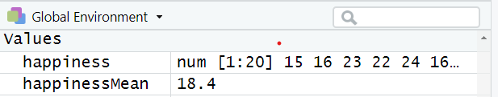

--- 
title: "Advanced Psychological Research Methods (PSY4034)"
author: "Christopher J. Wilson"
date: 'September 2020'
description: This is a handbook for postgraduate research methods courses in the psychology department at Teesside University.
documentclass: book
link-citations: yes
bibliography:
- book.bib
- packages.bib
site: bookdown::bookdown_site
biblio-style: apalike
css: style.css
---

# Welcome to the module

Placeholder


## Module Overview
## Module timetable and delivery for 2020/2021
### Learning and Teaching Strategies
### How will the online sessions work?
## Assessment
### Formative assessment
### Summative Assessments 
### Word limits for assessment
### Submitting work
### A note about referencing
## Statistical analysis software
### Downloading R and R Studio
## Academic Support and Guidance
### Module Team Contact Details
## Considering your thesis

<!--chapter:end:index.Rmd-->


# Research Methods Concepts Revision

Placeholder


## Basic concepts that you should already know
## Probability and hypothesis testing
## Variance in sample data influences our confidence in population estimates
## We can use confidence intervals to make educated guesses about the population mean
## We can also make confidence intervals of differences between means
## The null hypothesis and statistical significance

<!--chapter:end:01_Research_Methods_Revision.Rmd-->


# Introduction to R and R Studio

Placeholder


## By the end of this section, you should be able to:
## Why learn / use R?
### Some information about R
### Moving from other software to R
## R has many advantages
## Download R and R Studio
## The R Studio environment
## Working with a script
## Installing and loading packages

<!--chapter:end:02_introductiontoR.Rmd-->


# Working with data in R

<iframe src="https://teesside.hosted.panopto.com/Panopto/Pages/Embed.aspx?id=a31933a2-be52-407e-a459-ac2b00e2844f&autoplay=false&offerviewer=true&showtitle=true&showbrand=false&start=0&interactivity=all" height="405" width="720" style="border: 1px solid #464646;" allowfullscreen allow="autoplay"></iframe>

## By the end of this section, you will be able to:
- Import data into R from excel, SPSS and csv files
- Save data to objects
- Identify different data structures and variable types
- Convert variables from one type to another
- Order, filter and group data
- Summarise data
- Create new variables from data


## In this section, we will use the Tidyverse set of packages

-	A ‘toolkit’ of packages that are very useful for organsing and manipulating data
- We will use the haven package to import SPSS files
- We will use the dplyr to organise data
- Also includes the ggplot2 and tidyR packages which we will use later

To install: 

    install.packages(“tidyverse”)

(See the previous section on installing packages)

## Import data into R from excel, SPSS and csv files

We can import data from a range of sources using the **Import Dataset** button in the **Environment** tab:


It is also possible to import data using code, for example:


```{r eval=F}
 # importing a .csv file
    
    library(readr)
    studentData <- read_csv("Datasets/studentData.csv")


    #importing an SPSS file
    
    library(haven)
    mySPSSData <- read_sav("Datasets/salesData.sav")
```

   

Once the data are imported, it will be visible in the environment: 


## Understanding objects in R

In R, an **object** is anything that is saved to memory. For example, we might do some analysis:

```{r eval=F}

    mean(happiness)
```


  
     
However, in the example above, the result would appear in the console but not be saved anywhere. To store the result for reuse later, we save it to an object: 

```{r eval=F}
happinessMean <- mean(happiness)
```


    


In the above code (reading left to right):

- We name the object "happinessMean". This name can be anything we want.
- The arrow means that the result of the code on the right will be saved to the object on the left.
- The code on the right of the arrow calculates the mean of *happiness* data   
    
When this code is run, *happinessMean* will be stored in the environment window:



To recall an object from the environment, we can simply type its name. For example:


```{r eval=T, echo=T}
 happinessMean
```
 
    


> Its important to note that anything can be stored as an object in R and recalled later. This includes, dataframes, the results of statistical calculations, plots etc.

## Identify different data structures and variable types

### Data structures

There are many different types of data that R can work with. The most common type of data for most people tends to be a **dataframe**. A **dataframe** is what you might consider a "normal" 2-dimensional dataset, with rows of data and columns of variables:


R can also use other data types.

A vector is a one-dimensional set of values:

```{r}
# a vector example

scores <- c(1,4,6,8,3,4,6,7)

```

A matrix is a multi-dimensional set of values. The below example is a 3-dimensional matrix, there are 2 groups of 2 rows and 3 columns:

```{r echo=F}
#  a matrix example

myMatrix <-array(1:12,dim=c(2,3,2))

myMatrix
```

> We will primarily work with dataframes (and sometimes vectors), as this is how the data in psychology research is usually structured.

### Variable types

With numerical data, there are 4 key data types:

- Nominal (a category, group or factor)
- Ordinal (a ranking)
- Interval (scale data that can include negative values)
- Ratio (scale data that cannot include negative values)


R can use all of these variable types:


- **Nominal** variables are called **factors**
- **Ordinal** variables are called **ordered factors**
- **Interval and ratio** variables are called **numeric** data and can sometimes be called integers (if they are only whole numbers) or doubles (if they all have decimal points)

R can also use other data types such as text (**character**) data.

### Convert variables from one type to another

When we first import data into R, it might not recognise the data types correctly. For example, in the below data, we can see the **intervention** variable :

```{r echo=F}
# happinessSample$intervention <- as.numeric(happinessSample$intervention)
happinessSample %>% arrange(by = happiness) %>% head(10)
```
In the **intervention** variable, the numbers 1 and 2 refer to different intervention groups. Therefore, the variable is a **factor** variable. To ensure that R understands this, we can resave the intervention variable as a factor using the *as.factor()* function:

```{r}
happinessSample$intervention <- as.factor(happinessSample$intervention)
```


## Working with dataframes

Dataframes are the more standard data format that were are used to (think of how a dataset looks in SPSS or Excel).

In a dataframe, variables are columns and each row usually reperesents one measurement or one participant.

### View dataframe

To view a dataframe, we can click on it in the environment window and it will display:


### Refer to variables (columns) in a dataframe

Columns in a dataframe are accessed using the "$" sign. For example, to access the *happiness* column in the *happinessSample* dataframe, we would type:

```{r}
happinessSample$happiness

```

As we can see above, the result is then displayed.

## Order, filter and group data

If you have the **tidyverse** package loaded, it is easy to organise and filter data.


```{r arrange data}

arrange(happinessSample, happiness)
arrange(happinessSample, desc(happiness)) # Arrange in descending order
```

- Show clients with a happiness score of less than 4

```{r filter data}

filter(happinessSample, happiness < 4)
```

- Show Intervention group 2 with happiness scores above 7

```{r filter data 2}

filter(happinessSample, happiness > 7 & intervention == 2)
```

- Group by intervention and show the mean happiness score

```{r}
happinessSample %>% group_by(intervention) %>% summarise(mean = mean(happiness))
```


## Create new variables from data

To create new variables from data, we can use the **mutate()** function.

For example, let's say we wanted to calculate the difference between each person's happiness score and the mean happiness score.

We could do the following:

```{r}
happinessSample %>% mutate(difference = happiness - mean(happiness))
```


<!--chapter:end:02_workingWithData.Rmd-->


# Exploratory and descriptive analysis with R 

Placeholder


## Working example - record sales data
## Let's make sure our data types are correct #1 {.smaller}
## Measures of central tendency
### Mean {.smaller}
### Trimmed mean {.smaller}
### Median {.smaller}
### Mode {.smaller}
## Measures of dispresion or variance {.smaller}
### Range  {.smaller}
### Interquartile range {.smaller}
### Variance {.smaller}
### Standard deviation {.smaller}
## Skewness and Kurtosis {.smaller}
### Assessing skewness of distribution #1
### Assessing skewness of distribution #2 {.smaller}
### Kurtosis {.smaller}
### Assessing normality of distribution {.smaller}
## Getting and overall summary {.smaller}
### summary() - in "base R" {.smaller}
### describe() - in the "psych" package #1 {.smaller}
### describe() - in the "psych" package #2 {.smaller}
## Basic statistical tests (more detail in later sections)
### Corrleation {.smaller}
### Tests of difference - t-test {.smaller}
### Tests of difference - ANOVA {.smaller}

<!--chapter:end:03_descriptives.Rmd-->


# Graphing and data visualisation with R

Placeholder


## Presenting data visually
## By the end of this section, you will be able to:
## The "grammar of visualisation"
## How to code a graph
## The graph output
## Changing the geoms leads to different visualisations
## It is possible to represent more variables on the plot
## It is possible to represent more variables on the plot #2
## It is possible to represent more variables on the plot #3
## Plotting summaries of data
## Changing the axis labels and title on a plot
## Changing the legend on a plot
## Storing plots to be recalled later
## Create plot and store it as "myPlot" object
## Recalling a stored plot
## Saving plots # 1
## Plots can also be saved using code

<!--chapter:end:04_graphing.Rmd-->


# Correlation

Placeholder


## What is Correlation?
## How is correlation calculated?
## Running correlation in R
### Check assumptions: data
### Check assumptions: distribution 
### Check assumptions: distribution #2
### Checking assumptions: linearity
### Run correlation
### Check r Value (correlation value)
### Check the significance of the correlation
## What is regression?
## How is regression calculated?
## The regression equation 
## Running regression in R
## Run regression
## What are residuals?
## Check assumptions: distribution
## Check assumptions: linearity
## Check assumptions: Homogeneity of Variance #1
## Check assumptions: Influential cases 
## Check the r squared value
## Check model significance
## Check coefficient values 
## The regression equation
## Accounting for error in predictions

<!--chapter:end:05_correlation.Rmd-->


# Multiple Regression

Placeholder


## By the end of this session, you will be able to:
## What is multiple regression?
## What are the assumptions of Multiple Regression?
## What is multicollinearity?
## Testing multicollinearity  
## Sample size for multiple regression
## Approaches to multiple regression: All predictors at once
### Using categorical predictors in R
### Reviewing the output
### All predictors at once (testing interactions)
### Hierarchical multiple regression: Theory driven "blocks" of variables
### Stepwise multiple regression: computational selection of predictors
### Stepwise multiple regression: loading the MASS package and run the full model
### Stepwise multiple regression: Use stepAIC( ) with options
### Stepwise multiple regression: Display the best model
## Using regression with categorical predictors (more information) {#catreg}
### ANOVA Approach
### Regression approach
### Interpreting regression output

<!--chapter:end:06_MultipleRegression.Rmd-->


# Mediation analysis

Placeholder


## Overview
## What is mediation?
## What is moderation?
## Why different models?
## Mediation analysis
### What is a mediation design?
### What is mediation analysis?
### What packages do we need?
## Mediation analysis (the Baron and Kenny Approach)
### Conducting mediation analysis (the Baron and Kenny Approach)
### Step 1: Total Effect
### Step 2: Path A (X on M)
### Step 3: Path B (M on Y, controlling for X)
### Step 4: Reversed Path C (Y on X, controlling for M)
### Viewing output
### Interpreting Baron and Kenny approach
### Running the Sobel test
## Mediation analysis (the Mediation package)
### Preacher & Hayes (2004) mediation approach
### What is bootstrapping?
### Mediation example
### Step 1: Run the models 
### Step 2: Check assumptions
### Step 3.1: Run the mediation analysis on the models
### Step 3.2: Plot the mediation analysis of the models
### Step 4: Bootstrap the mediation model
## References

<!--chapter:end:07_Mediation.Rmd-->


# Moderation analysis

Placeholder


## Overview
## What is moderation?
## What packages do we need?
## What is moderation?
## Moderation: step-by-step
### Step 1: Grand Mean Centering
### Step 2: Check assumptions
### Step 3: Moderation Analysis
#### Visualising the moderation effect
### Step 4: Bootstrapping

<!--chapter:end:08_Moderation.Rmd-->

