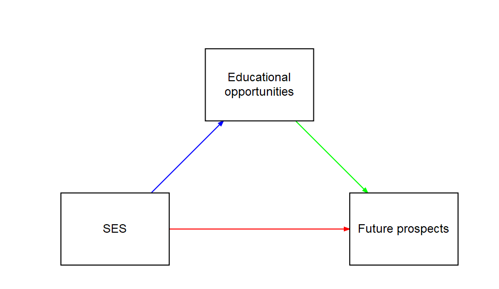
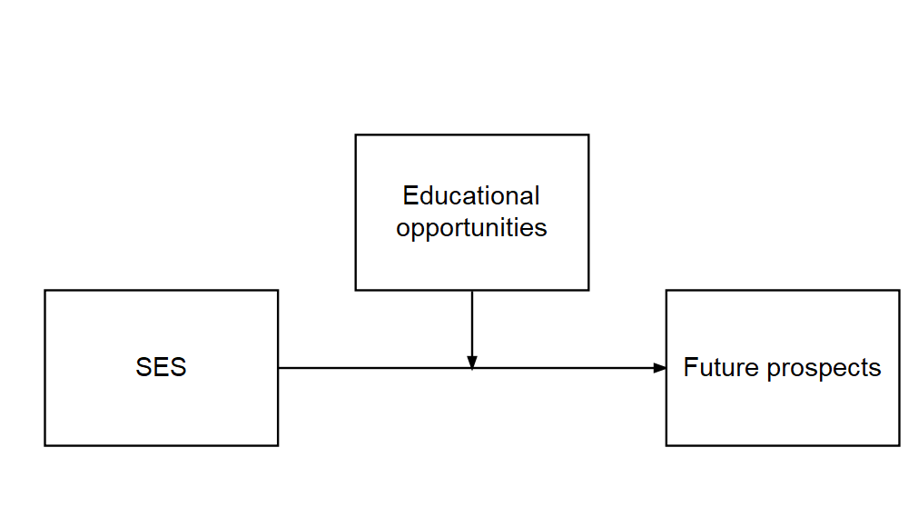
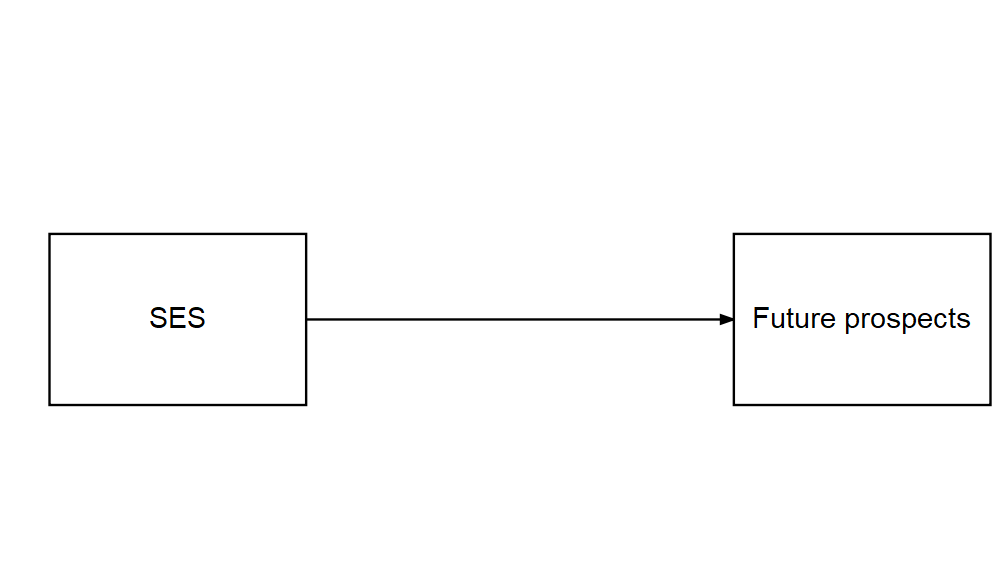
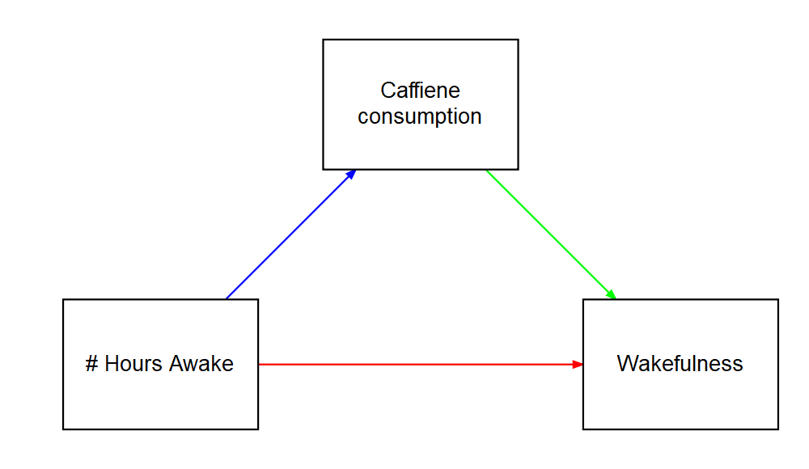
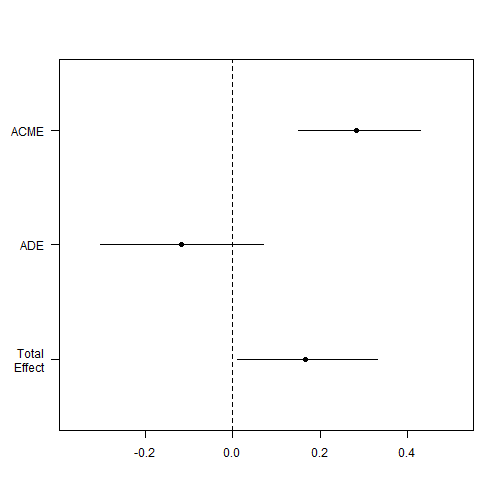
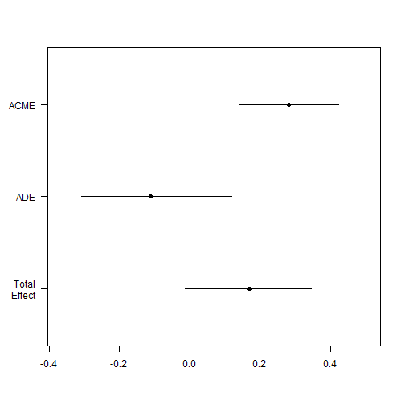

If you have any questions before we start, ask them in the chat or raise your hand.
========================================================
author: Christopher Wilson
height:1080
width:1920
css: custom.css

Mediation Analysis
========================================================
type: section

Overview
========================================================

- What are mediation and moderation?
- Mediation analysis example
- Packages needed
- Baron and Kenny approach in R
- Mediation package approach in R

What are mediation and moderation?
========================================================
type: section


What is mediation?
========================================================
Where the relationship between a predictor (X) and an outcome (Y) is mediated by another variable (M). 


In the above model, we theorise that socio-economic status predicts education level, which predicts future prospects.


What is moderation?
======

There is a direct relationship between X and Y but it is affected by a moderator (M)


In the above model, we theorise that socio-economic status predicts future prospects but the strength of the relationship is changed by education level


Why different models?
======




This might be more appropriate if higher education costs money


Why different models?
======




This might be more appopriate if access to higher education is free 


Mediation analysis
========================================================
type: section


What is a mediation design?
======

Whether a mediation analysis is approprite is determined as much by the design as by statistical criteria.


We must consider whether it makes sense to predict this relationship between variables


What is mediation analysis?
========================================================

- Based on regression

A summary of the logic of mediation:

- The direct relationship between X and Y should be significant
- The relationship between X and M should be significant
- The relationship between M and Y (controlling for X) should be significant
- When controlling for M, the strength of the relationship between X and Y decreases and is **not** significant

What is mediation analysis?
======



***

- The direct relationship between X and Y should be significant
- <span style="color: blue;"> The relationship between X and M should be significant </span>
- <span style="color: green;"> The relationship between M and Y (controlling for X) should be significant </span>
- <span style="color: red;"> When controlling for M, the strength of the relationship between X and Y decreases and is **not** significant </span>

> Baron & Kenny (1986) originally used a 4-step regression model to test each of these relationships.


What packages do we need?
======

    library(mediation) #Mediation package
    library(multilevel) #Sobel Test
    library(bda) #Another Sobel Test option
    library(gvlma) #Testing Model Assumptions 
    library(stargazer) #Handy regression tables
    
    
Mediation analysis (the Baron and Kenny Approach)
========================================================
type: section


Conducting mediation analysis (the Baron and Kenny Approach)
======
- Baron & Kenny (1986) originally used a 4-step regression model to test each of these relationships.
- The sobel test is then used to test the significance of mediation


Step 1: Total Effect
======

```r
#1. Total Effect
fit <- lm(Y ~ X, data=Meddata)
summary(fit)
```

```

Call:
lm(formula = Y ~ X, data = Meddata)

Residuals:
    Min      1Q  Median      3Q     Max 
-10.917  -3.738  -0.259   2.910  12.540 

Coefficients:
            Estimate Std. Error t value Pr(>|t|)  
(Intercept) 19.88368   14.26371   1.394   0.1665  
X            0.16899    0.08116   2.082   0.0399 *
---
Signif. codes:  0 '***' 0.001 '**' 0.01 '*' 0.05 '.' 0.1 ' ' 1

Residual standard error: 5.16 on 98 degrees of freedom
Multiple R-squared:  0.04237,	Adjusted R-squared:  0.0326 
F-statistic: 4.336 on 1 and 98 DF,  p-value: 0.03993
```

Step 2: 
======


```r
#2. Path A (X on M)
fita <- lm(M ~ X, data=Meddata)
summary(fita)
```

```

Call:
lm(formula = M ~ X, data = Meddata)

Residuals:
    Min      1Q  Median      3Q     Max 
-9.5367 -3.4175 -0.4375  2.9032 16.4520 

Coefficients:
            Estimate Std. Error t value Pr(>|t|)    
(Intercept)  6.04494   13.41692   0.451    0.653    
X            0.66252    0.07634   8.678 8.87e-14 ***
---
Signif. codes:  0 '***' 0.001 '**' 0.01 '*' 0.05 '.' 0.1 ' ' 1

Residual standard error: 4.854 on 98 degrees of freedom
Multiple R-squared:  0.4346,	Adjusted R-squared:  0.4288 
F-statistic: 75.31 on 1 and 98 DF,  p-value: 8.872e-14
```

Step 3: 
======


```r
#3. Path B (M on Y, controlling for X)
fitb <- lm(Y ~ M + X, data=Meddata)
summary(fitb)
```

```

Call:
lm(formula = Y ~ M + X, data = Meddata)

Residuals:
    Min      1Q  Median      3Q     Max 
-9.3651 -3.3037 -0.6222  3.1068 10.3991 

Coefficients:
            Estimate Std. Error t value Pr(>|t|)    
(Intercept) 17.32177   13.16216   1.316    0.191    
M            0.42381    0.09899   4.281 4.37e-05 ***
X           -0.11179    0.09949  -1.124    0.264    
---
Signif. codes:  0 '***' 0.001 '**' 0.01 '*' 0.05 '.' 0.1 ' ' 1

Residual standard error: 4.756 on 97 degrees of freedom
Multiple R-squared:  0.1946,	Adjusted R-squared:  0.1779 
F-statistic: 11.72 on 2 and 97 DF,  p-value: 2.771e-05
```

Step 4: 
======

```r
#4. Reversed Path C (Y on X, controlling for M)
fitc <- lm(X ~ Y + M, data=Meddata)
summary(fitc)
```

```

Call:
lm(formula = X ~ Y + M, data = Meddata)

Residuals:
    Min      1Q  Median      3Q     Max 
-14.438  -2.573  -0.030   3.010  11.779 

Coefficients:
            Estimate Std. Error t value Pr(>|t|)    
(Intercept) 96.11234    9.27663  10.361  < 2e-16 ***
Y           -0.11493    0.10229  -1.124    0.264    
M            0.69619    0.08356   8.332 5.27e-13 ***
---
Signif. codes:  0 '***' 0.001 '**' 0.01 '*' 0.05 '.' 0.1 ' ' 1

Residual standard error: 4.823 on 97 degrees of freedom
Multiple R-squared:  0.4418,	Adjusted R-squared:  0.4303 
F-statistic: 38.39 on 2 and 97 DF,  p-value: 5.233e-13
```

Viewing output
======


    Summary Table
    stargazer(fit, fita, fitb, fitc, type = "text", title = "Baron and Kenny Method")


Interpreting Baron and Kenny approach
======

A reminder of the logic of mediation:

- The direct relationship between X and Y should be significant
- The relationship between X and M should be significant
- The relationship between M and Y (controlling for X) should be significant
- When controlling for M, the strength of the relationship between X and Y decreases and is **not** significant

Running the Sobel test
=====

- The Sobel test checks the singificance of indirect effects


```r
#Sobel Test
library(multilevel)
sobel(Meddata$X, Meddata$M, Meddata$Y)
```

```
$`Mod1: Y~X`
              Estimate Std. Error  t value   Pr(>|t|)
(Intercept) 19.8836805 14.2637142 1.394004 0.16646905
pred         0.1689931  0.0811601 2.082220 0.03992761

$`Mod2: Y~X+M`
              Estimate  Std. Error   t value     Pr(>|t|)
(Intercept) 17.3217682 13.16215851  1.316028 1.912663e-01
pred        -0.1117904  0.09949262 -1.123605 2.639537e-01
med          0.4238113  0.09899469  4.281152 4.371472e-05

$`Mod3: M~X`
             Estimate  Std. Error   t value     Pr(>|t|)
(Intercept) 6.0449365 13.41692114 0.4505457 6.533122e-01
pred        0.6625203  0.07634187 8.6783345 8.871741e-14

$Indirect.Effect
[1] 0.2807836

$SE
[1] 0.07313234

$z.value
[1] 3.83939

$N
[1] 100
```

Mediation analysis (the Mediation package)
========================================================
type: section


Preacer & Hayes (2004) mediation approach
======
- Mediation package in R uses the  Preacher & Hayes (2004) bootstrapping approach
- They argue that few people test the signficance of the indirect effect

>> "Baron and Kenny simply state that perfect mediation has occurred if c' becomes nonsignificant after controlling for
M, so researchers have focused on that requirement." (Preacer & Hayes, 2004, p. 719)

- Sobel test has low power (requires larger sample sizes)
- Sobel test assumes normality (often violated)


What is bootstrapping?
======
>> "Bootstrapping is a nonparametric approach to effect-size estimation and hypothesis testing that makes no assumptions about the shape of the distributions of the variables or the sampling distribution of the statistic" (Preacer & Hayes, 2004, p. 722)

- Bootstrapping takes a large number of samples from our data and runs the analysis on each of these samples
- The sampling is done randomly with replacement, and each sample in the bootstrap is the same size as our dataset

- Using this method, we can create estimates with that fall within a narrower confidence interval (since we have now run the analysis on 100's of samples)
- Bootstrapping overcomes concerns about the distribution of our original dataset


Mediation example
======

Is the relationship between *No of hours awake* and *wakefulness* mediated by *caffiene consumption*?

>  This example is from  Demos & Salas (2019). *A Language, not a Letter: Learning Statistics in R* (Chapter 14)



Step 1: Run the models 
======


```r
#Mediate package
library(mediation)

fitM <- lm(M ~ X,     data=Meddata) #IV on M; Hours since waking predicting coffee consumption
fitY <- lm(Y ~ X + M, data=Meddata) #IV and M on DV; Hours since dawn and coffee predicting wakefulness
```

Step 2: Check assumptions
======


```r
gvlma(fitM) 
```

```

Call:
lm(formula = M ~ X, data = Meddata)

Coefficients:
(Intercept)            X  
     6.0449       0.6625  


ASSESSMENT OF THE LINEAR MODEL ASSUMPTIONS
USING THE GLOBAL TEST ON 4 DEGREES-OF-FREEDOM:
Level of Significance =  0.05 

Call:
 gvlma(x = fitM) 

                   Value p-value                   Decision
Global Stat        8.833 0.06542    Assumptions acceptable.
Skewness           6.314 0.01198 Assumptions NOT satisfied!
Kurtosis           1.219 0.26949    Assumptions acceptable.
Link Function      1.076 0.29959    Assumptions acceptable.
Heteroscedasticity 0.223 0.63674    Assumptions acceptable.
```

```r
# We can see that the data is positively skewed. We might need to transform the data (we will discuss this another time).

gvlma(fitY)
```

```

Call:
lm(formula = Y ~ X + M, data = Meddata)

Coefficients:
(Intercept)            X            M  
    17.3218      -0.1118       0.4238  


ASSESSMENT OF THE LINEAR MODEL ASSUMPTIONS
USING THE GLOBAL TEST ON 4 DEGREES-OF-FREEDOM:
Level of Significance =  0.05 

Call:
 gvlma(x = fitY) 

                     Value p-value                Decision
Global Stat        3.41844  0.4904 Assumptions acceptable.
Skewness           1.85648  0.1730 Assumptions acceptable.
Kurtosis           0.77788  0.3778 Assumptions acceptable.
Link Function      0.71512  0.3977 Assumptions acceptable.
Heteroscedasticity 0.06896  0.7929 Assumptions acceptable.
```


Step 3.1: Run the mediation analysis on the models
======

The mediate function gives us:  
- Average Causal Mediation Effects (ACME)
- Average Direct Effects (ADE) 
- combined indirect and direct effects (Total Effect) 
- the ratio of these estimates (Prop. Mediated). 

The ACME here is the indirect effect of M (total effect - direct effect) and thus this value tells us if our mediation effect is significant.


```r
fitMed <- mediate(fitM, fitY, treat="X", mediator="M")
summary(fitMed)
```

```

Causal Mediation Analysis 

Quasi-Bayesian Confidence Intervals

               Estimate 95% CI Lower 95% CI Upper p-value    
ACME             0.2835       0.1517         0.43  <2e-16 ***
ADE             -0.1167      -0.3013         0.07    0.22    
Total Effect     0.1668       0.0113         0.33    0.04 *  
Prop. Mediated   1.6739       0.5929         9.22    0.04 *  
---
Signif. codes:  0 '***' 0.001 '**' 0.01 '*' 0.05 '.' 0.1 ' ' 1

Sample Size Used: 100 


Simulations: 1000 
```

Step 3.2: Plot the mediation analysis of the models
======

The plot below reiterates what was on the previous slide:

- The confidence intervals of Total Effect and ACME are significant
- The confidence interval of ADE is not significant

> **Translation:**
> - Total effect is signficant: there is a relationship between X and Y (direct and indirect)
> - ADE is not significant: the relationship between X and Y is not direct
> - ACME is significant: the relationship between X and Y is mediated by M


```r
plot(fitMed)
```



Step 4: Bootstrap the mediation model
======

The plot below changes our interpretation slightly:

- The confidence interval ACME is significant
- The confidence interval of Total Effect and ADE are not significant

> **Translation:**
> - Total effect is not signficant: the relationship between X and Y is not significant when we combine direct and indirect effects
> - ADE is not significant: the relationship between X and Y is not direct
> - ACME is significant: the relationship between X and Y is mediated by M


```r
fitMedBoot <- mediate(fitM, fitY, boot=TRUE, sims=999, treat="X", mediator="M")
summary(fitMedBoot)
```

```

Causal Mediation Analysis 

Nonparametric Bootstrap Confidence Intervals with the Percentile Method

               Estimate 95% CI Lower 95% CI Upper p-value    
ACME             0.2808       0.1409         0.42  <2e-16 ***
ADE             -0.1118      -0.3080         0.12    0.31    
Total Effect     0.1690      -0.0123         0.34    0.07 .  
Prop. Mediated   1.6615      -3.7235        11.33    0.07 .  
---
Signif. codes:  0 '***' 0.001 '**' 0.01 '*' 0.05 '.' 0.1 ' ' 1

Sample Size Used: 100 


Simulations: 999 
```

```r
plot(fitMedBoot) ##
```



Summary
========================================================

- What are mediation and moderation?
- Mediation analysis example
- Packages needed
- Baron and Kenny approach in R
- Mediation package approach in R

References
======
Demos & Salas (2019). *A Language, not a Letter: Learning Statistics in R* (Chapter 14). https://ademos.people.uic.edu/ Accessed Jan 2020.

Preacher, K. J., & Hayes, A. F. (2004). SPSS and SAS procedures for estimating indirect effects in simple mediation models. Behavior research methods, instruments, & computers, 36(4), 717-731.


