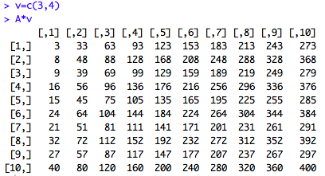

Importing and working with data in RStudio
========================================================
author: Dr Christopher Wilson
date: 2020
autosize: true
width:1290
height: 1080
css: custom.css

By the end of this section, you will be able to:
=======
- Import data into R from excel, SPSS and csv files
- Identify different data structures and variable types
- Convert variables from one type to another
- Order, filter and group data
- Summarise data
- Create new variables from data

The *Tidyverse* set of packages
=======
- A 'toolkit' of packages that are very useful for organsing and manipulating data
- We will use the *haven* package to import SPSS files
- We will use the *dplyr* to organise data
- Also includes the *ggplot2* and *tidyR* packages which we will use later

To install:
    
    install.packages("tidyverse")


Importing .csv data into R 
======

- Can use typed commands or the menu:

```r
library(readr)
studentData <- read_csv("Datasets/studentData.csv")
```


Importing SPSS data files into R
======

    library(haven)
    mySPSSData <- read_sav("mySPSSFile.sav")


R can store many different data types
======

- Vectors: One-dimensional 
- Data frames: Two-dimensional
- Matrices: Two-dimensional
- Arrays, Lists etc...

A data matrix:


The data frame
======

- A data frame is like a table or a two-dimensional array or matrix
- Each column contains values of one variable
- Each row contains one set of values 
- Each column name must be unique


```r
# view the first few rows of this dataframe
head(studentData) 
```

```
# A tibble: 6 x 6
     X1 route    grades hoursOfStudy hasDepdendants satisfactionLevel
  <dbl> <chr>     <dbl>        <dbl> <chr>          <chr>            
1     1 FullTime     56            3 Yes            Very             
2     2 FullTime     47            1 Yes            Not at all       
3     3 FullTime     72            8 Yes            Not at all       
4     4 FullTime     79            0 Yes            Very             
5     5 FullTime     79            4 Yes            Somewhat         
6     6 FullTime     80            3 Yes            Somewhat         
```


Checking the structure of the data
======

- The __str()__ command will allow us to check how our data is structured:


```r
str(studentData)
```

```
tibble [100 x 6] (S3: spec_tbl_df/tbl_df/tbl/data.frame)
 $ X1               : num [1:100] 1 2 3 4 5 6 7 8 9 10 ...
 $ route            : chr [1:100] "FullTime" "FullTime" "FullTime" "FullTime" ...
 $ grades           : num [1:100] 56 47 72 79 79 80 76 39 85 41 ...
 $ hoursOfStudy     : num [1:100] 3 1 8 0 4 3 1 6 2 5 ...
 $ hasDepdendants   : chr [1:100] "Yes" "Yes" "Yes" "Yes" ...
 $ satisfactionLevel: chr [1:100] "Very" "Not at all" "Not at all" "Very" ...
 - attr(*, "spec")=
  .. cols(
  ..   X1 = col_double(),
  ..   route = col_character(),
  ..   grades = col_double(),
  ..   hoursOfStudy = col_double(),
  ..   hasDepdendants = col_character(),
  ..   satisfactionLevel = col_character()
  .. )
```
Notice that some of the variable types are incorrect

Changing variables from one data type to another {.smaller}
======


```r
studentData$route <- as.factor(studentData$route)
studentData$hasDepdendants <- as.factor(studentData$hasDepdendants)
studentData$satisfactionLevel <- as.ordered(studentData$satisfactionLevel)
```

Changing variables from one data type to another #2 
======

Let's check the structure again: 


```r
str(studentData)
```

```
tibble [100 x 6] (S3: spec_tbl_df/tbl_df/tbl/data.frame)
 $ X1               : num [1:100] 1 2 3 4 5 6 7 8 9 10 ...
 $ route            : Factor w/ 2 levels "FullTime","PartTime": 1 1 1 1 1 1 1 1 1 1 ...
 $ grades           : num [1:100] 56 47 72 79 79 80 76 39 85 41 ...
 $ hoursOfStudy     : num [1:100] 3 1 8 0 4 3 1 6 2 5 ...
 $ hasDepdendants   : Factor w/ 2 levels "No","Yes": 2 2 2 2 2 2 2 2 2 2 ...
 $ satisfactionLevel: Ord.factor w/ 3 levels "Not at all"<"Somewhat"<..: 3 1 1 3 2 2 3 2 1 2 ...
 - attr(*, "spec")=
  .. cols(
  ..   X1 = col_double(),
  ..   route = col_character(),
  ..   grades = col_double(),
  ..   hoursOfStudy = col_double(),
  ..   hasDepdendants = col_character(),
  ..   satisfactionLevel = col_character()
  .. )
```

```r
str(studentData$satisfactionLevel)
```

```
 Ord.factor w/ 3 levels "Not at all"<"Somewhat"<..: 3 1 1 3 2 2 3 2 1 2 ...
```

Changing variables from one data type to another #3 
======

Let's give a proper name to the row ID:

```r
library(dplyr) # Loading the dplyr library
#Overwriting studentData with a new version, where the ID column has been correctly named
studentData <- studentData %>% rename(ID = X1) 
head(studentData) # viewingthe first 5 rows of the data
```

```
# A tibble: 6 x 6
     ID route    grades hoursOfStudy hasDepdendants satisfactionLevel
  <dbl> <fct>     <dbl>        <dbl> <fct>          <ord>            
1     1 FullTime     56            3 Yes            Very             
2     2 FullTime     47            1 Yes            Not at all       
3     3 FullTime     72            8 Yes            Not at all       
4     4 FullTime     79            0 Yes            Very             
5     5 FullTime     79            4 Yes            Somewhat         
6     6 FullTime     80            3 Yes            Somewhat         
```

Sorting data 
======

- Using the *dplyr* package, we can arrange our data according to student grade:


```r
library(dplyr)
arrange(studentData, grades)
```

```
# A tibble: 100 x 6
      ID route    grades hoursOfStudy hasDepdendants satisfactionLevel
   <dbl> <fct>     <dbl>        <dbl> <fct>          <ord>            
 1    64 PartTime     35            7 No             Somewhat         
 2    93 PartTime     36            8 No             Somewhat         
 3    25 FullTime     37            7 Yes            Not at all       
 4    39 FullTime     37            2 Yes            Somewhat         
 5    46 FullTime     37            6 Yes            Very             
 6    61 PartTime     38            2 No             Somewhat         
 7     8 FullTime     39            6 Yes            Somewhat         
 8    31 FullTime     39            4 Yes            Somewhat         
 9    58 PartTime     39            7 No             Very             
10    67 PartTime     40            6 No             Not at all       
# ... with 90 more rows
```

```r
arrange(studentData, desc(grades)) # Arrange in descending order
```

```
# A tibble: 100 x 6
      ID route    grades hoursOfStudy hasDepdendants satisfactionLevel
   <dbl> <fct>     <dbl>        <dbl> <fct>          <ord>            
 1     9 FullTime     85            2 Yes            Not at all       
 2    43 FullTime     85            0 Yes            Somewhat         
 3    59 PartTime     85            4 No             Very             
 4    76 PartTime     83            6 No             Not at all       
 5    48 FullTime     82            6 Yes            Not at all       
 6    68 PartTime     82            6 No             Very             
 7    71 PartTime     82            4 No             Somewhat         
 8    12 FullTime     81            8 Yes            Not at all       
 9    74 PartTime     81            5 No             Very             
10     6 FullTime     80            3 Yes            Somewhat         
# ... with 90 more rows
```

Filtering data 
======
- Show students who acheived a grade of less than 40%

```r
library(dplyr)
filter(studentData, grades < 40)
```

```
# A tibble: 9 x 6
     ID route    grades hoursOfStudy hasDepdendants satisfactionLevel
  <dbl> <fct>     <dbl>        <dbl> <fct>          <ord>            
1     8 FullTime     39            6 Yes            Somewhat         
2    25 FullTime     37            7 Yes            Not at all       
3    31 FullTime     39            4 Yes            Somewhat         
4    39 FullTime     37            2 Yes            Somewhat         
5    46 FullTime     37            6 Yes            Very             
6    58 PartTime     39            7 No             Very             
7    61 PartTime     38            2 No             Somewhat         
8    64 PartTime     35            7 No             Somewhat         
9    93 PartTime     36            8 No             Somewhat         
```
Filtering data #2 
======

- Show part-time students who scored above 70%

```r
library(dplyr)
filter(studentData, grades > 70 & route == "PartTime")
```

```
# A tibble: 17 x 6
      ID route    grades hoursOfStudy hasDepdendants satisfactionLevel
   <dbl> <fct>     <dbl>        <dbl> <fct>          <ord>            
 1    52 PartTime     72            4 No             Very             
 2    59 PartTime     85            4 No             Very             
 3    60 PartTime     73            2 No             Very             
 4    62 PartTime     80            0 No             Somewhat         
 5    68 PartTime     82            6 No             Very             
 6    69 PartTime     74            7 No             Very             
 7    71 PartTime     82            4 No             Somewhat         
 8    73 PartTime     75            8 No             Very             
 9    74 PartTime     81            5 No             Very             
10    75 PartTime     75            1 No             Very             
11    76 PartTime     83            6 No             Not at all       
12    78 PartTime     77            0 No             Very             
13    81 PartTime     77            7 No             Somewhat         
14    87 PartTime     75            1 No             Somewhat         
15    88 PartTime     71            1 No             Not at all       
16    97 PartTime     80            5 No             Somewhat         
17    98 PartTime     76            5 No             Somewhat         
```
Using the "pipe" %>% with dplyr 
======

- The pipe %>% allows us to:
    - write R commands in a way that is easier to read 
    - Chain multiple commands together
- For example:
   
        filteredData <- studentData %>% filter(grades > 70 & route == "PartTime")

Grouping data
======
- It is possible to organise the data into groups and performe analysis on each group:

```r
library(dplyr)

 studentData %>% group_by(hasDepdendants) %>% 
   summarise(mean = mean(grades), sd = sd(grades))
```

```
# A tibble: 2 x 3
  hasDepdendants  mean    sd
  <fct>          <dbl> <dbl>
1 No              62.4  14.3
2 Yes             62.3  14.8
```

Remember: we can store that summary data as an object and call it later:
======


```r
library(dplyr)

summaryTable <- studentData %>% group_by(hasDepdendants) %>% 
  summarise(mean = mean(grades), sd = sd(grades))

summaryTable
```

```
# A tibble: 2 x 3
  hasDepdendants  mean    sd
  <fct>          <dbl> <dbl>
1 No              62.4  14.3
2 Yes             62.3  14.8
```

Create new variables from data
======

We can create new variables from existing data using __mutuate__

```r
library(dplyr)

studentData %>% mutate(passFail = ifelse(grades > 40, "Pass", "Fail"))
```

```
# A tibble: 100 x 7
      ID route    grades hoursOfStudy hasDepdendants satisfactionLevel passFail
   <dbl> <fct>     <dbl>        <dbl> <fct>          <ord>             <chr>   
 1     1 FullTime     56            3 Yes            Very              Pass    
 2     2 FullTime     47            1 Yes            Not at all        Pass    
 3     3 FullTime     72            8 Yes            Not at all        Pass    
 4     4 FullTime     79            0 Yes            Very              Pass    
 5     5 FullTime     79            4 Yes            Somewhat          Pass    
 6     6 FullTime     80            3 Yes            Somewhat          Pass    
 7     7 FullTime     76            1 Yes            Very              Pass    
 8     8 FullTime     39            6 Yes            Somewhat          Fail    
 9     9 FullTime     85            2 Yes            Not at all        Pass    
10    10 FullTime     41            5 Yes            Somewhat          Pass    
# ... with 90 more rows
```

Importing and Working with data in R -- Tasks:
=======
type: section

Importing and Working with data in R 
======

0. Install the **tidyverse** package. When this has been done, enter the command __library("tidyverse")__
1. Use the __read.sav()__ command to import the __"Datasets/salesData.sav"__ file to a new object called __salesData__
2. Use the __str()__ command to check the structure of __salesData__ . There should be 5 variables: salary, married, numberOfVisits, age & valueOfSales
3. Change the variable __married__ to a factor
4. Arrange the data from lowest to highest __sales__ . What was the lowest __sales__ value?
5. What is the mean __salary__ ?
6. Filter the data to only display customers who are __married__ (1 = married, 2 = not married)
7. Create a summary of the data to compare the mean and standard deviation of __sales__ for married and non-married customers (1 = married, 2 = not married)
8. Create a new variable called __VIP__ and label customers who spent over ?500 as "VIP" and other customers as "Non-VIP"
