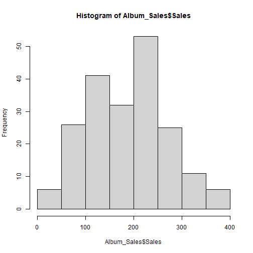

Descriptive Statistics with R
========================================================
author: Dr Christopher Wilson
date: 2020
width:1280
height: 720
css: custom.css


Let's import the data
======


```r
library("tidyverse")
Album_Sales <- read_csv("Datasets/album_sales.csv")
```

Let's look at the data
======


```r
head(Album_Sales)
```

```
# A tibble: 6 x 5
  Adverts Sales Airplay Attract Genre  
    <dbl> <dbl>   <dbl>   <dbl> <chr>  
1    10.3   330      43      10 Country
2   986.    120      28       7 Pop    
3  1446.    360      35       7 HipHop 
4  1188.    270      33       7 HipHop 
5   575.    220      44       5 Metal  
6   569.    170      19       5 Country
```

Let's make sure our data types are correct #1
======

- This variable is currently stored as charcters, not as a factor / category variable


```r
str(Album_Sales$Genre) 
```

```
 chr [1:200] "Country" "Pop" "HipHop" "HipHop" "Metal" "Country" "Pop" ...
```

Let's make sure our data types are correct #2
======

- We can  save it as a factor


```r
Album_Sales$Genre <- as.factor(Album_Sales$Genre)

str(Album_Sales$Genre) 
```

```
 Factor w/ 4 levels "Country","HipHop",..: 1 4 2 2 3 1 4 4 3 2 ...
```

Summarising data: Central tendency
======
type: section

Measures of central tendency
======
The main measures of central tendency are:
- Mean
- Median
- Mode

Mean
======

"What is the mean of album sales?"
  

```r
mean(Album_Sales$Sales)
```

```
[1] 193.2
```

Trimmed mean
======
- The trimmed mean is used to reduce the influence of outliers on the summary


```r
mean(Album_Sales$Sales, trim = 0.05)
```

```
[1] 192.6667
```

Median
=======

"What is the median amount of Airplay?"


```r
median(Album_Sales$Airplay)
```

```
[1] 28
```
Mode
======

"What is the most common attractiveness rating of bands?"

- The easiest way to get the mode in R is to generate a frequency table


```r
table(Album_Sales$Attract)
```

```

 1  2  3  4  5  6  7  8  9 10 
 3  1  1  4 17 44 73 44 12  1 
```
- We can then look for the most frequently occuring response

Measures of dispersion or variance
======
type: section

Range 
======
The range is the difference between the lowest and highest values

- You can calculate it using these values


```r
max(Album_Sales$Airplay) - min(Album_Sales$Airplay)
```

```
[1] 63
```
 - Or you can use the range command to get the min and max values in one go


```r
range(Album_Sales$Airplay)
```

```
[1]  0 63
```

Interquartile range
======
- We know that the median is the "middle" of the data = 50th percentile
- The interquatile range is the difference between the values at the 25th and 75th percentiles

```r
quantile( x = Album_Sales$Airplay, probs = c(.25,.75) )
```

```
  25%   75% 
19.75 36.00 
```

- Interquartile range = 36 - 19.75 = 16.25

Sum of squares
======

- The difference between each value and the mean value, squared, and then summed together


```r
sum( (Album_Sales$Adverts - mean(Album_Sales$Adverts))^2 )
```

```
[1] 46936335
```


Variance
======
- Variance: Sum of sqaures divided by n-1


```r
# variance calculation
varianceAdverts <- sum( (Album_Sales$Adverts - mean(Album_Sales$Adverts))^2 ) / 199
```


Standard deviation
======

- Standard deviation is square root of the variance


```r
# sd calculation


sqrt(varianceAdverts)
```

```
[1] 485.6552
```
- Can be calculated using the sd() command


```r
sd(Album_Sales$Adverts)
```

```
[1] 485.6552
```

The *psych* package includes a lot of useful descriptive stats
======


```r
library("psych")
```

Skewness and Kurtosis
======
type: section

Assessing skewness of distribution #1
======
- It is possible to use graphs to view the distribution
- We will focus on graphic presentation of data next week


```r
hist(Album_Sales$Sales)
```



Assessing skewness of distribution #2
======

- We can check raw skewness value using the *skew()* command in the **psych** package


```r
skew(Album_Sales$Sales)
```

```
[1] 0.0432729
```

Kurtosis
======

| informal term |technical name|   kurtosis value |
|--:|--:|--:|
|"too flat"|platykurtic|   negative|
|  "just pointy enough"|  mesokurtic|  zero|
| "too pointy" |leptokurtic |positive |


```r
kurtosi(Album_Sales$Sales)
```

```
[1] -0.7157339
```

Assessing normality of distribution
====== 
- We can use the shapiro-wilk test of normality
- This is part of "base" r (no package needed)


```r
shapiro.test(Album_Sales$Sales)
```

```

	Shapiro-Wilk normality test

data:  Album_Sales$Sales
W = 0.98479, p-value = 0.02965
```

Getting an overall summary
=======
type: section

summary() - in "base R"
======


```r
summary(Album_Sales)
```

```
    Adverts             Sales          Airplay         Attract     
 Min.   :   9.104   Min.   : 10.0   Min.   : 0.00   Min.   : 1.00  
 1st Qu.: 215.918   1st Qu.:137.5   1st Qu.:19.75   1st Qu.: 6.00  
 Median : 531.916   Median :200.0   Median :28.00   Median : 7.00  
 Mean   : 614.412   Mean   :193.2   Mean   :27.50   Mean   : 6.77  
 3rd Qu.: 911.226   3rd Qu.:250.0   3rd Qu.:36.00   3rd Qu.: 8.00  
 Max.   :2271.860   Max.   :360.0   Max.   :63.00   Max.   :10.00  
     Genre   
 Country:46  
 HipHop :53  
 Metal  :48  
 Pop    :53  
             
             
```


describe() - in the "psych" package #1
======


```r
describe(Album_Sales)
```

```
        vars   n   mean     sd median trimmed    mad  min     max   range  skew
Adverts    1 200 614.41 485.66 531.92  560.81 489.09  9.1 2271.86 2262.76  0.84
Sales      2 200 193.20  80.70 200.00  192.69  88.96 10.0  360.00  350.00  0.04
Airplay    3 200  27.50  12.27  28.00   27.46  11.86  0.0   63.00   63.00  0.06
Attract    4 200   6.77   1.40   7.00    6.88   1.48  1.0   10.00    9.00 -1.27
Genre*     5 200   2.54   1.12   3.00    2.55   1.48  1.0    4.00    3.00 -0.02
        kurtosis    se
Adverts     0.17 34.34
Sales      -0.72  5.71
Airplay    -0.09  0.87
Attract     3.56  0.10
Genre*     -1.37  0.08
```

describe() - in the "psych" package #2
======

- We can describe by factor variables 

```r
describeBy(Album_Sales, group = Album_Sales$Genre)
```

```

 Descriptive statistics by group 
group: Country
        vars  n   mean     sd median trimmed    mad  min     max   range  skew
Adverts    1 46 656.22 507.96 574.14  620.40 581.96  9.1 1985.12 1976.01  0.51
Sales      2 46 201.74  73.64 210.00  200.79  66.72 60.0  360.00  300.00  0.03
Airplay    3 46  29.07  10.53  28.00   28.50  11.12  9.0   54.00   45.00  0.44
Attract    4 46   6.52   1.63   7.00    6.71   1.48  1.0   10.00    9.00 -1.49
Genre*     5 46   1.00   0.00   1.00    1.00   0.00  1.0    1.00    0.00   NaN
        kurtosis    se
Adverts    -0.65 74.89
Sales      -0.52 10.86
Airplay    -0.10  1.55
Attract     3.54  0.24
Genre*       NaN  0.00
------------------------------------------------------------ 
group: HipHop
        vars  n   mean     sd median trimmed    mad   min  max   range  skew
Adverts    1 53 606.32 452.84 601.43  568.33 501.36 10.65 2000 1989.35  0.70
Sales      2 53 199.62  92.71 200.00  200.70 103.78 10.00  360  350.00 -0.10
Airplay    3 53  28.09  13.86  30.00   28.33  14.83  0.00   55   55.00 -0.14
Attract    4 53   6.96   1.13   7.00    7.00   1.48  3.00    9    6.00 -0.80
Genre*     5 53   2.00   0.00   2.00    2.00   0.00  2.00    2    0.00   NaN
        kurtosis    se
Adverts     0.05 62.20
Sales      -0.91 12.74
Airplay    -0.83  1.90
Attract     2.03  0.15
Genre*       NaN  0.00
------------------------------------------------------------ 
group: Metal
        vars  n   mean     sd median trimmed    mad  min     max   range  skew
Adverts    1 48 693.45 534.06  593.0  640.19 521.34 45.3 2271.86 2226.56  0.92
Sales      2 48 197.71  75.18  200.0  198.25  88.96 40.0  340.00  300.00 -0.07
Airplay    3 48  27.96  11.37   27.5   28.00  11.12  2.0   57.00   55.00  0.02
Attract    4 48   6.85   1.34    7.0    6.90   1.48  2.0    9.00    7.00 -0.84
Genre*     5 48   3.00   0.00    3.0    3.00   0.00  3.0    3.00    0.00   NaN
        kurtosis    se
Adverts     0.21 77.08
Sales      -0.94 10.85
Airplay    -0.26  1.64
Attract     1.74  0.19
Genre*       NaN  0.00
------------------------------------------------------------ 
group: Pop
        vars  n   mean     sd median trimmed    mad   min     max   range  skew
Adverts    1 53 514.63 446.04  429.5  453.85 438.01 15.31 1789.66 1774.35  1.01
Sales      2 53 175.28  77.92  160.0  171.86  88.96 40.00  360.00  320.00  0.34
Airplay    3 53  25.13  12.75   26.0   25.02  11.86  1.00   63.00   62.00  0.25
Attract    4 53   6.72   1.47    7.0    6.81   1.48  1.00    9.00    8.00 -1.11
Genre*     5 53   4.00   0.00    4.0    4.00   0.00  4.00    4.00    0.00   NaN
        kurtosis    se
Adverts     0.27 61.27
Sales      -0.67 10.70
Airplay     0.46  1.75
Attract     2.51  0.20
Genre*       NaN  0.00
```


