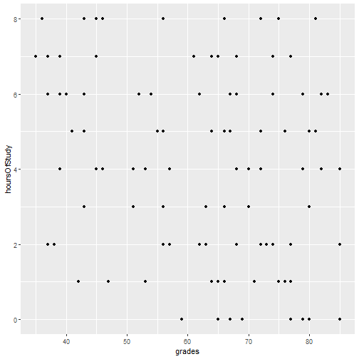
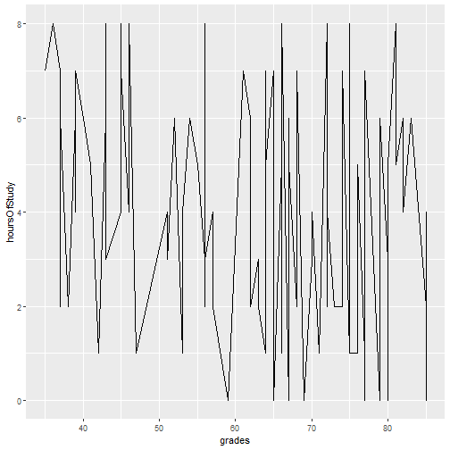
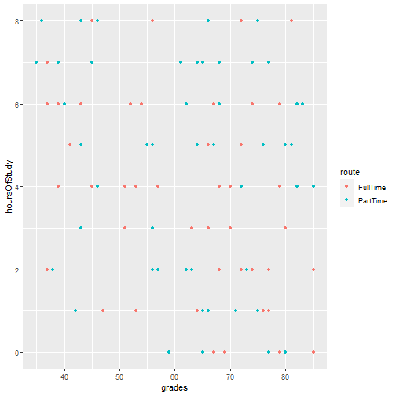
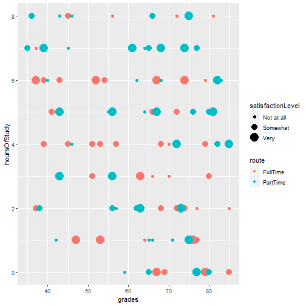
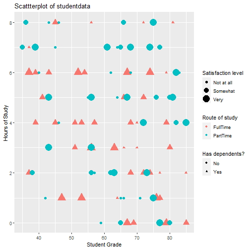

Graphing and data visualisation
========================================================
author: Christopher Wilson
css: custom.css
width: 1280
height: 720

Advanced Psychological Research Methods

<link href="https://fonts.googleapis.com/css?family=Open+Sans" rel="stylesheet">


By the end of this section, you will be able to:
======================================================== 

- Describe the ggplot "grammar of visualisation": coordinates and geoms
- Write a graph function to display multiple variables on a plot
- Amend the titles and legends of a plot
- Save plots in PDF or image formats


The "grammar of visualisation"
========================================================
 
- Graphs are made up of 3 components:
    * A dataset
    * A coordinate system
    * Visual marks to represent data __(geoms)__

The "grammar of visualisation" #2
======================================================== 
 

- In the above example, the dataset is the _studentData_ that we used previously.
- The _grades_ variable is mapped to the X axis
- The _hoursOfStudy_ variable is mapped to the Y axis

How to code a graph
========================================================

- The graph is created using the following code:


- In this code, we specify the dataset, the variables for the X and Y axes and the __geom__ that will represent the data points visually (in this case, each datum is a point)

The graph output
========================================================


```r
library(ggplot2)

ggplot(data=studentData, aes(x=grades,y=hoursOfStudy)) + geom_point()
```




Changing the geoms leads to different visualisations
========================================================

- If we change from points to lines, for example we get a different plot:


```r
library(ggplot2)

ggplot(data=studentData, aes(x=grades,y=hoursOfStudy)) + geom_line()
```




It is possible to represent more variables on the plot
========================================================

- By specifying that colours of our points should be attached to the __route__ variable, the data is now colour-coded


```r
library(ggplot2)

ggplot(data=studentData, aes(x=grades,y=hoursOfStudy)) + geom_point(aes(color = route))
```



It is possible to represent more variables on the plot #2
========================================================
- By specifying that size of our points should be attached to the __satisfactionLevel__ variable, the size of the points adjusts


```r
library(ggplot2)

ggplot(data=studentData, aes(x=grades,y=hoursOfStudy)) + geom_point(aes(color = route, size=satisfactionLevel))
```



It is possible to represent more variables on the plot #3
========================================================

- By specifying that shape of our points should be attached to the __hasDependents__ variable, the shape of the points changes accordingly


```r
library(ggplot2)

ggplot(data=studentData, aes(x=grades,y=hoursOfStudy)) + geom_point(aes(color = route, size=satisfactionLevel, shape=hasDepdendants))
```


Changing the axis labels and title on a plot
========================================================
We can change the axis labels and title using the __labs()__ command:

labs(x="Student Grade", y="Hours of Study", title = "Scattterplot of student data")


```r
library(ggplot2)

ggplot(data=studentData, aes(x=grades,y=hoursOfStudy)) + geom_point(aes(color = route, size=satisfactionLevel, shape=hasDepdendants)) + labs(x="Student Grade", y="Hours of Study", title = "Scattterplot of studentdata")
```


Changing the legend on a plot
========================================================

To change the legend, we use the __labs()__ command too, and reference the relevant property (e.g. size, shape, colour)


```r
library(ggplot2)

  ggplot(data=studentData, aes(x=grades,y=hoursOfStudy)) + 
    geom_point(aes(color = route, size=satisfactionLevel, shape=hasDepdendants)) +
  labs(x="Student Grade", y="Hours of Study", title = "Scattterplot of studentdata", color="Route of study", size="Satisfaction level", shape="Has dependents?")
```



Storing plots to be recalled later
========================================================
- Plots can be assigned to objects in R and recalled later, just like any other piece of data


```r
library(ggplot2)

## Create plot and store it as "myPlot" object

myPlot <- ggplot(data=studentData, aes(x=grades,y=hoursOfStudy)) +
  geom_point(aes(color = route, size=satisfactionLevel, shape=hasDepdendants)) +
  labs(x="Student Grade", y="Hours of Study", title = "Scattterplot of studentdata", color="Route of study", size="Satisfaction level", shape="Has dependents?")
```

Recalling a stored plot
========================================================


```r
 #Recall myPlot
myPlot
```


Saving plots # 1
========================================================

- Plots can be save using the __export__ button in the plots tab


Plots can also be saved using code
========================================================

- You might want to include code to save your plot in a script, for example
- This can allow greater control over the output file and plot dimensions:

```r
ggsave(plot= myPlot, file="myPlot.pdf", width = 4, height = 4)
ggsave(plot= myPlot, file="myPlot.png", width = 4, height = 4, units="cm", dpi=320)
```


