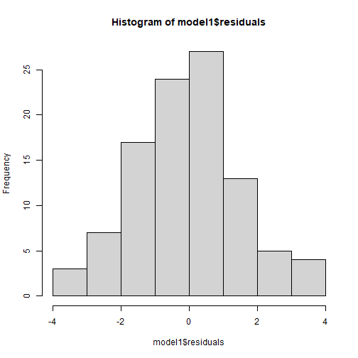

Correlation and Simple Regression in R
========================================================
author: Christopher Wilson
height:720
width:1280
css: custom.css

Overview
======


Correlation
======
- The relationship between 2 variables
- Question: Is treatment duration related to aggression levels?


How is correlation calculated?
======


How is correlation calculated?
======


- Think of this as covariance divided by individual variance
- If the changes are consistent with both variables, the final value will be higher


Running correlation in R
======
- Step 1: Check assumptions
  - Data,distribution,linearity
- Step 2: Run correlation
- Step 3: Check R value
- Step 4: Check significance

Check assumptions: data
======
- Parametric tests require interval or ratio data
- If the data are ordinal then a non-parametric correlation is used

> What type of data are treatment duration and aggression level?


Check assumptions: distribution #1
======
- Parametric tests require normally distributed data


***


Check assumptions: distribution #2
======
- Parametric tests require normally distributed data


```r
shapiro.test(regression_data$treatment_duration)
```

```

	Shapiro-Wilk normality test

data:  regression_data$treatment_duration
W = 0.94971, p-value = 0.0007939
```

```r
shapiro.test(regression_data$aggression_level)
```

```

	Shapiro-Wilk normality test

data:  regression_data$aggression_level
W = 0.9928, p-value = 0.8756
```
 - The normality assumption is less of an issue when sample size is > 30


Checking assumptions: linearity
======


Checking assumptions: linearity
======


```r
regression_data %>% ggplot(aes(x=treatment_duration,y=aggression_level)) +
  geom_point()
```


- Here we are looking to see if the relationship is linear

Run correlation
======
- R can run correlations using the *cor.test()* command


```r
cor.test(regression_data$treatment_duration,regression_data$aggression_level)
```

```

	Pearson's product-moment correlation

data:  regression_data$treatment_duration and regression_data$aggression_level
t = -9.5503, df = 98, p-value = 1.146e-15
alternative hypothesis: true correlation is not equal to 0
95 percent confidence interval:
 -0.7838251 -0.5765006
sample estimates:
       cor 
-0.6942996 
```
Check r Value (correlation value)
======
- The r value tells us the strength and direction of the relationship
- In the output it is labelled as "cor" (short for correlation)


```r
cor.test(regression_data$treatment_duration,regression_data$aggression_level)
```

```

	Pearson's product-moment correlation

data:  regression_data$treatment_duration and regression_data$aggression_level
t = -9.5503, df = 98, p-value = 1.146e-15
alternative hypothesis: true correlation is not equal to 0
95 percent confidence interval:
 -0.7838251 -0.5765006
sample estimates:
       cor 
-0.6942996 
```

Check the significance of the correlation
======
- We can see that the significance by looking at the p value 
  - The significance is 1.146^-15
  - This means: 0.0000000000000001146
- Therefore p value < 0.05

```r
cor.test(regression_data$treatment_duration,regression_data$aggression_level)
```

```

	Pearson's product-moment correlation

data:  regression_data$treatment_duration and regression_data$aggression_level
t = -9.5503, df = 98, p-value = 1.146e-15
alternative hypothesis: true correlation is not equal to 0
95 percent confidence interval:
 -0.7838251 -0.5765006
sample estimates:
       cor 
-0.6942996 
```

======

# Regression

What is regression?
======
- Testing to see if we can make predictions based on data that are correlated

> We found a strong correlation between treatment duration and agression levels. Can we use this data to predict aggression levels of other clients, based on their treatment duration?


- When we carry out regression, we get a information about:
  - How much variance in the **outcome** is explained by the **predictor**
  - How confident we can be about these results generalising (i.e. **significance**)
  - How much error we can expect from anu predictions that we make (i.e. **standard error of the estimate**)
  - The figures we need to calculate a predicted outcome value (i.e. **coefficient values**)
  
How is regression calculated?
======


- When we run a regression analysis, a calculation is done to select the "line of best fit"
- This is a "prediction line" that minimises the overall amount of error
  - Error = difference between the data points and the line 


The regression equation #1
======

- Once the line of best fit is calculated, predictions are based on this line
- To make predictions we need the **intercept** and **slope** of the line
  - **Intercept** or **constant**= where the line crosses the y axis
  - **Slope** or **beta** = the angle of the line

The regression equation #2
======
- Predictions are made using the calculation for a line: 
### Y = bX + c

- You can think of the equation like this:

### predicted outcome value = beta coefficient * value of predictor + constant 


Running regression in R
======
- Step 1: Run regression
- Step 2: Check assumptions
  - Data
  - Distribution
  - Linearity
  - Homogeneity of variance
  - Uncorrelated predictors
  - Indpendence of residuals
  - No influental cases / outliers

- Step 3: Check R^2 value
- Step 4: Check model significance
- Step 5: Check coefficient values


Run regression
======
- We use the *lm()* command to run regression while saving the results 
- We then use the *summary()* function to check the results


```r
model1 <- lm(formula= aggression_level ~ treatment_duration ,data=regression_data)
summary(model1)
```

```

Call:
lm(formula = aggression_level ~ treatment_duration, data = regression_data)

Residuals:
    Min      1Q  Median      3Q     Max 
-3.4251 -1.1493 -0.0593  0.8814  3.4542 

Coefficients:
                   Estimate Std. Error t value Pr(>|t|)    
(Intercept)         12.3300     0.7509   16.42  < 2e-16 ***
treatment_duration  -0.6933     0.0726   -9.55 1.15e-15 ***
---
Signif. codes:  0 '***' 0.001 '**' 0.01 '*' 0.05 '.' 0.1 ' ' 1

Residual standard error: 1.551 on 98 degrees of freedom
Multiple R-squared:  0.4821,	Adjusted R-squared:  0.4768 
F-statistic: 91.21 on 1 and 98 DF,  p-value: 1.146e-15
```


What are residuals?
====
- In regression, the assumptions apply to the residuals, not the data themselves
- Residual just means the difference between the data point and the regression line


Check assumptions: distribution
====
- Using the *plot()* command on our regression model will give us some useful diagnostic plots
- The second plot that it outputs shows the normality

```r
plot(model1, which=2)
```


Check assumptions: distribution
======
- We could also use a histogram to check the distribution
- Notice how we can use the $ sign to get the residuals from the model


```r
hist(model1$residuals)
```




Check assumptions: linearity
======
- Using the *plot()* command on our regression model will give us some useful diagnostic plots
- The first plot that it outputs shows the residuals vs the fitted values
- Here, we want to see them spread out, with the line being horizontal and straight 

```r
plot(model1, which=1)
```


- There is a slight amount of curvilinearity here but nothing to be worried about

Check assumptions: Homogeneity of Variance #1
======
- We can use the sample plot to check Homogeneity of Variance
- We want the variance to be constant across the data set. We do not want the variance to change at different points in the data 


```r
plot(model1, which=1)
```


Check assumptions: Homogeneity of Variance #2
======
- A violation of Homogeneity of Variance would usually look like a funnel, with the data narrowing 


Check assumptions: Influential cases #1
======

- We need to check that there are no extreme outliers - they could throw off our predictions
- We are looking for participants that have high rediduals + high leverage
  - Some guidance suggests anything higher than 1 is an influential case 
  - Others suggest 4/n is the cut off point (4 divided by number of participants)


```r
plot(model1, which=4)
```


Check assumptions: Influential cases #2
======

- We are looking for participants that have high rediduals + high leverage
  - No cases over 1
  - Many are over 0.04 (4/n = 0.04)


```r
plot(model1, which=5)
```


Check the r squared value
========

-  r^2 = the amount of variance in the **outcome** that is explained by the **predictor(s)**
- The closer this value is to 1, the more useful our regression model is for predicting the outcome

```r
modelSummary <- summary(model1)
modelSummary
```

```

Call:
lm(formula = aggression_level ~ treatment_duration, data = regression_data)

Residuals:
    Min      1Q  Median      3Q     Max 
-3.4251 -1.1493 -0.0593  0.8814  3.4542 

Coefficients:
                   Estimate Std. Error t value Pr(>|t|)    
(Intercept)         12.3300     0.7509   16.42  < 2e-16 ***
treatment_duration  -0.6933     0.0726   -9.55 1.15e-15 ***
---
Signif. codes:  0 '***' 0.001 '**' 0.01 '*' 0.05 '.' 0.1 ' ' 1

Residual standard error: 1.551 on 98 degrees of freedom
Multiple R-squared:  0.4821,	Adjusted R-squared:  0.4768 
F-statistic: 91.21 on 1 and 98 DF,  p-value: 1.146e-15
```
- The r^2 of 0.482052 means that 48% of the variance in **aggression level** is explained by **treatment duration**

Check model significance
======
- The model significance is displayed at the very end of the output
  - *p-value: 1.146e-15* 
  - As p < 0.05, the model is significant
  

```r
modelSummary
```

```

Call:
lm(formula = aggression_level ~ treatment_duration, data = regression_data)

Residuals:
    Min      1Q  Median      3Q     Max 
-3.4251 -1.1493 -0.0593  0.8814  3.4542 

Coefficients:
                   Estimate Std. Error t value Pr(>|t|)    
(Intercept)         12.3300     0.7509   16.42  < 2e-16 ***
treatment_duration  -0.6933     0.0726   -9.55 1.15e-15 ***
---
Signif. codes:  0 '***' 0.001 '**' 0.01 '*' 0.05 '.' 0.1 ' ' 1

Residual standard error: 1.551 on 98 degrees of freedom
Multiple R-squared:  0.4821,	Adjusted R-squared:  0.4768 
F-statistic: 91.21 on 1 and 98 DF,  p-value: 1.146e-15
```


Check coefficient values #1
======
- The coefficient values are displayed in the coefficients table
- If we have more than one predictor, they are all listed here


```r
modelSummary$coefficients
```

```
                     Estimate Std. Error   t value     Pr(>|t|)
(Intercept)        12.3300211 0.75087601 16.420848 6.840516e-30
treatment_duration -0.6933201 0.07259671 -9.550297 1.145898e-15
```
- The **beta coefficient** for treatment duration is in the *Estimate* column
- For every unit increase in treatment duration, aggression level decreases by 0.69


The regression equation
======

- The regression equation is:

### Outcome = predictor value * beta coefficient + constant

- For this model, that is:

### Aggression level = treatment duration * -0.69 + 12.33 


```r
modelSummary$coefficients
```

```
                     Estimate Std. Error   t value     Pr(>|t|)
(Intercept)        12.3300211 0.75087601 16.420848 6.840516e-30
treatment_duration -0.6933201 0.07259671 -9.550297 1.145898e-15
```

Accounting for error in predictions
======
- We also know that the accruracy of predictions will be within a certain margin of error
- This is known as **standard error of the estimate** or **residual standard error**
  

```r
modelSummary
```

```

Call:
lm(formula = aggression_level ~ treatment_duration, data = regression_data)

Residuals:
    Min      1Q  Median      3Q     Max 
-3.4251 -1.1493 -0.0593  0.8814  3.4542 

Coefficients:
                   Estimate Std. Error t value Pr(>|t|)    
(Intercept)         12.3300     0.7509   16.42  < 2e-16 ***
treatment_duration  -0.6933     0.0726   -9.55 1.15e-15 ***
---
Signif. codes:  0 '***' 0.001 '**' 0.01 '*' 0.05 '.' 0.1 ' ' 1

Residual standard error: 1.551 on 98 degrees of freedom
Multiple R-squared:  0.4821,	Adjusted R-squared:  0.4768 
F-statistic: 91.21 on 1 and 98 DF,  p-value: 1.146e-15
```
