Factor analysis
========================================================
author: Christopher Wilson
css: custom.css
width: 1280
height: 720


Overview
========================================================
- What is factor analysis
- CFA versus PCA
- Variance in factor analysis
- Considerations for factor analysis
- Identifying / extracting factors
- Rotation
- Cronbach's alpha


Factor analysis can be used for different purposes
======

For example, it is often used as part of the process for assessment and scale development.

This is done in combination with other steps:

- Item generation
- Reliability (e.g. test-retest, cronbach's alpha)
- Validity (e.g. discriminant, divergent)

Exploratory Factor analysis 
======

- Identify the relational structure between a set of variables in order to reduce them to a smaller set of factors
  - The process of **dimension reduction** (identify new variables) or **data summarisation** (summarise what is already there)


Dimension reduction
=======

- **Latent Variables**: Not directly observable. Rather they are inferred from other responses
  - Many psychological constructs (e.g. anxiety) are latent variables that we cannot directly measure. 
  - Rather, we can measure behaviours, cognitions and other variables that are related to the construct.

> We might concptualise this as: "Responses to the questions are indicative of levels of underlying anxiety"

***  
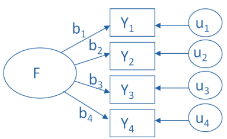

Data summarisation
=======

- **Index Variables** or **Components**: A weighted summary of measured variables that contribute to the component variable

- "Principal components are variables of maximal variance constructed from linear combinations of the input features"

> We might conceptualise this as: "We can reduce these measures/questions to a smaller set of higher order, independent, composite variables"  

Latent versus index variables
======

**Latent Variables** are causes of their indicators: changes in mathematical ability (indicator) leads to changes in score on a maths test (measure).

**Index Variables** are effects of their indicators: change in the price of goods (indicator) will change consumer behaviour (index measure).

> Altering the indicators of an index changes the definition of the variable being indexed. This is not the case with a latent variable.               


Variance in exploratory factor analysis
======
There are two common methods of exploratory factor analysis: **Common Factor analysis** and **Principal Component Analysis**


- CFA assumes that there are two types of variance: common and unique

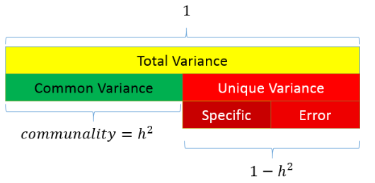


Variance in exploratory factor analysis
======

- PCA only assumes common variance


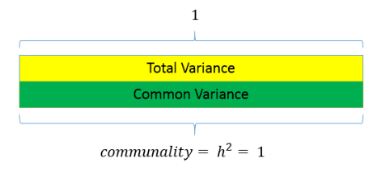

Variance in exploratory factor analysis
======

- Due to these different approaches, PCA is considered to be reflective of the current sample but not generalisable to the wider population
- Whereas, CFA is considered appropriate for hypothesis testing and making inferences to the population


What is factor analysis?
======
- If we measure several variables (or questions), we can examine the correlation between sets of these variables
  - Such a correlation matrix is known as an **R Matrix** (*r* because correlation)
- If there are clusters of correlations between a number of the variables (or questions), this indicates that they might be linked to the same underlying dimension (or latent variable)
- The researcher should use informed judgement when assessing the appropriateness of variables for inclusion

***


An r matrix example

Considerations with factor analysis 
======
- Sample size: 
  - Must be more data points than variables being measured
  - A common rule of thumb is at least 10 per variable
  - There are tests to assess sample size adequacy (e.g. Kaiser-Meyer test should be greater than 0.5)

- Inter-correlation:
  - There must be sufficient correlation between the variables being measured
  - A high number of correlations over 0.3
  - Can be tested using Bartlett test of sphericity (sig. result means factor analysis can be used)
  
Other things to check (see Field, 2018)  
======
- The quality of analysis depends upon the quality of the data (GIGO).
- Avoid multicollinearity:
  - several variables highly correlated, r > .80.
  - Determinent: should be greater than 0.00001
- Avoid singularity:
  - some variables perfectly correlated, r = 1.
- Screen the correlation matrix, eliminate any variables that obviously cause concern.


Representing factor analysis
======
> We can represent factors visually based on the strength of their inter-correlations 
- Here, the axis of the graph represents a factor or latent variable

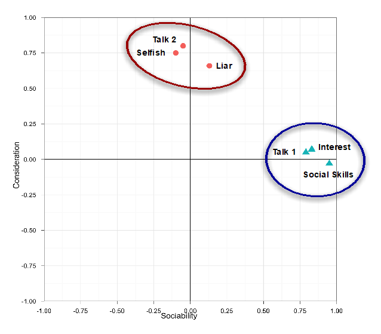

***

> We can also represent factor analysis using a regression equation
- Here the beta values represent the extent to which the variable "loads onto" a particular factor

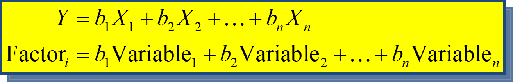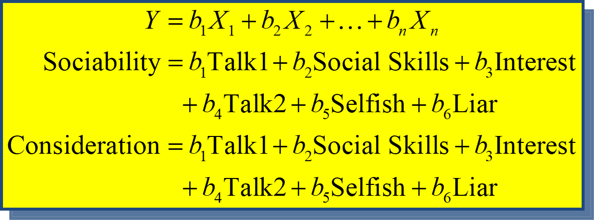

Example: Statistics anxiety
======

- Many people get anxious about statistics
- We can ask them about their experience in a number of ways (e.g. questions compiled by students in a stats class)

- Their responses might indicate that stats anxiety has a number of dimensions
  - i.e. it is a multi-dimensional construct, as opposed to a unitary construct

***
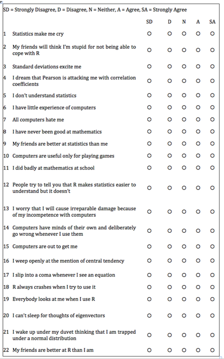

Step 1: Create a correlation matrix
======

```r
raq.matrix <- cor(raq)

raq.matrix
```

```
             Q01         Q02        Q03         Q04         Q05         Q06
Q01  1.000000000 -0.09872403 -0.3366489  0.43586018  0.40243992  0.21673399
Q02 -0.098724032  1.00000000  0.3183902 -0.11185965 -0.11934658 -0.07420968
Q03 -0.336648879  0.31839020  1.0000000 -0.38046016 -0.31030879 -0.22674048
Q04  0.435860179 -0.11185965 -0.3804602  1.00000000  0.40067225  0.27820154
Q05  0.402439917 -0.11934658 -0.3103088  0.40067225  1.00000000  0.25746014
Q06  0.216733985 -0.07420968 -0.2267405  0.27820154  0.25746014  1.00000000
Q07  0.305365139 -0.15917448 -0.3819533  0.40861502  0.33939179  0.51358048
Q08  0.330737608 -0.04962257 -0.2586342  0.34942939  0.26862697  0.22283175
Q09 -0.092339458  0.31464054  0.2998036 -0.12454637 -0.09570151 -0.11264384
Q10  0.213681706 -0.08400316 -0.1933887  0.21581010  0.25820925  0.32223023
Q11  0.356786290 -0.14382984 -0.3506397  0.36865655  0.29782882  0.32807072
Q12  0.345381133 -0.19486946 -0.4099513  0.44164706  0.34674325  0.31250937
Q13  0.354646283 -0.14274026 -0.3179193  0.34429168  0.30182159  0.46640487
Q14  0.337879655 -0.16469991 -0.3707551  0.35080964  0.31533810  0.40224407
Q15  0.245752635 -0.16499581 -0.3123968  0.33423089  0.26137190  0.35989309
Q16  0.498618057 -0.16755228 -0.4186478  0.41586725  0.39491795  0.24433888
Q17  0.370550512 -0.08699527 -0.3273715  0.38273945  0.31041722  0.28226121
Q18  0.347118037 -0.16389415 -0.3752329  0.38200149  0.32209148  0.51332164
Q19 -0.189011027  0.20329748  0.3415737 -0.18597751 -0.16532210 -0.16675017
Q20  0.213897945 -0.20159437 -0.3248338  0.24291796  0.19966945  0.10092489
Q21  0.329153138 -0.20461730 -0.4171878  0.41029317  0.33461494  0.27233273
Q22 -0.104408664  0.23087487  0.2036569 -0.09838349 -0.13253593 -0.16513541
Q23 -0.004480593  0.09967828  0.1502065 -0.03381815 -0.04165684 -0.06868743
            Q07         Q08         Q09         Q10         Q11         Q12
Q01  0.30536514  0.33073761 -0.09233946  0.21368171  0.35678629  0.34538113
Q02 -0.15917448 -0.04962257  0.31464054 -0.08400316 -0.14382984 -0.19486946
Q03 -0.38195325 -0.25863421  0.29980362 -0.19338871 -0.35063969 -0.40995127
Q04  0.40861502  0.34942939 -0.12454637  0.21581010  0.36865655  0.44164706
Q05  0.33939179  0.26862697 -0.09570151  0.25820925  0.29782882  0.34674325
Q06  0.51358048  0.22283175 -0.11264384  0.32223023  0.32807072  0.31250937
Q07  1.00000000  0.29749696 -0.12829828  0.28372299  0.34474770  0.42298591
Q08  0.29749696  1.00000000  0.01573316  0.15860850  0.62929768  0.25198582
Q09 -0.12829828  0.01573316  1.00000000 -0.13418658 -0.11552479 -0.16739436
Q10  0.28372299  0.15860850 -0.13418658  1.00000000  0.27143657  0.24582591
Q11  0.34474770  0.62929768 -0.11552479  0.27143657  1.00000000  0.33529466
Q12  0.42298591  0.25198582 -0.16739436  0.24582591  0.33529466  1.00000000
Q13  0.44211926  0.31424716 -0.16743882  0.30196707  0.42316548  0.48871303
Q14  0.44070276  0.28058958 -0.12150197  0.25468730  0.32532025  0.43270398
Q15  0.39136675  0.29968600 -0.18657099  0.29523438  0.36482687  0.33179910
Q16  0.38854534  0.32149420 -0.18886556  0.29058576  0.36907763  0.40805908
Q17  0.39074283  0.59014022 -0.03681556  0.21832214  0.58683495  0.33269383
Q18  0.50086685  0.27974433 -0.14957782  0.29250304  0.37341373  0.49296482
Q19 -0.26912031 -0.15947671  0.24931170 -0.12723487 -0.19965203 -0.26665953
Q20  0.22095420  0.17515089 -0.15864747  0.08406520  0.25533736  0.29802585
Q21  0.48300388  0.29571756 -0.13594310  0.19313633  0.34643407  0.44063832
Q22 -0.16820488 -0.07917265  0.25684622 -0.13090831 -0.16198921 -0.16728557
Q23 -0.07029016 -0.05023839  0.17077441 -0.06191796 -0.08637256 -0.04642506
            Q13         Q14         Q15         Q16         Q17         Q18
Q01  0.35464628  0.33787966  0.24575263  0.49861806  0.37055051  0.34711804
Q02 -0.14274026 -0.16469991 -0.16499581 -0.16755228 -0.08699527 -0.16389415
Q03 -0.31791928 -0.37075510 -0.31239678 -0.41864780 -0.32737145 -0.37523290
Q04  0.34429168  0.35080964  0.33423089  0.41586725  0.38273945  0.38200149
Q05  0.30182159  0.31533810  0.26137190  0.39491795  0.31041722  0.32209148
Q06  0.46640487  0.40224407  0.35989309  0.24433888  0.28226121  0.51332164
Q07  0.44211926  0.44070276  0.39136675  0.38854534  0.39074283  0.50086685
Q08  0.31424716  0.28058958  0.29968600  0.32149420  0.59014022  0.27974433
Q09 -0.16743882 -0.12150197 -0.18657099 -0.18886556 -0.03681556 -0.14957782
Q10  0.30196707  0.25468730  0.29523438  0.29058576  0.21832214  0.29250304
Q11  0.42316548  0.32532025  0.36482687  0.36907763  0.58683495  0.37341373
Q12  0.48871303  0.43270398  0.33179910  0.40805908  0.33269383  0.49296482
Q13  1.00000000  0.44978632  0.34219704  0.35837775  0.40837657  0.53293713
Q14  0.44978632  1.00000000  0.38011484  0.41841820  0.35374183  0.49830615
Q15  0.34219704  0.38011484  1.00000000  0.45427861  0.37310235  0.34287045
Q16  0.35837775  0.41841820  0.45427861  1.00000000  0.40976309  0.42197911
Q17  0.40837657  0.35374183  0.37310235  0.40976309  1.00000000  0.37560681
Q18  0.53293713  0.49830615  0.34287045  0.42197911  0.37560681  1.00000000
Q19 -0.22697105 -0.25405813 -0.20980230 -0.26704702 -0.16288096 -0.25663183
Q20  0.20396327  0.22592173  0.20625622  0.26514025  0.20523013  0.23518040
Q21  0.37443078  0.39938896  0.29971557  0.42054273  0.36349147  0.43010427
Q22 -0.19535632 -0.16983754 -0.16790617 -0.15579385 -0.12629066 -0.15982631
Q23 -0.05298304 -0.04847418 -0.06200665 -0.08152195 -0.09167243 -0.08041698
           Q19         Q20         Q21         Q22          Q23
Q01 -0.1890110  0.21389794  0.32915314 -0.10440866 -0.004480593
Q02  0.2032975 -0.20159437 -0.20461730  0.23087487  0.099678285
Q03  0.3415737 -0.32483385 -0.41718781  0.20365686  0.150206522
Q04 -0.1859775  0.24291796  0.41029317 -0.09838349 -0.033818152
Q05 -0.1653221  0.19966945  0.33461494 -0.13253593 -0.041656841
Q06 -0.1667502  0.10092489  0.27233273 -0.16513541 -0.068687430
Q07 -0.2691203  0.22095420  0.48300388 -0.16820488 -0.070290157
Q08 -0.1594767  0.17515089  0.29571756 -0.07917265 -0.050238392
Q09  0.2493117 -0.15864747 -0.13594310  0.25684622  0.170774410
Q10 -0.1272349  0.08406520  0.19313633 -0.13090831 -0.061917956
Q11 -0.1996520  0.25533736  0.34643407 -0.16198921 -0.086372565
Q12 -0.2666595  0.29802585  0.44063832 -0.16728557 -0.046425059
Q13 -0.2269710  0.20396327  0.37443078 -0.19535632 -0.052983042
Q14 -0.2540581  0.22592173  0.39938896 -0.16983754 -0.048474181
Q15 -0.2098023  0.20625622  0.29971557 -0.16790617 -0.062006650
Q16 -0.2670470  0.26514025  0.42054273 -0.15579385 -0.081521950
Q17 -0.1628810  0.20523013  0.36349147 -0.12629066 -0.091672426
Q18 -0.2566318  0.23518040  0.43010427 -0.15982631 -0.080416984
Q19  1.0000000 -0.24859386 -0.27489793  0.23392259  0.122434401
Q20 -0.2485939  1.00000000  0.46770448 -0.09970186 -0.034665293
Q21 -0.2748979  0.46770448  1.00000000 -0.12902148 -0.067664367
Q22  0.2339226 -0.09970186 -0.12902148  1.00000000  0.230369402
Q23  0.1224344 -0.03466529 -0.06766437  0.23036940  1.000000000
```

Step 2: Let's check for Inter-correlation <good>
======


```r
library(corrplot)
corrplot(raq.matrix, method = "number")
```

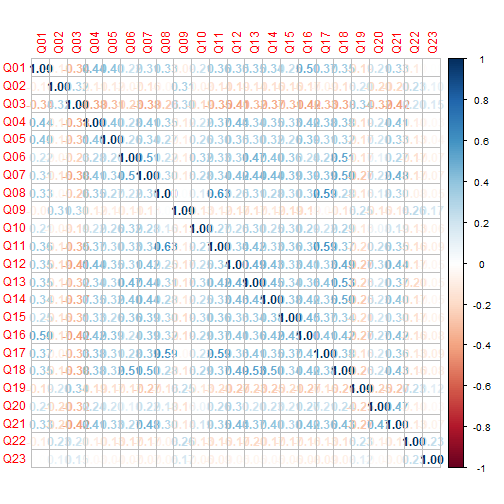

Step 2: Let's check for Inter-correlation <good>
======
- We can use bartlett's test from the psych package


```r
library(psych)

cortest.bartlett(raq.matrix, n=2571)
```

```
$chisq
[1] 19334.49

$p.value
[1] 0

$df
[1] 253
```


Step 3: Check sampling adequacy
======
- Overall should be > 0.5


```r
KMO(raq)
```

```
Kaiser-Meyer-Olkin factor adequacy
Call: KMO(r = raq)
Overall MSA =  0.93
MSA for each item = 
 Q01  Q02  Q03  Q04  Q05  Q06  Q07  Q08  Q09  Q10  Q11  Q12  Q13  Q14  Q15  Q16 
0.93 0.87 0.95 0.96 0.96 0.89 0.94 0.87 0.83 0.95 0.91 0.95 0.95 0.97 0.94 0.93 
 Q17  Q18  Q19  Q20  Q21  Q22  Q23 
0.93 0.95 0.94 0.89 0.93 0.88 0.77 
```

Step 4: Identify number of factors
======

## Based on Eigenvalues:
- Kaiser (1960) – retain factors with eigen values > 1.
- Joliffe (1972) – retain factors with eigen values > .70. 

## Use a scree plot: Cattell (1966): use ‘point of inflexion’. 

## Which rule?
- Use Kaiser’s extraction when
  - Less than 30 variables, communalities after extraction > 0.7
  - Sample size > 250 and mean communality ≥ 0.6
- Scree plot is good if sample size is > 200

Scree plot
======


```r
scree(raq)
```

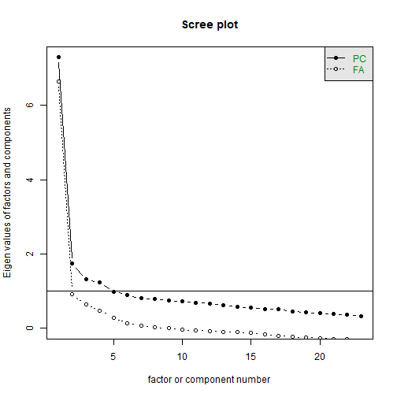

***
- We are looking for the point of inflection
- Where there is a drop-off

> One approach:
> See how many factors we can draw a line through

## We can get another scee plot from the parallel analysis output (next slide)

Step 4: Identify number of factors
======
> How many dimensions of stats anxiety are captured in the questionnaire?

- We can run a **parallel analysis** to get an indication of the number of factors contained within the data
- Parallel Analysis:
   - Simulates data within the same range of values as our data set
   - Suggests that we retain, at maximum, the factors with eigenvalues larger than those extracted from simulated data.


***


Step 4: Identify number of factors
======


```r
library(psych)

 parallel_analysis <- fa.parallel(raq)
```

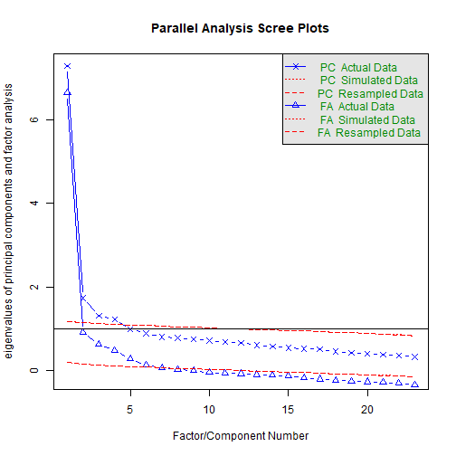

```
Parallel analysis suggests that the number of factors =  6  and the number of components =  4 
```

Step 4: Identify number of factors
======


```r
parallel_analysis
```

```
Call: fa.parallel(x = raq)
Parallel analysis suggests that the number of factors =  6  and the number of components =  4 

 Eigen Values of 
  Original factors Resampled data Simulated data Original components
1             6.64           0.21           0.22                7.29
2             0.91           0.15           0.15                1.74
3             0.63           0.13           0.14                1.32
4             0.48           0.12           0.12                1.23
5             0.29           0.10           0.10                0.99
6             0.13           0.08           0.09                0.90
  Resampled components Simulated components
1                 1.18                 1.18
2                 1.14                 1.15
3                 1.12                 1.13
4                 1.11                 1.11
5                 1.09                 1.09
6                 1.08                 1.08
```

Step 5: Perform factor analysis (with initial recommended # factors)
======


```r
paf <- fa(raq,
nfactors = 6,
fm="pa",
max.iter = 100,
rotate = "none")
```


```r
paf
```

```
Factor Analysis using method =  pa
Call: fa(r = raq, nfactors = 6, rotate = "none", max.iter = 100, fm = "pa")
Standardized loadings (pattern matrix) based upon correlation matrix
      PA1   PA2   PA3   PA4   PA5   PA6   h2   u2 com
Q01  0.57  0.13 -0.12  0.23 -0.28 -0.19 0.52 0.48 2.3
Q02 -0.28  0.37  0.17  0.12 -0.03  0.01 0.26 0.74 2.6
Q03 -0.60  0.25  0.20 -0.02 -0.01  0.03 0.46 0.54 1.6
Q04  0.61  0.08 -0.06  0.18 -0.09 -0.03 0.42 0.58 1.3
Q05  0.52  0.04 -0.02  0.15 -0.17 -0.08 0.33 0.67 1.5
Q06  0.55  0.02  0.49 -0.17  0.07 -0.01 0.57 0.43 2.2
Q07  0.66 -0.03  0.22  0.03  0.11  0.06 0.50 0.50 1.3
Q08  0.55  0.49 -0.27 -0.21  0.10 -0.02 0.66 0.34 2.9
Q09 -0.27  0.46  0.12  0.21  0.10  0.03 0.35 0.65 2.4
Q10  0.40 -0.01  0.17 -0.09 -0.15  0.02 0.22 0.78 1.8
Q11  0.64  0.31 -0.20 -0.27  0.08 -0.04 0.63 0.37 2.1
Q12  0.64 -0.10  0.06  0.15  0.05 -0.07 0.45 0.55 1.2
Q13  0.65  0.02  0.22 -0.06  0.06 -0.13 0.50 0.50 1.4
Q14  0.63 -0.04  0.16  0.06  0.01  0.01 0.42 0.58 1.2
Q15  0.58 -0.01  0.07 -0.15 -0.19  0.44 0.59 0.41 2.3
Q16  0.66 -0.02 -0.11  0.14 -0.28  0.09 0.56 0.44 1.6
Q17  0.63  0.36 -0.15 -0.15  0.04  0.01 0.57 0.43 1.9
Q18  0.68 -0.04  0.28  0.04  0.09 -0.10 0.57 0.43 1.4
Q19 -0.40  0.27  0.11  0.06 -0.05  0.02 0.25 0.75 2.0
Q20  0.41 -0.17 -0.25  0.19  0.24  0.11 0.37 0.63 3.5
Q21  0.64 -0.10 -0.11  0.27  0.28  0.10 0.60 0.40 2.0
Q22 -0.28  0.29  0.05  0.28  0.05  0.11 0.26 0.74 3.4
Q23 -0.13  0.18  0.08  0.23  0.01  0.08 0.12 0.88 3.1

                       PA1  PA2  PA3  PA4  PA5  PA6
SS loadings           6.79 1.14 0.83 0.67 0.45 0.32
Proportion Var        0.30 0.05 0.04 0.03 0.02 0.01
Cumulative Var        0.30 0.34 0.38 0.41 0.43 0.44
Proportion Explained  0.67 0.11 0.08 0.07 0.04 0.03
Cumulative Proportion 0.67 0.78 0.86 0.92 0.97 1.00

Mean item complexity =  2
Test of the hypothesis that 6 factors are sufficient.

The degrees of freedom for the null model are  253  and the objective function was  7.55 with Chi Square of  19334.49
The degrees of freedom for the model are 130  and the objective function was  0.23 

The root mean square of the residuals (RMSR) is  0.02 
The df corrected root mean square of the residuals is  0.02 

The harmonic number of observations is  2571 with the empirical chi square  364.66  with prob <  3.9e-24 
The total number of observations was  2571  with Likelihood Chi Square =  578.65  with prob <  7.6e-58 

Tucker Lewis Index of factoring reliability =  0.954
RMSEA index =  0.037  and the 90 % confidence intervals are  0.034 0.04
BIC =  -442.12
Fit based upon off diagonal values = 1
Measures of factor score adequacy             
                                                   PA1  PA2  PA3  PA4   PA5
Correlation of (regression) scores with factors   0.97 0.83 0.80 0.75  0.70
Multiple R square of scores with factors          0.93 0.68 0.64 0.56  0.48
Minimum correlation of possible factor scores     0.87 0.37 0.27 0.12 -0.03
                                                    PA6
Correlation of (regression) scores with factors    0.65
Multiple R square of scores with factors           0.42
Minimum correlation of possible factor scores     -0.17
```


Check the factor matrix
======

- We are looking high levels of variance explained with SS loadings > 1


```r
print(paf$loadings, cutoff=0, digits=3)
```

```

Loadings:
    PA1    PA2    PA3    PA4    PA5    PA6   
Q01  0.567  0.129 -0.120  0.229 -0.275 -0.188
Q02 -0.280  0.369  0.172  0.115 -0.029  0.009
Q03 -0.603  0.245  0.199 -0.022 -0.006  0.030
Q04  0.606  0.082 -0.056  0.184 -0.090 -0.033
Q05  0.523  0.043 -0.020  0.154 -0.167 -0.083
Q06  0.548  0.024  0.488 -0.166  0.073 -0.006
Q07  0.662 -0.026  0.223  0.030  0.107  0.057
Q08  0.545  0.488 -0.272 -0.214  0.096 -0.020
Q09 -0.266  0.462  0.124  0.210  0.097  0.032
Q10  0.405 -0.005  0.172 -0.090 -0.148  0.024
Q11  0.644  0.312 -0.199 -0.270  0.085 -0.037
Q12  0.641 -0.099  0.063  0.154  0.047 -0.067
Q13  0.650  0.024  0.223 -0.058  0.061 -0.134
Q14  0.626 -0.036  0.161  0.056  0.011  0.013
Q15  0.580 -0.007  0.072 -0.152 -0.188  0.436
Q16  0.661 -0.016 -0.109  0.138 -0.283  0.094
Q17  0.629  0.355 -0.155 -0.150  0.038  0.006
Q18  0.683 -0.039  0.277  0.041  0.092 -0.099
Q19 -0.395  0.267  0.110  0.060 -0.052  0.022
Q20  0.412 -0.171 -0.250  0.190  0.241  0.114
Q21  0.644 -0.099 -0.110  0.270  0.283  0.099
Q22 -0.279  0.291  0.050  0.284  0.047  0.114
Q23 -0.130  0.182  0.081  0.235  0.011  0.077

                 PA1   PA2   PA3   PA4   PA5   PA6
SS loadings    6.786 1.140 0.827 0.667 0.452 0.324
Proportion Var 0.295 0.050 0.036 0.029 0.020 0.014
Cumulative Var 0.295 0.345 0.381 0.410 0.429 0.443
```

Check the structure matrix

======


```r
print(paf$Structure, cutoff=0, digits=3)
```

```

Loadings:
    PA1    PA2    PA3    PA4    PA5    PA6   
Q01  0.567  0.129 -0.120  0.229 -0.275 -0.188
Q02 -0.280  0.369  0.172  0.115 -0.029  0.009
Q03 -0.603  0.245  0.199 -0.022 -0.006  0.030
Q04  0.606  0.082 -0.056  0.184 -0.090 -0.033
Q05  0.523  0.043 -0.020  0.154 -0.167 -0.083
Q06  0.548  0.024  0.488 -0.166  0.073 -0.006
Q07  0.662 -0.026  0.223  0.030  0.107  0.057
Q08  0.545  0.488 -0.272 -0.214  0.096 -0.020
Q09 -0.266  0.462  0.124  0.210  0.097  0.032
Q10  0.405 -0.005  0.172 -0.090 -0.148  0.024
Q11  0.644  0.312 -0.199 -0.270  0.085 -0.037
Q12  0.641 -0.099  0.063  0.154  0.047 -0.067
Q13  0.650  0.024  0.223 -0.058  0.061 -0.134
Q14  0.626 -0.036  0.161  0.056  0.011  0.013
Q15  0.580 -0.007  0.072 -0.152 -0.188  0.436
Q16  0.661 -0.016 -0.109  0.138 -0.283  0.094
Q17  0.629  0.355 -0.155 -0.150  0.038  0.006
Q18  0.683 -0.039  0.277  0.041  0.092 -0.099
Q19 -0.395  0.267  0.110  0.060 -0.052  0.022
Q20  0.412 -0.171 -0.250  0.190  0.241  0.114
Q21  0.644 -0.099 -0.110  0.270  0.283  0.099
Q22 -0.279  0.291  0.050  0.284  0.047  0.114
Q23 -0.130  0.182  0.081  0.235  0.011  0.077

                 PA1   PA2   PA3   PA4   PA5   PA6
SS loadings    6.786 1.140 0.827 0.667 0.452 0.324
Proportion Var 0.295 0.050 0.036 0.029 0.020 0.014
Cumulative Var 0.295 0.345 0.381 0.410 0.429 0.443
```


Check eigenvalues
======

```r
paf$e.values[1:6]
```

```
[1] 7.2900471 1.7388287 1.3167515 1.2271982 0.9878779 0.8953304
```

Check communalities
======

- Communality for each variable: the percentage of variance that can be explained by the retained factors.
- Retained factors should explain more of the variance in each variable.


```r
paf$communality
```

```
      Q01       Q02       Q03       Q04       Q05       Q06       Q07       Q08 
0.5170176 0.2585136 0.4643374 0.4196524 0.3341637 0.5720655 0.5042725 0.6649413 
      Q09       Q10       Q11       Q12       Q13       Q14       Q15       Q16 
0.3542281 0.2240464 0.6328967 0.4544862 0.4973541 0.4223263 0.5902303 0.5571656 
      Q17       Q18       Q19       Q20       Q21       Q22       Q23 
0.5700891 0.5655104 0.2467731 0.3686202 0.5991875 0.2606533 0.1178839 
```


Step 6: Perform factor analysis (with reduced number of factors)
======

```r
paf1 <- fa(raq,
nfactors = 2,
fm="pa",
max.iter = 100,
rotate = "none")

paf1
```

```
Factor Analysis using method =  pa
Call: fa(r = raq, nfactors = 2, rotate = "none", max.iter = 100, fm = "pa")
Standardized loadings (pattern matrix) based upon correlation matrix
      PA1   PA2    h2   u2 com
Q01  0.56  0.12 0.324 0.68 1.1
Q02 -0.28  0.39 0.228 0.77 1.8
Q03 -0.61  0.25 0.430 0.57 1.3
Q04  0.61  0.09 0.377 0.62 1.0
Q05  0.52  0.05 0.276 0.72 1.0
Q06  0.53  0.04 0.282 0.72 1.0
Q07  0.66 -0.01 0.437 0.56 1.0
Q08  0.53  0.40 0.445 0.56 1.9
Q09 -0.27  0.46 0.287 0.71 1.6
Q10  0.40  0.00 0.163 0.84 1.0
Q11  0.63  0.27 0.472 0.53 1.3
Q12  0.64 -0.08 0.421 0.58 1.0
Q13  0.65  0.04 0.421 0.58 1.0
Q14  0.63 -0.02 0.396 0.60 1.0
Q15  0.56  0.00 0.315 0.68 1.0
Q16  0.65 -0.01 0.428 0.57 1.0
Q17  0.63  0.34 0.511 0.49 1.5
Q18  0.68 -0.02 0.461 0.54 1.0
Q19 -0.40  0.28 0.238 0.76 1.8
Q20  0.40 -0.15 0.187 0.81 1.3
Q21  0.63 -0.07 0.403 0.60 1.0
Q22 -0.28  0.29 0.161 0.84 2.0
Q23 -0.13  0.19 0.053 0.95 1.8

                       PA1  PA2
SS loadings           6.67 1.04
Proportion Var        0.29 0.05
Cumulative Var        0.29 0.34
Proportion Explained  0.86 0.14
Cumulative Proportion 0.86 1.00

Mean item complexity =  1.3
Test of the hypothesis that 2 factors are sufficient.

The degrees of freedom for the null model are  253  and the objective function was  7.55 with Chi Square of  19334.49
The degrees of freedom for the model are 208  and the objective function was  1.23 

The root mean square of the residuals (RMSR) is  0.05 
The df corrected root mean square of the residuals is  0.05 

The harmonic number of observations is  2571 with the empirical chi square  3114.53  with prob <  0 
The total number of observations was  2571  with Likelihood Chi Square =  3155.34  with prob <  0 

Tucker Lewis Index of factoring reliability =  0.812
RMSEA index =  0.074  and the 90 % confidence intervals are  0.072 0.077
BIC =  1522.12
Fit based upon off diagonal values = 0.97
Measures of factor score adequacy             
                                                   PA1  PA2
Correlation of (regression) scores with factors   0.96 0.78
Multiple R square of scores with factors          0.92 0.61
Minimum correlation of possible factor scores     0.83 0.23
```
Step 6: Perform factor analysis (with reduced number of factors)
======

```r
plot(paf1)
```


Factor analysis rotation
======
## What is rotation?
- It is possible that variables load "highly" onto one factor and "medium" onto another
- By rotating the factor axes, the variables are aligned with the factors that they load onto most
- This helps us  discriminate between factors

## There are different methods of rotation
- **Orthogonal rotation:** Assumes that factors are unrelated and keeps them that way
- **Oblique rotation:** Assumes that factors might be related and allows them to be correlated after rotation

> ## Are factors related?
> -Theoretical: Do we have logical reason for thinking they could be connected?

> -Based on data: Does the factor plot suggest independence or relatedness?


Step 7: Rotation
======
 - Perform factor analysis (with rotation)


```r
paf2 <- fa(raq,
nfactors = 2,
fm="pa",
max.iter = 100,
rotate = "oblimin")

paf2
```

```
Factor Analysis using method =  pa
Call: fa(r = raq, nfactors = 2, rotate = "oblimin", max.iter = 100, 
    fm = "pa")
Standardized loadings (pattern matrix) based upon correlation matrix
      PA1   PA2    h2   u2 com
Q01  0.57  0.03 0.324 0.68 1.0
Q02 -0.12  0.44 0.228 0.77 1.2
Q03 -0.48  0.36 0.430 0.57 1.8
Q04  0.61 -0.01 0.377 0.62 1.0
Q05  0.52 -0.03 0.276 0.72 1.0
Q06  0.52 -0.05 0.282 0.72 1.0
Q07  0.63 -0.11 0.437 0.56 1.1
Q08  0.66  0.32 0.445 0.56 1.4
Q09 -0.08  0.51 0.287 0.71 1.0
Q10  0.39 -0.06 0.163 0.84 1.1
Q11  0.70  0.16 0.472 0.53 1.1
Q12  0.58 -0.19 0.421 0.58 1.2
Q13  0.63 -0.07 0.421 0.58 1.0
Q14  0.59 -0.12 0.396 0.60 1.1
Q15  0.53 -0.09 0.315 0.68 1.1
Q16  0.62 -0.12 0.428 0.57 1.1
Q17  0.73  0.24 0.511 0.49 1.2
Q18  0.64 -0.13 0.461 0.54 1.1
Q19 -0.27  0.35 0.238 0.76 1.9
Q20  0.33 -0.22 0.187 0.81 1.8
Q21  0.57 -0.18 0.403 0.60 1.2
Q22 -0.15  0.34 0.161 0.84 1.4
Q23 -0.05  0.21 0.053 0.95 1.1

                       PA1  PA2
SS loadings           6.33 1.39
Proportion Var        0.28 0.06
Cumulative Var        0.28 0.34
Proportion Explained  0.82 0.18
Cumulative Proportion 0.82 1.00

 With factor correlations of 
      PA1   PA2
PA1  1.00 -0.22
PA2 -0.22  1.00

Mean item complexity =  1.2
Test of the hypothesis that 2 factors are sufficient.

The degrees of freedom for the null model are  253  and the objective function was  7.55 with Chi Square of  19334.49
The degrees of freedom for the model are 208  and the objective function was  1.23 

The root mean square of the residuals (RMSR) is  0.05 
The df corrected root mean square of the residuals is  0.05 

The harmonic number of observations is  2571 with the empirical chi square  3114.53  with prob <  0 
The total number of observations was  2571  with Likelihood Chi Square =  3155.34  with prob <  0 

Tucker Lewis Index of factoring reliability =  0.812
RMSEA index =  0.074  and the 90 % confidence intervals are  0.072 0.077
BIC =  1522.12
Fit based upon off diagonal values = 0.97
Measures of factor score adequacy             
                                                   PA1  PA2
Correlation of (regression) scores with factors   0.96 0.81
Multiple R square of scores with factors          0.91 0.65
Minimum correlation of possible factor scores     0.82 0.30
```


Step 7: Rotation
======

```r
plot(paf1)
```

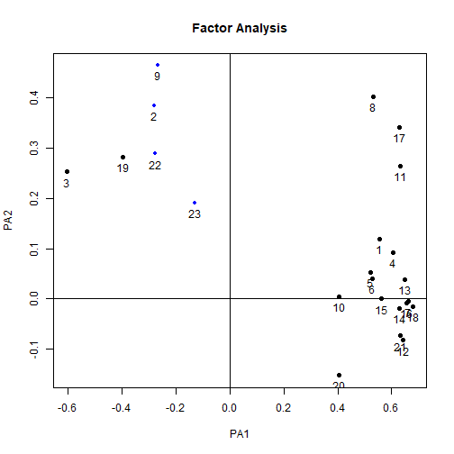
***

```r
plot(paf2)
```

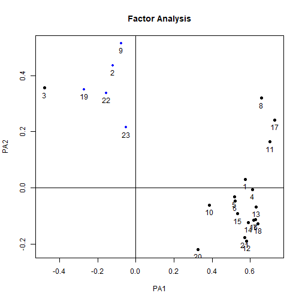

Reliability / internal consistency
=======
type: section

Cronbach's Alpha
=======
- An expansion of the split-half reliability concept
- Alpha takes all possible combination of items and assesses their relationship to each other
- High values above 0.7 suggest internal consistency among items

Chronbach's Alpha in R
=======

-  We can use the *alpha()* function in the psych package

```r
library(psych)

alpha(raq)
```

```
Some items ( Q02 Q03 Q09 Q19 Q22 Q23 ) were negatively correlated with the total scale and 
probably should be reversed.  
To do this, run the function again with the 'check.keys=TRUE' option
```

```

Reliability analysis   
Call: alpha(x = raq)

  raw_alpha std.alpha G6(smc) average_r S/N    ase mean   sd median_r
      0.75      0.77    0.83      0.13 3.4 0.0065  3.3 0.39     0.23

 lower alpha upper     95% confidence boundaries
0.74 0.75 0.77 

 Reliability if an item is dropped:
    raw_alpha std.alpha G6(smc) average_r S/N alpha se var.r med.r
Q01      0.73      0.76    0.82      0.12 3.1   0.0071 0.071  0.23
Q02      0.77      0.79    0.84      0.15 3.8   0.0061 0.071  0.25
Q03      0.79      0.81    0.85      0.16 4.2   0.0055 0.059  0.25
Q04      0.73      0.75    0.82      0.12 3.0   0.0072 0.070  0.22
Q05      0.74      0.76    0.82      0.12 3.1   0.0071 0.072  0.22
Q06      0.73      0.76    0.82      0.12 3.1   0.0072 0.072  0.23
Q07      0.73      0.75    0.82      0.12 3.0   0.0074 0.069  0.22
Q08      0.73      0.76    0.82      0.12 3.1   0.0071 0.072  0.23
Q09      0.78      0.79    0.84      0.15 3.8   0.0058 0.071  0.25
Q10      0.74      0.76    0.83      0.13 3.3   0.0068 0.074  0.23
Q11      0.73      0.75    0.81      0.12 3.0   0.0072 0.069  0.22
Q12      0.73      0.75    0.82      0.12 3.1   0.0072 0.069  0.22
Q13      0.73      0.75    0.82      0.12 3.0   0.0073 0.069  0.22
Q14      0.73      0.75    0.82      0.12 3.1   0.0072 0.070  0.22
Q15      0.73      0.76    0.82      0.12 3.1   0.0071 0.071  0.22
Q16      0.73      0.75    0.82      0.12 3.0   0.0072 0.069  0.22
Q17      0.73      0.75    0.81      0.12 3.0   0.0072 0.070  0.22
Q18      0.72      0.75    0.81      0.12 3.0   0.0074 0.068  0.22
Q19      0.78      0.80    0.85      0.15 4.0   0.0057 0.067  0.26
Q20      0.75      0.77    0.83      0.13 3.3   0.0067 0.073  0.25
Q21      0.73      0.75    0.82      0.12 3.1   0.0072 0.069  0.22
Q22      0.77      0.79    0.84      0.15 3.8   0.0059 0.071  0.26
Q23      0.77      0.79    0.84      0.14 3.7   0.0061 0.074  0.26

 Item statistics 
       n   raw.r  std.r  r.cor r.drop mean   sd
Q01 2571  0.5598  0.581  0.564  0.492  3.6 0.83
Q02 2571 -0.0116 -0.018 -0.114 -0.105  4.4 0.85
Q03 2571 -0.3356 -0.361 -0.465 -0.435  3.4 1.08
Q04 2571  0.6064  0.618  0.606  0.533  3.2 0.95
Q05 2571  0.5365  0.546  0.516  0.454  3.3 0.96
Q06 2571  0.5709  0.560  0.547  0.478  3.8 1.12
Q07 2571  0.6409  0.636  0.635  0.560  3.1 1.10
Q08 2571  0.5646  0.582  0.578  0.493  3.8 0.87
Q09 2571  0.0587  0.020 -0.068 -0.081  3.2 1.26
Q10 2571  0.4300  0.442  0.391  0.346  3.7 0.88
Q11 2571  0.6078  0.628  0.633  0.540  3.7 0.88
Q12 2571  0.5909  0.602  0.593  0.519  2.8 0.92
Q13 2571  0.6288  0.637  0.634  0.559  3.6 0.95
Q14 2571  0.6056  0.609  0.596  0.528  3.1 1.00
Q15 2571  0.5433  0.550  0.526  0.457  3.2 1.01
Q16 2571  0.5965  0.615  0.612  0.525  3.1 0.92
Q17 2571  0.6329  0.650  0.653  0.568  3.5 0.88
Q18 2571  0.6534  0.653  0.656  0.578  3.4 1.05
Q19 2571 -0.1316 -0.157 -0.264 -0.248  3.7 1.10
Q20 2571  0.3705  0.375  0.326  0.265  2.4 1.04
Q21 2571  0.5922  0.598  0.591  0.514  2.8 0.98
Q22 2571 -0.0063 -0.027 -0.127 -0.121  3.1 1.04
Q23 2571  0.1030  0.084 -0.014 -0.013  2.6 1.04

Non missing response frequency for each item
       1    2    3    4    5 miss
Q01 0.02 0.07 0.29 0.52 0.11    0
Q02 0.01 0.04 0.08 0.31 0.56    0
Q03 0.03 0.17 0.34 0.26 0.19    0
Q04 0.05 0.17 0.36 0.37 0.05    0
Q05 0.04 0.18 0.29 0.43 0.06    0
Q06 0.06 0.10 0.13 0.44 0.27    0
Q07 0.09 0.24 0.26 0.34 0.07    0
Q08 0.03 0.06 0.19 0.58 0.15    0
Q09 0.08 0.28 0.23 0.20 0.20    0
Q10 0.02 0.10 0.18 0.57 0.14    0
Q11 0.02 0.06 0.22 0.53 0.16    0
Q12 0.09 0.23 0.46 0.20 0.02    0
Q13 0.03 0.12 0.25 0.48 0.12    0
Q14 0.07 0.18 0.38 0.31 0.06    0
Q15 0.06 0.18 0.30 0.39 0.07    0
Q16 0.06 0.16 0.42 0.33 0.04    0
Q17 0.03 0.10 0.27 0.52 0.08    0
Q18 0.06 0.12 0.31 0.37 0.14    0
Q19 0.02 0.15 0.22 0.33 0.29    0
Q20 0.22 0.37 0.25 0.15 0.02    0
Q21 0.09 0.29 0.34 0.26 0.02    0
Q22 0.05 0.26 0.34 0.26 0.10    0
Q23 0.12 0.42 0.27 0.12 0.06    0
```

Cronbach's Alpha in R
=======

- Here we get a warning that some of the items are negatively correlated and we should probably reverse them.
- The decision to do so should be based on the logic of the questions themselves - check first
- However, since cronbach's alpha is designed to check internal consistency related to a single construct, we would expect that negative correlations would only result from:
  - Items that are designed to be reverse-scored
  - Questions that are related to another factor or construct

Cronbach's Alpha in R
====
- Let's check the questionnaire
  - (Q02, Q03, Q09, Q19, Q22, Q23):


  
Cronbach's Alpha in R
======

- It is possible to run the analysis with automatic reversal of negatively-correlated items


```r
alpha(raq, check.keys=TRUE)
```

```

Reliability analysis   
Call: alpha(x = raq, check.keys = TRUE)

  raw_alpha std.alpha G6(smc) average_r S/N    ase mean   sd median_r
      0.89      0.89    0.91      0.27 8.3 0.0031  3.1 0.54     0.27

 lower alpha upper     95% confidence boundaries
0.88 0.89 0.9 

 Reliability if an item is dropped:
     raw_alpha std.alpha G6(smc) average_r S/N alpha se var.r med.r
Q01       0.88      0.89    0.90      0.26 7.9   0.0032 0.016  0.27
Q02-      0.89      0.89    0.91      0.28 8.4   0.0031 0.016  0.28
Q03-      0.88      0.89    0.90      0.26 7.8   0.0033 0.017  0.26
Q04       0.88      0.89    0.90      0.26 7.8   0.0033 0.016  0.26
Q05       0.89      0.89    0.90      0.27 8.0   0.0032 0.017  0.27
Q06       0.88      0.89    0.90      0.27 8.0   0.0032 0.016  0.27
Q07       0.88      0.89    0.90      0.26 7.7   0.0034 0.016  0.26
Q08       0.89      0.89    0.90      0.27 8.0   0.0032 0.016  0.27
Q09-      0.89      0.89    0.91      0.28 8.4   0.0030 0.016  0.28
Q10       0.89      0.89    0.90      0.27 8.2   0.0032 0.017  0.28
Q11       0.88      0.89    0.90      0.26 7.8   0.0033 0.016  0.26
Q12       0.88      0.89    0.90      0.26 7.7   0.0033 0.016  0.26
Q13       0.88      0.89    0.90      0.26 7.7   0.0033 0.016  0.26
Q14       0.88      0.89    0.90      0.26 7.8   0.0033 0.016  0.26
Q15       0.88      0.89    0.90      0.26 7.9   0.0033 0.017  0.27
Q16       0.88      0.89    0.90      0.26 7.7   0.0033 0.016  0.26
Q17       0.88      0.89    0.90      0.26 7.8   0.0033 0.016  0.26
Q18       0.88      0.88    0.90      0.26 7.7   0.0034 0.016  0.26
Q19-      0.89      0.89    0.90      0.27 8.2   0.0032 0.017  0.29
Q20       0.89      0.89    0.90      0.27 8.2   0.0032 0.017  0.28
Q21       0.88      0.89    0.90      0.26 7.7   0.0033 0.016  0.26
Q22-      0.89      0.89    0.91      0.28 8.4   0.0031 0.016  0.29
Q23-      0.89      0.90    0.91      0.28 8.7   0.0030 0.014  0.29

 Item statistics 
        n raw.r std.r r.cor r.drop mean   sd
Q01  2571  0.55  0.57  0.54   0.50  3.6 0.83
Q02- 2571  0.36  0.36  0.31   0.30  1.6 0.85
Q03- 2571  0.65  0.64  0.62   0.59  2.6 1.08
Q04  2571  0.61  0.61  0.59   0.55  3.2 0.95
Q05  2571  0.54  0.55  0.52   0.48  3.3 0.96
Q06  2571  0.56  0.55  0.53   0.49  3.8 1.12
Q07  2571  0.67  0.67  0.65   0.62  3.1 1.10
Q08  2571  0.51  0.53  0.51   0.46  3.8 0.87
Q09- 2571  0.37  0.35  0.30   0.28  2.8 1.26
Q10  2571  0.44  0.45  0.40   0.38  3.7 0.88
Q11  2571  0.63  0.64  0.63   0.58  3.7 0.88
Q12  2571  0.65  0.65  0.64   0.60  2.8 0.92
Q13  2571  0.65  0.65  0.64   0.60  3.6 0.95
Q14  2571  0.64  0.64  0.62   0.59  3.1 1.00
Q15  2571  0.59  0.59  0.56   0.53  3.2 1.01
Q16  2571  0.66  0.67  0.65   0.61  3.1 0.92
Q17  2571  0.61  0.62  0.61   0.56  3.5 0.88
Q18  2571  0.68  0.68  0.67   0.63  3.4 1.05
Q19- 2571  0.47  0.46  0.42   0.40  2.3 1.10
Q20  2571  0.45  0.45  0.41   0.38  2.4 1.04
Q21  2571  0.64  0.64  0.63   0.59  2.8 0.98
Q22- 2571  0.37  0.36  0.31   0.30  2.9 1.04
Q23- 2571  0.23  0.22  0.15   0.15  3.4 1.04

Non missing response frequency for each item
       1    2    3    4    5 miss
Q01 0.02 0.07 0.29 0.52 0.11    0
Q02 0.01 0.04 0.08 0.31 0.56    0
Q03 0.03 0.17 0.34 0.26 0.19    0
Q04 0.05 0.17 0.36 0.37 0.05    0
Q05 0.04 0.18 0.29 0.43 0.06    0
Q06 0.06 0.10 0.13 0.44 0.27    0
Q07 0.09 0.24 0.26 0.34 0.07    0
Q08 0.03 0.06 0.19 0.58 0.15    0
Q09 0.08 0.28 0.23 0.20 0.20    0
Q10 0.02 0.10 0.18 0.57 0.14    0
Q11 0.02 0.06 0.22 0.53 0.16    0
Q12 0.09 0.23 0.46 0.20 0.02    0
Q13 0.03 0.12 0.25 0.48 0.12    0
Q14 0.07 0.18 0.38 0.31 0.06    0
Q15 0.06 0.18 0.30 0.39 0.07    0
Q16 0.06 0.16 0.42 0.33 0.04    0
Q17 0.03 0.10 0.27 0.52 0.08    0
Q18 0.06 0.12 0.31 0.37 0.14    0
Q19 0.02 0.15 0.22 0.33 0.29    0
Q20 0.22 0.37 0.25 0.15 0.02    0
Q21 0.09 0.29 0.34 0.26 0.02    0
Q22 0.05 0.26 0.34 0.26 0.10    0
Q23 0.12 0.42 0.27 0.12 0.06    0
```

Summary
========================================================
- What is factor analysis
- CFA versus PCA
- Variance in factor analysis
- Considertations for factor analysis
- Identifying / extracting factors
- Rotation
- Cronbach's alpha

