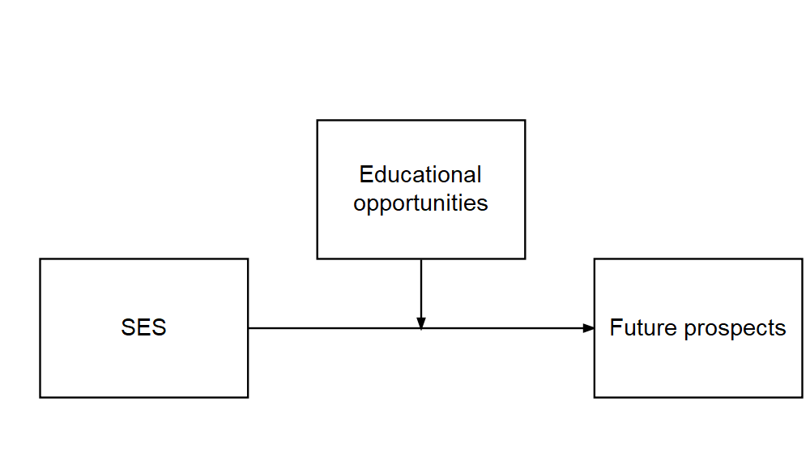
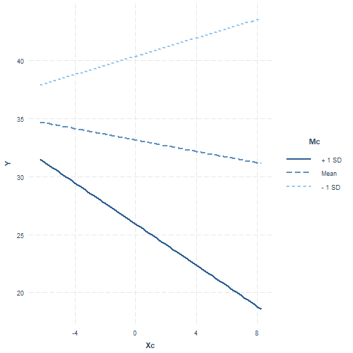
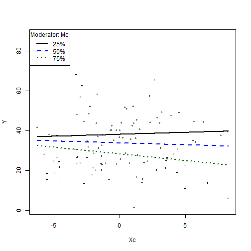
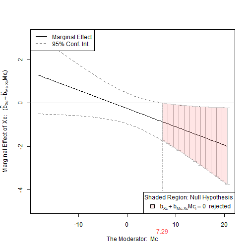
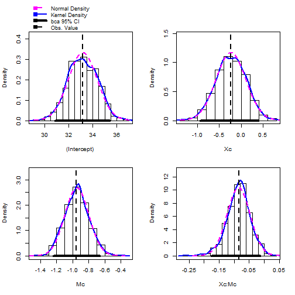

Q&A Session will start at 10am. If you have any questions, you can hold on to them until then!
========================================================
author: Christopher Wilson
width: 1920
height:1080
css: custom.css

Overview
========================================================

- What are mediation and moderation?
- Moderation analysis in more detail
- Grand Mean Centering
- Checking Assumptions
- Interpreting Moderation
- Bootstrapping Moderation

Revision: What are mediation and moderation?
========================================================
type: section


What is moderation?
======

There is a direct relationship between X and Y but it is affected by a moderator (M)


In the above model, we theorise that socio-economic status predicts future prospects but the strength of the relationship is changed by education level

What is mediation?
========================================================
Where the relationship between a predictor (X) and an outcome (Y) is mediated by another variable (M). 


In the above model, we theorise that socio-economic status predicts education level, which predicts future prospects.


Why different models?
======


This might be more appropriate if higher education costs money


Why different models?
======


This might be more appopriate if access to higher education is free 


What packages do we need?
======
- **gvlma** (for checking assumptions)
- **interactions** (for generating interaction plot)
- **Rockchalk** (for testing simple slopes)
- **car** (includes a **Boot()** function to bootstrap regression models )


What is moderation?
======

- The relationship between a predictor (X) and outcome (Y) is affected by another variable (M)
- This is referred to as an interaction (similar to interaction in standard regression)
- A moderator can effect the direction and/or strength of a relationship between X and Y



Here we might find that the relationship between SES and employment prospects is strong for those who do not spend a lot of time in education and weak for those who spend a lot of time in education.

What is moderation? #2
====

- Very similar to multiple regression
    
    lm(Y ~ X + M + X*M)

- Moderation analysis includes X, M and the interaction between X and M

- If we find a moderation effect it becomes the focus of our analysis (the independent role of X and M becomes less important)


What is moderation? #3
======


In the plot above:
- The blue line is the "standard" regression line
- The black line is when the moderator is "low" (-1sd)
- The dotted line is when the moderator is "high" (+1sd)


Moderation: step-by-step
=======
type: section


Step 1: Grand Mean Centering
======

- Regression coefficients (b values) are based on predicting Y when X = 0
- Not all measures actually have a zero value
- To make results easier to interpret, we can centre our data around the grand mean of the data (making the mean 0)
  - The mean of the full sample is subtracted from the value
- This is similar to z-score (i.e. a standardised score)

To do this in R, we can use the **scale()** function:

    Xc    <- scale(X, center=TRUE, scale=FALSE) #Centering X; 
    Mc    <- scale(M,  center=TRUE, scale=FALSE) #Centering M;
    
We then use the centred data in our analysis


Step 1: Grand Mean Centering #2
======

## We can see that the difference between the original data is the mean of the data.


```r
  Xc    <- scale(X, center=TRUE, scale=FALSE) #Centering X; 
  
  X
```

```
  [1]  3.7580974  5.0792900 12.2348333  6.2820336  6.5171509 12.8602599
  [7]  7.8436648  0.9397551  3.2525886  4.2173521 10.8963272  7.4392553
 [13]  7.6030858  6.4427309  3.7766355 13.1476525  7.9914019  1.8664686
 [19]  8.8054236  4.1088344  1.7287052  5.1281003  1.8959822  3.0844351
 [25]  3.4998429  0.7467732  9.3511482  6.6134925  1.4474523 11.0152597
 [31]  7.7058569  4.8197141  9.5805026  9.5125340  9.2863243  8.7545610
 [37]  8.2156706  5.7523532  4.7761493  4.4781160  3.2211721  5.1683309
 [43]  0.9384146 14.6758239 10.8318480  1.5075657  4.3884607  4.1333786
 [49]  9.1198605  5.6665237  7.0132741  5.8858130  5.8285182 11.4744091
 [55]  5.0969161 12.0658824  0.1950112  8.3384550  6.4954170  6.8637663
 [61]  7.5185579  3.9907062  4.6671705  1.9256985  1.7128351  7.2141146
 [67]  7.7928391  6.2120169  9.6890699 14.2003387  4.0358753  3.2366755
 [73] 10.0229541  3.1631969  3.2479655 10.1022855  4.8609080  1.1171292
 [79]  6.7252139  5.4444346  6.0230567  7.5411216  4.5173599  8.5775062
 [85]  5.1180538  7.3271279 10.3873561  7.7407260  4.6962737 10.5952305
 [91]  9.9740154  8.1935878  6.9549269  3.4883757 11.4426098  3.5989617
 [97] 14.7493320 12.1304425  5.0571986  1.8943164
```

```r
  Xc
```

```
              [,1]
  [1,] -2.72442479
  [2,] -1.40323216
  [3,]  5.75231105
  [4,] -0.20048864
  [5,]  0.03462873
  [6,]  6.37773774
  [7,]  1.36114262
  [8,] -5.54276714
  [9,] -3.22993361
 [10,] -2.26517009
 [11,]  4.41380498
 [12,]  0.95673310
 [13,]  1.12056360
 [14,] -0.03979134
 [15,] -2.70588675
 [16,]  6.66513034
 [17,]  1.50887971
 [18,] -4.61605358
 [19,]  2.32290140
 [20,] -2.37368784
 [21,] -4.75381703
 [22,] -1.35442186
 [23,] -4.58654000
 [24,] -3.39808712
 [25,] -2.98267928
 [26,] -5.73574896
 [27,]  2.86862597
 [28,]  0.13097027
 [29,] -5.03506995
 [30,]  4.53273748
 [31,]  1.22333468
 [32,] -1.66280814
 [33,]  3.09798044
 [34,]  3.03001174
 [35,]  2.80380212
 [36,]  2.27203881
 [37,]  1.73314841
 [38,] -0.73016905
 [39,] -1.70637286
 [40,] -2.00440621
 [41,] -3.26135012
 [42,] -1.31419132
 [43,] -5.54410761
 [44,]  8.19330166
 [45,]  4.34932579
 [46,] -4.97495654
 [47,] -2.09406155
 [48,] -2.34914362
 [49,]  2.63733827
 [50,] -0.81599847
 [51,]  0.53075185
 [52,] -0.59670923
 [53,] -0.65400404
 [54,]  4.99188693
 [55,] -1.38560615
 [56,]  5.58336021
 [57,] -6.28751099
 [58,]  1.85593279
 [59,]  0.01289477
 [60,]  0.38124407
 [61,]  1.03603572
 [62,] -2.49181602
 [63,] -1.81535174
 [64,] -4.55682374
 [65,] -4.76968711
 [66,]  0.73159236
 [67,]  1.31031691
 [68,] -0.27050530
 [69,]  3.20654767
 [70,]  7.71781654
 [71,] -2.44664687
 [72,] -3.24584670
 [73,]  3.54043189
 [74,] -3.31932526
 [75,] -3.23455667
 [76,]  3.61976327
 [77,] -1.62161423
 [78,] -5.36539306
 [79,]  0.24269171
 [80,] -1.03808766
 [81,] -0.45946546
 [82,]  1.05859940
 [83,] -1.96516233
 [84,]  2.09498399
 [85,] -1.36446845
 [86,]  0.84460565
 [87,]  3.90483385
 [88,]  1.25820376
 [89,] -1.78624855
 [90,]  4.11270827
 [91,]  3.49149322
 [92,]  1.71106563
 [93,]  0.47240473
 [94,] -2.99414651
 [95,]  4.96008759
 [96,] -2.88356055
 [97,]  8.26680977
 [98,]  5.64792030
 [99,] -1.42532364
[100,] -4.58820581
attr(,"scaled:center")
[1] 6.482522
```

```r
   mean(X)
```

```
[1] 6.482522
```

```r
  X[1]-Xc[1]
```

```
[1] 6.482522
```


Step 2: Check assumptions
======

## We can use the gvlma function to check regression assumptions 


```r
library(gvlma)
gvlma(fitMod)
```

```

Call:
lm(formula = Y ~ Xc + Mc + Xc * Mc, data = Moddata)

Coefficients:
(Intercept)           Xc           Mc        Xc:Mc  
   33.15071     -0.24574     -0.95207     -0.08425  


ASSESSMENT OF THE LINEAR MODEL ASSUMPTIONS
USING THE GLOBAL TEST ON 4 DEGREES-OF-FREEDOM:
Level of Significance =  0.05 

Call:
 gvlma(x = fitMod) 

                      Value  p-value                   Decision
Global Stat        16.25835 0.002691 Assumptions NOT satisfied!
Skewness            9.69478 0.001848 Assumptions NOT satisfied!
Kurtosis            6.42028 0.011282 Assumptions NOT satisfied!
Link Function       0.01433 0.904712    Assumptions acceptable.
Heteroscedasticity  0.12895 0.719519    Assumptions acceptable.
```

The data looks skewed, we should transform it or perhaps use bootstrapping


Step 3: Moderation Analysis
======


```r
fitMod <- lm(Y ~ Xc + Mc + Xc*Mc, data = Moddata) #Model interacts IV & moderator
summary(fitMod)
```

```

Call:
lm(formula = Y ~ Xc + Mc + Xc * Mc, data = Moddata)

Residuals:
    Min      1Q  Median      3Q     Max 
-22.193  -8.184  -0.445   5.670  44.161 

Coefficients:
            Estimate Std. Error t value Pr(>|t|)    
(Intercept) 33.15071    1.20186  27.583  < 2e-16 ***
Xc          -0.24574    0.35732  -0.688   0.4933    
Mc          -0.95207    0.15921  -5.980 3.81e-08 ***
Xc:Mc       -0.08425    0.04236  -1.989   0.0496 *  
---
Signif. codes:  0 '***' 0.001 '**' 0.01 '*' 0.05 '.' 0.1 ' ' 1

Residual standard error: 11.93 on 96 degrees of freedom
Multiple R-squared:  0.2909,	Adjusted R-squared:  0.2687 
F-statistic: 13.13 on 3 and 96 DF,  p-value: 2.97e-07
```

The results above show that there is a moderated effect


Step 3: Moderation analysis #2
======

We use an approach called **simple slopes** to visualise the moderation effect


    interact_plot(fitMod, pred = Xc, modx = Mc)
    


Step 3: Moderation analysis #3
======

The **rockchalk** package includes useful functions for visualising simple slopes


```r
library(rockchalk)

mod1 <- lm(Y ~Mc*Xc, data = Moddata)
summary(fitMod)
```

```

Call:
lm(formula = Y ~ Xc + Mc + Xc * Mc, data = Moddata)

Residuals:
    Min      1Q  Median      3Q     Max 
-22.193  -8.184  -0.445   5.670  44.161 

Coefficients:
            Estimate Std. Error t value Pr(>|t|)    
(Intercept) 33.15071    1.20186  27.583  < 2e-16 ***
Xc          -0.24574    0.35732  -0.688   0.4933    
Mc          -0.95207    0.15921  -5.980 3.81e-08 ***
Xc:Mc       -0.08425    0.04236  -1.989   0.0496 *  
---
Signif. codes:  0 '***' 0.001 '**' 0.01 '*' 0.05 '.' 0.1 ' ' 1

Residual standard error: 11.93 on 96 degrees of freedom
Multiple R-squared:  0.2909,	Adjusted R-squared:  0.2687 
F-statistic: 13.13 on 3 and 96 DF,  p-value: 2.97e-07
```

```r
slopes <- plotSlopes(fitMod, modx = "Mc", plotx = "Xc")
```



```r
testSlopes <- testSlopes(slopes)
```

```
Values of Mc OUTSIDE this interval:
          lo           hi 
-2210.011369     7.290036 
cause the slope of (b1 + b2*Mc)Xc to be statistically significant
```

```r
plot(testSlopes)
```




Step 4: Bootstrapping
======

## The **car** package includes a function to bootstrap regression


```r
library(car)

bootstrapModel <- Boot(fitMod, R=999)

confint(fitMod)
```

```
                 2.5 %        97.5 %
(Intercept) 30.7650397 35.5363842663
Xc          -0.9550230  0.4635440922
Mc          -1.2681029 -0.6360294935
Xc:Mc       -0.1683425 -0.0001632251
```

```r
confint(bootstrapModel)
```

```
Bootstrap bca confidence intervals

                 2.5 %      97.5 %
(Intercept) 30.8778236 35.41771485
Xc          -0.9351717  0.38542382
Mc          -1.2381687 -0.66465099
Xc:Mc       -0.1749438 -0.01361759
```

```r
summary(bootstrapModel)
```

```

Number of bootstrap replications R = 999 
             original    bootBias  bootSE   bootMed
(Intercept) 33.150712  0.02697380 1.20072 33.165894
Xc          -0.245739  0.01004465 0.34117 -0.233827
Mc          -0.952066  0.00608159 0.14915 -0.941268
Xc:Mc       -0.084253 -0.00086089 0.03861 -0.083022
```

```r
hist(bootstrapModel)
```



Summary
========================================================

- Revision: What are mediation and moderation?
- Moderation analysis in more detail
- Grand Mean Centering
- Checking Assumptions
- Interpreting Moderation
- Bootstrapping Moderation

 
