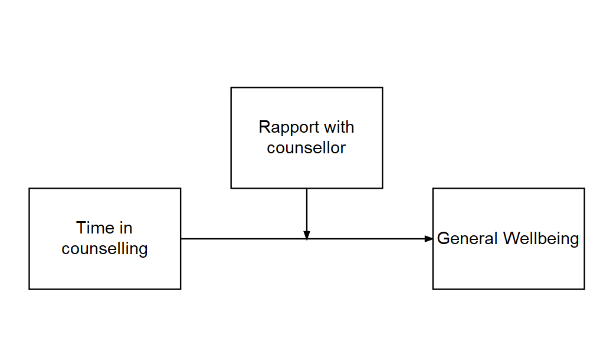
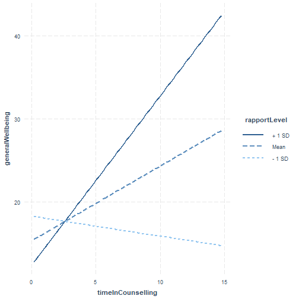
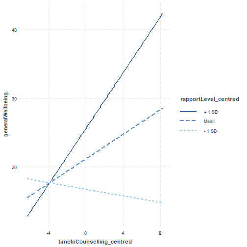
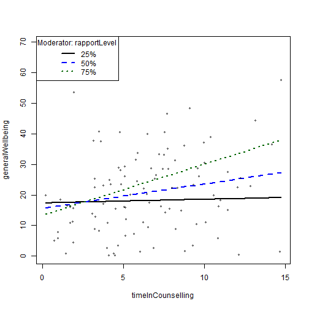
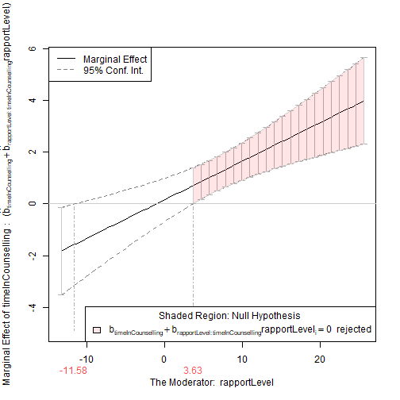

Moderation analysis
========================================================
author: Christopher Wilson
width: 1920
height:1080
autosize: true
css: custom.css

Overview
========================================================

- What are mediation and moderation?
- Moderation analysis in more detail
- Grand Mean Centering
- Checking Assumptions
- Interpreting Moderation
- Bootstrapping Moderation

What are mediation and moderation?
========================================================
type: section


What is moderation?
======


There is a direct relationship between X and Y but it is affected by a moderator (M)



In the above model, we theorise that Time in counselling predicts General Wellbeing but the strength of the relationship is affected by the level of Rapport with counsellor


What packages do we need?
======
- **gvlma** (for checking assumptions)
- **interactions** (for generating interaction plot)
- **Rockchalk** (for testing simple slopes)
- **car** (includes a **Boot()** function to bootstrap regression models )


What is moderation?
======

- The relationship between a predictor (X) and outcome (Y) is affected by another variable (M)
- This is referred to as an interaction (similar to interaction in standard regression)
- A moderator can effect the direction and/or strength of a relationship between X and Y


Here we might find that the relationship between Time in counselling and General Wellbeing is strong for those who have a strong rapport with their counselling psychologist and weak for those who do not have good rapport with their counselling psychologist.


What is moderation? #2
====

- Very similar to multiple regression
    
    lm(Y ~ X + M + X*M)

- Moderation analysis includes X, M and the interaction between X and M

- If we find a moderation effect it becomes the focus of our analysis (the independent role of X and M becomes less important)


What is moderation? #3
======


In the plot above:
- The blue line is the "standard" regression line
- The black line is when the moderator is "low" (-1sd)
- The dotted line is when the moderator is "high" (+1sd)


Moderation: step-by-step
=======
type: section


Step 1: Grand Mean Centering
======

- Regression coefficients (b values) are based on predicting Y when X = 0
- Not all measures actually have a zero value
- To make results easier to interpret, we can centre our data around the grand mean of the data (making the mean 0)
  - The mean of the full sample is subtracted from the value
- This is similar to z-score (i.e. a standardised score)

To do this in R, we can use the **scale()** function:

    Xc    <- scale(X, center=TRUE, scale=FALSE) #Centering X; 
    Mc    <- scale(M,  center=TRUE, scale=FALSE) #Centering M;
    
We then use the centred data in our analysis


Step 1: Grand Mean Centering #2
======

## We can see that the difference between the original data is the mean of the data.


```r
#Centering Data
Moddata$timeInCounselling_centred    <- c(scale(timeInCounselling, center=TRUE, scale=FALSE)) 

#Centering IV; 
Moddata$rapportLevel_centred    <- c(scale(rapportLevel,  center=TRUE, scale=FALSE)) #Centering moderator; 

#Moderation "By Hand" with centred data
library(gvlma)
fitMod <- lm(generalWellbeing ~ timeInCounselling_centred *rapportLevel_centred  , data = Moddata) #Model interacts IV & moderator

library(interactions)
 ip <- interact_plot(fitMod, pred = timeInCounselling_centred, modx = rapportLevel_centred)
 ip
```


Do I need to mean centre my data?
======
It is worth noting:

- It does not change the results of your interaction (coefficient, standard error or significance tests).
- It will change the results of the direct effects (the individual predictors in your model).
- It is a step that tries to ensure that the coefficients of the predictor and moderator are meaningful in relation to each other.
- In some cases, it might not be necessary to mean centre at all. However, there is no harm in doing so, and it could potentially be helpful.

Hayes (2013) discusses mean centering, pp. 282-290. 

McClelland, G. H., Irwin, J. R., Disatnik, D., & Sivan, L. (2017). Multicollinearity is a red herring in the search for moderator variables: A guide to interpreting moderated multiple regression models and a critique of Iacobucci, Schneider, Popovich, and Bakamitsos (2016). Behavior research methods, 49(1), 394-402.


Step 2: Check assumptions
======

## We can use the gvlma function to check regression assumptions 


```r
library(gvlma)
gvlma(fitMod)
```

```

Call:
lm(formula = generalWellbeing ~ timeInCounselling_centred * rapportLevel_centred, 
    data = Moddata)

Coefficients:
                                   (Intercept)  
                                       21.1851  
                     timeInCounselling_centred  
                                        0.8971  
                          rapportLevel_centred  
                                        0.5842  
timeInCounselling_centred:rapportLevel_centred  
                                        0.1495  


ASSESSMENT OF THE LINEAR MODEL ASSUMPTIONS
USING THE GLOBAL TEST ON 4 DEGREES-OF-FREEDOM:
Level of Significance =  0.05 

Call:
 gvlma(x = fitMod) 

                    Value p-value                   Decision
Global Stat        9.6949 0.04589 Assumptions NOT satisfied!
Skewness           7.7571 0.00535 Assumptions NOT satisfied!
Kurtosis           1.2182 0.26972    Assumptions acceptable.
Link Function      0.5287 0.46716    Assumptions acceptable.
Heteroscedasticity 0.1910 0.66207    Assumptions acceptable.
```

The "global stat" is an attempt to check multiple assumptions of linear model: Pena, E. A., & Slate, E. H. (2006). Global validation of linear model assumptions. Journal of the American Statistical Association, 101(473), 341-354.

Since one of the underlying assumptions is violated, the overall stat is also not acceptable.

The data looks skewed, we should transform it or perhaps use bootstrapping


Step 3: Moderation Analysis
======


```r
fitMod <- lm(generalWellbeing ~ timeInCounselling_centred *rapportLevel_centred  , data = Moddata) #Model interacts IV & moderator
 #Model interacts IV & moderator
summary(fitMod)
```

```

Call:
lm(formula = generalWellbeing ~ timeInCounselling_centred * rapportLevel_centred, 
    data = Moddata)

Residuals:
    Min      1Q  Median      3Q     Max 
-18.121  -8.938  -0.670   5.840  37.396 

Coefficients:
                                               Estimate Std. Error t value
(Intercept)                                    21.18508    1.14115  18.565
timeInCounselling_centred                       0.89707    0.33927   2.644
rapportLevel_centred                            0.58416    0.15117   3.864
timeInCounselling_centred:rapportLevel_centred  0.14948    0.04022   3.716
                                               Pr(>|t|)    
(Intercept)                                     < 2e-16 ***
timeInCounselling_centred                      0.009569 ** 
rapportLevel_centred                           0.000203 ***
timeInCounselling_centred:rapportLevel_centred 0.000340 ***
---
Signif. codes:  0 '***' 0.001 '**' 0.01 '*' 0.05 '.' 0.1 ' ' 1

Residual standard error: 11.33 on 96 degrees of freedom
Multiple R-squared:  0.2737,	Adjusted R-squared:  0.251 
F-statistic: 12.06 on 3 and 96 DF,  p-value: 9.12e-07
```

The results above show that there is a moderated effect


Step 3: Moderation analysis #2
======

We use an approach called **simple slopes** to visualise the moderation effect


        interact_plot(fitMod, pred = timeInCounselling_centred, modx = rapportLevel_centred)
    


Step 3: Moderation analysis #3
======

The **rockchalk** package includes useful functions for visualising simple slopes


```r
library(rockchalk)

fitMod <- lm(generalWellbeing ~ timeInCounselling *rapportLevel  , data = Moddata)
summary(fitMod)
```

```

Call:
lm(formula = generalWellbeing ~ timeInCounselling * rapportLevel, 
    data = Moddata)

Residuals:
    Min      1Q  Median      3Q     Max 
-18.121  -8.938  -0.670   5.840  37.396 

Coefficients:
                               Estimate Std. Error t value Pr(>|t|)    
(Intercept)                    17.28006    3.17944   5.435 4.15e-07 ***
timeInCounselling               0.15510    0.42033   0.369  0.71296    
rapportLevel                   -0.38484    0.29916  -1.286  0.20140    
timeInCounselling:rapportLevel  0.14948    0.04022   3.716  0.00034 ***
---
Signif. codes:  0 '***' 0.001 '**' 0.01 '*' 0.05 '.' 0.1 ' ' 1

Residual standard error: 11.33 on 96 degrees of freedom
Multiple R-squared:  0.2737,	Adjusted R-squared:  0.251 
F-statistic: 12.06 on 3 and 96 DF,  p-value: 9.12e-07
```

```r
slopes <- plotSlopes(fitMod, modx = "rapportLevel", plotx = "timeInCounselling")
```



```r
testSlopes <- testSlopes(slopes)
```

```
Values of rapportLevel OUTSIDE this interval:
        lo         hi 
-11.580166   3.634439 
cause the slope of (b1 + b2*rapportLevel)timeInCounselling to be statistically significant
```

```r
plot(testSlopes)
```




Step 4: Bootstrapping
======

## The **car** package includes a function to bootstrap regression


```r
library(car)

bootstrapModel <- Boot(fitMod, R=999)

confint(fitMod)
```

```
                                     2.5 %     97.5 %
(Intercept)                    10.96891826 23.5912086
timeInCounselling              -0.67926290  0.9894532
rapportLevel                   -0.97866229  0.2089882
timeInCounselling:rapportLevel  0.06963667  0.2293205
```

```r
confint(bootstrapModel)
```

```
Bootstrap bca confidence intervals

                                     2.5 %     97.5 %
(Intercept)                    11.57230420 23.7222700
timeInCounselling              -0.61780918  1.0397199
rapportLevel                   -0.90786799  0.2558502
timeInCounselling:rapportLevel  0.05806412  0.2146814
```

```r
summary(bootstrapModel)
```

```

Number of bootstrap replications R = 999 
                               original    bootBias   bootSE  bootMed
(Intercept)                    17.28006 -0.13667103 3.165301 17.05431
timeInCounselling               0.15510  0.01637117 0.399550  0.15929
rapportLevel                   -0.38484  0.00716631 0.294061 -0.38218
timeInCounselling:rapportLevel  0.14948 -0.00052838 0.038516  0.14974
```

```r
hist(bootstrapModel)
```


Summary
========================================================

- Revision: What are mediation and moderation?
- Moderation analysis in more detail
- Grand Mean Centering
- Checking Assumptions
- Interpreting Moderation
- Bootstrapping Moderation

 
