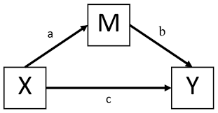

```{r setup, include=FALSE}
knitr::opts_chunk$set(echo = FALSE, message = FALSE, warning = FALSE)
```

# Introduction

This is text.

# Method



## Design

The design of this study is.

The variables were...

## Participants

- Item 1
- Item 2

# Results

```{r graph, echo=FALSE, warning=FALSE, message=FALSE}
library(dplyr)
library(knitr)
library(ggplot2)

myData <-  read.csv("datasets/studentData.csv")

myData$route <- as.factor(myData$route)

summaryTable <- myData %>% 
  group_by(route) %>%
  summarise(meanHours = mean(hoursOfStudy), SDHours = sd(hoursOfStudy)) %>%
as.data.frame()

summaryTable %>% kable() 


```

# Results 2

```{r}
summaryTable %>%
  ggplot(aes(x = route, y = meanHours)) + geom_col()
```


# Discussion

> This is a blockquote